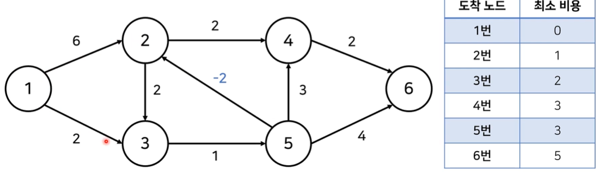

# 벨만 포드 알고리즘(Bellman-Ford Algorithm)

## 음수 간선이 표함된 상황에서의 최단 거리 문제
- N개의 도시가 있다. 그리고 한 도시에서 출발하여 다른 도시에 도착하는 버스가 M개 있다. 각 버스는 A, B, C로 나타낼 수 있는데, A는 시작도시, B는 도착도시, C는 버스를 타고 이동하는데 걸리는 시간이다. 시간 C가 양수가 아닌 경우가 있다. C = 0인 경우는 순간 이동을 하는 경우, C < 0인 경우는 타임머신으로 시간을 되돌아가는 경우이다. 1번 도시에서 출방해서 나머지 도시로 가는 가장 빠른 시간을 구하는 프로그램을 작성하시오
- 도시의 개수: N (1 <= N <= 500)
- 버스 노선의 개수: M (1 <= M <= 6000)

- 단순히 음수 간선이 표함되어 있다고 해서 최단 거리를 못 구하는 것은 아니다.

    

- 단 음수 간선의 순환이 포함되는 경우 최단 거리를 특정할 수 없는 경우가 있다.
  - 사이클을 돌았을 때 합의 음수가 아니라면 최단 거리를 특정할 수 있으나 음수라면 사이클을 무한히 돌아 최단 거리 값을 무한히 줄일 수 있다.

  

- 음수 순환이 포함되어 있는 경우 최단 거리 값을 구하는 방법이 bellman-ford 알고리즘이다.

### 벨만 포드 알고리즘(Bellman-Ford)
- 음수 간선에 관하여 최단 경로 문제는 다음과 같이 분류 가능하다.
  1. 모든 간선이 양수인 경우
  2. 음수 간선이 있는 경우
     1. 음수 간선 순환이 없는 경우
     2. 음수 간선 순환이 있는 경우

- **벨만 포드 최단 경로 알고리즘**은 음의 간선이 포함된 상황에서도 사용할 수 있다.
  - 또한 음수 간선의 순환을 감지할 수 있다.
  - 벨만 포드의 기본 시간 복잡도는 $O(VE)$로 다익스트라 알고리즘에 비해 느리다.
  - 벨만 포드 알고리즘은 모든 간선에 대해 적용 가능하다.

- 음수 간선이 있는 경우로도 종종 나오지만 음수 사이클 여부를 판단하는 문제가 더 많이 출제된다.

#### 벨만 포드 알고리즘(Bellman-Ford) 동작 과정
1. 출발 노드를 설정
2. 최단 거리 테이블 초기화
3. 다음 과정을 N-1번 반복(업데이트 최대 반복 횟수는 노드 개수 - 1)
   1. 전체 간선 E개를 하나씩 확인
   2. 각 간선을 거쳐 다른 노드로 가는 비용을 계산하여 최단 거리 테이블을 갱신

- 만약 음수 간선 순환이 발생하는지 체크하고 싶다면 n-1번 갱신 과정을 반복한 후 마지막에 3번의 과정을 한 번 더 수행한다.
  - 이때 최단 거리 테이블이 갱신된다면 음수 간선 순환이 존재하는 것이다.
  - 어떠한 최단거리도 간선을 최대 n-1개 사용한다. 즉 n-1번 갱신한 이후 또 갱신이 가능하다는 말은 음의 사이클이 존재한다는 의미이다.

- 업데이트 반복 횟수가 k번이라면 해당 시점에 정답 리스트의 값은 시작점에서 k개의 엣지를 사용했을 때 각 노드에 대한 최단거리이다.
  
  - k=1이면 시작 접에서 다른 이웃한 노드까지의 최단 거리가 갱신된다. 왜냐하면 나머지 시작점이 아닌 노드는 값이 무한대이므로 갱신 되지 않기 때문이다.
  
  - k=2는 k=1에서와 마찬가지로 모든 노드를 검사하지만 k=1에서 갱신된 노드에 대해서만 이웃한 노드에 대한 간선을 통해 최단 거리를 업데이트 함 by 나머지 노드는 무한대이므로 갱신이 되지 않기 때문이다.
    - 이때 갱신하는 최단 경로는 간선 두개를 사용했을 때 해당 노드까지의 최단 거리이다.
  
  - ***그러면 왜 이미 k=1에서 최단 경로로 갱신한 것을 또 검사하냐?*** 
    - ***음수 간선이 있는 경우 현재 값보다 더 작은 값을 최단 경로로 가질 수 있기 때문이다.***

#### 벨만 포드 알고리즘 VS 다익스트라 알고리즘
- 다익스트라 알고리즘
  - 매번 방문하지 않은 노드 중에서 최단 거리가 가장 짧은 노드를 선택
  - 음수 간선이 없다면 최적의 해를 찾을 수 있음

- 벨만 포드 알고리즘
  - 매번 모든 간선을 전부 확인
    - 따라서 다익스트라 알고리즘에서의 최적의 해를 항상 포함함
  - 다익스트라 알고리즘에 비해 시간이 오래 걸리지만 ***음수 간선 순환을 탐지할 수 있음***

#### 벨만 포드 알고리즘 구현
```
import sys
input = sys.stdin.readline
INF = int(1e9)

def bf(start):
    # 시작 노드에 대해서 초기화
    dist[start] = 0
    # 전체 n번의 라운드 반복
    for i in range(n):
        # 매 반복마다 모든 간선 확인
        for j in range(m):
            cur = edges[j][0]
            next_node = edges[j][1]
            cost = edges[j][2]
            # 현재 간선을 거쳐 다른 노드로 이동하는 거리가 더 짧은 경우 
            # 즉 시작노드에서 next_node로 가는 최단 거리가 cur로 가는 최단 거리 + cost보다 큰 경우
            if dist[cur] != INF and dist[next_node] > dist[cur] + cost:
                dist[next_node] = dist[cur] + cost
                # 값을 갱신했는데 그때 i가 n-1이면(n번째 라운드라면) 음수 순환이 존재
                if i == n-1:
                    return True
    return False

# 노드의 개수, 간선의 개수를 입력받기
n,m = map(int, input().split())
# 모든 간선에 대한 정보를 담는 리스트 만들기
edges = []

# 최단 거리 테이블을 모두 무한으로 초기화
dist = [INF] * (n+1)

# 모든 간선 정보를 입력받기
for _ in range(m):
    a, b, c = map(int, input().split())
    # a번 노드에서 b번 노드로 가는 비용이 c라는 의미
    edges.append((a, b, c))

negative_cycle = bf(1) # 1번 노드를 시작 노드로

if negative_cycle:
    print('-1')
else:
    # 1번 노드를 제외한 다른 모든 노드로 가기 위한 최단 거리 출력
    for i in range(2, n+1):
        # 도달할 수 없는 경우, -1을 출력
        if dist[i] == INF:
            print('-1')
        else:
            print(dist[i])
```