# 그래프 탐색 알고리즘: DFS/BFS
- 탐색(search)이란 많은 양의 데이터 중에서 **원하는 데이터를 찾는 과정**을 말한다.
- 대표적인 그래프 탐색 알고리즘으로는 DFS와 BFS가 있다.
- `DFS와 BFS는 코딩 테스트에서 매우 자주 등장하는 유형`이므로 반드시 숙지가 필요하다.
- [DFS/BFS를 위한 기본 자료구조](https://github.com/lgb201020/TIL/blob/main/algorithm/data_structure_for_DFS_BFS.md)

## DFS(Depth-First Search)
- DFS는 깊이 우선 탐색이라고 불리며 그래프에서 깊은 부분을 우선적으로 탐색하는 알고리즘이다.

- 즉 한 방향으로 최대한 깊이 들어간 후 더 들어갈 수 없다면 되돌아와 다른 방향으로 깊이 들어간다.

- DFS는 **스택 자료구조(혹은 재귀 함수)를 이용**하며, 구체적인 동작 과정은 다음과 같다.
  
  - 탐색 시작 노드를 스택에 삽입라고 방문 처리를 한다.
  - 스택의 최상단 노드에 방문하지 않은 인접한 노드가 하나라도 있으면 그 노드를 스택에 넣고 방문 처리를 한다.
  - 스택의 최상단 노드에 방문하지 않은 노드가 없으면 스택에서 최상단 노드를 꺼낸다.
  - 더 이상 위 두 과정을 수행 할 수 없을 때까지 반복한다.

### DFS 동작 예시
- [Step 0] 방향이 없는 무방향 그래프를 준비한다.
  - DFS는 인접 노드가 여러 개인 경우 어떤 노드부터 방문할지 기준이 필요하다.
  - 방문 기준: 번호가 낮은 인접 노드부터
  - 시작 노드: 1

- 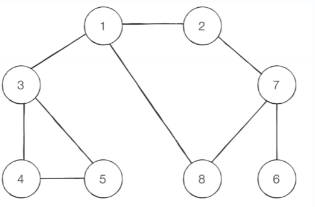

- [Step 1] 시작 노드인 '1'을 스택에 삽입하고 방문 처리를 한다.
- 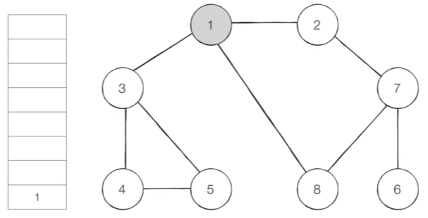

- [Step 2] 스택의 최상단 노드인 '1'에 방문하지 않은 인접 노드 '2','3','8'이 있다.
  - 이 중에서 가장 작은 노드인 '2'를 스택에 넣고 방문 처리를 한다. 
- 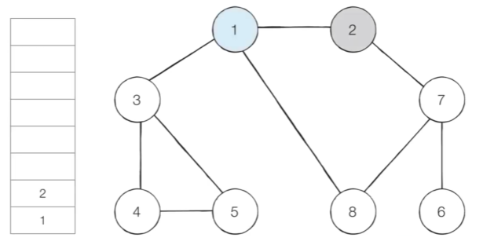

- [Step 3] 스택의 최상단 노드인 '2'에 방문하지 않은 인접 노드 '7'이 있다.
  - 따라서 '7'을 스택에 넣고 방문 처리를 한다. 
- 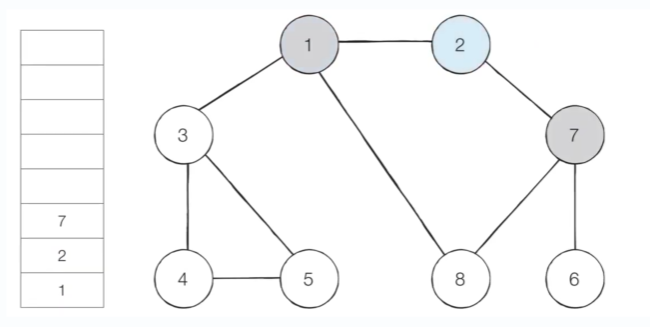

- [Step 4] 스택의 최상단 노드인 '7'에 방문하지 않은 인접 노드 '6','8'이 있다.
  - 이 중에서 가장 작은 노드인 '6'을 스택에 넣고 방문 처리를 한다. 
- 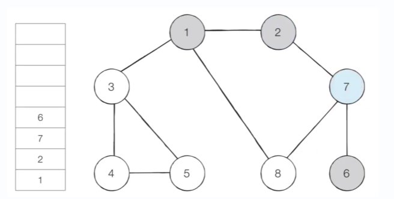

- [Step 5] 스택의 최상단 노드인 '6'에 방문하지 않은 인접 노드가 없다.
  - 따라서 스택에서 '6'을 꺼낸다.
- 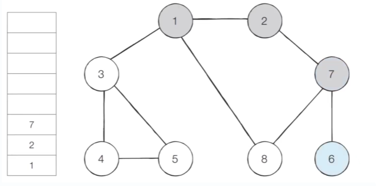

- [Step 5] 스택의 최상단 노드인 '7'에 방문하지 않은 인접 노드 '8'이 있다.
  - 따라서 '8'을 스택에 넣고 방문 처리를 한다. 
- 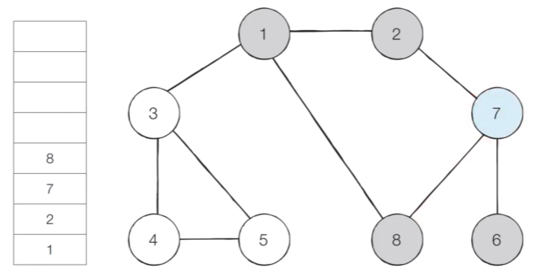

- 이러한 과정을 반복하였을 때 전체 노드의 탐색 순서(스택에 들어간 순서)는 다음과 같다.

    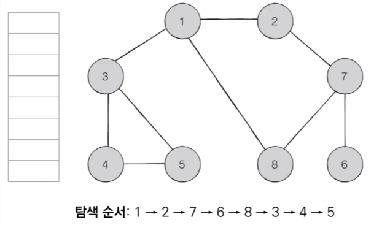

### DFS 소스코드 예제
- 파이썬에서는 그래프를 표현하기 위해 2차원 리스트를 사용할 수 있다.
  ```
  graph = [
      [],
      [2, 3, 8],
      [1, 7],
      [1, 4, 5],
      [3, 5],
      [3, 4],
      [7],
      [2, 6, 8],
      [1, 7]
  ]

  # 각 노드의 방문 정보를 기록할 1차원 리스트 선언 및 초기화
  # 사용하지 않는 인덱스 0을 고려해 8이 아닌 9로 크기를 설정
  visited = [Fales] * 9
  ```
  - 노드의 번호가 1번부터 시작하는 경우가 많기 때문에 인덱스 0에 대한 내용은 비워두고 인덱스 1부터 1번 노드에 인접한 노드 정보를 담아준다.
  ```
  def dfs(graph, v, visited):
      # 현재 노드를 방문 처리
      visited[v] = True              
      print(v, end=' ')

      # 현재 노드와 연결된 다른 노드를 재귀적으로 방문
      for i in graph[v]:             
          if not visited[i]:         # 현재 노드 인접 노드 중 방문 x 인 경우 
              dfs(graph, i, visited) # 해당 노드에 대한 dfs 함수 호출해 방문 처리
  
  # 정의된 DFS 함수 호출
  dfs(graph, 1, visited)
  ```
  ```
  1 2 7 6 8 3 4 5
  ```
## BFS(Breadgh-First Search)
- BFS는 너비 우선 탐색이라고 불리며, 그래프에서 **가까운 노드부터 우선적으로 탐색하는 알고리즘** 이다.

- BFS는 **큐(queue) 자료구조**를 이용하며, 구체적인 동작 과정은 다음과 같다.
  - 탐색 시작 노드를 큐에 삽입하고 방문 처리를 한다.
  - 큐에서 노드를 꺼낸 뒤에 해당 노드의 인접 노드 중에서 방문하지 않은 노드를 모두 큐에 삽입하고 방문 처리를 한다.
  - 위 과정을 수행할 수 없을 때까지 반복한다.
- BFS는 **특정 조건에서의 최단 경로 문제**를 해결하기 위한 목적으로도 효과적으로 사용될 수 있다.
  - 각 간선의 비용이 모두 동일한 상황에서 최단 거리 문제를 해결하기 위한 목적으로 사용될 수 있다.

### BFS 동작 예시
- [Step 0] 방향이 없는 무방향 그래프를 준비한다.
  - BFS는 DFS와 마찬가지로 인접 노드가 여러 개인 경우 어떤 노드부터 방문할지 기준이 필요하다.
  - 방문 기준: 번호가 낮은 인접 노드부터
  - 시작 노드: 1
- 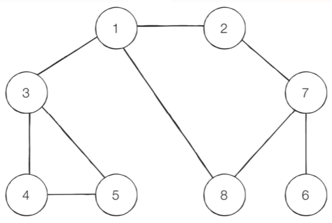

- [Step 1] 시작 노드인 '1'을 큐에 삽입하고 방문 처리를 한다.
  - 원소는 위에서 들어와 아래로 나간다고 가정
- 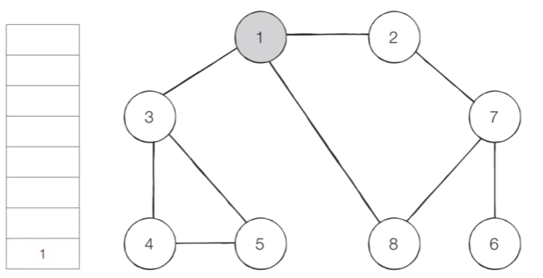

- [Step 2] 큐에서 노드 '1'을 꺼내고 방문하지 않은 인접 노드 '2','3','8'을 큐에 삽입하고 방문 처리한다.
- 작은 노드부터 들어가므로 노드 '2'부터 넣는다.
- 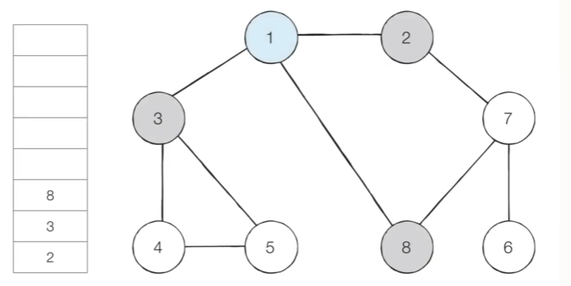

- [Step 3] 큐에서 노드 '2'를 꺼내고 방문하지 않은 인접한 노드 '7'을 큐에 삽입하고 방문 처리한다.
- 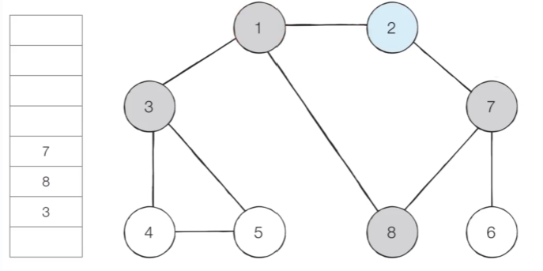

- [Step 4] 큐에서 노드 '3'을 꺼내고 방문하지 않은 인접한 노드 '4','5'를 큐에 삽입하고 방문 처리한다.
- 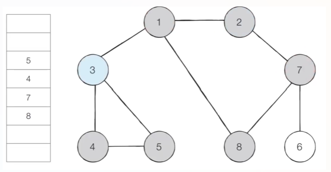

- [Step 5] 큐에서 노드 '8'을 꺼내고 방문하지 않은 인접 노드가 없으므로 무시한다.
- 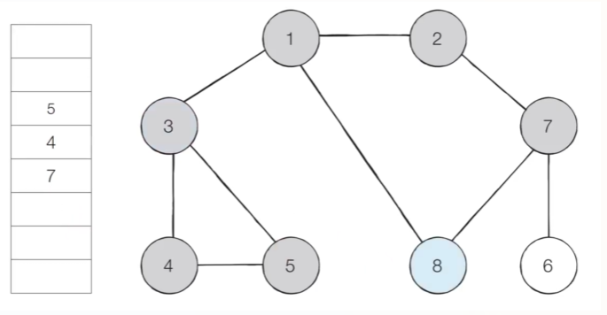

- 이러한 과정을 반복하여 전체 노드의 탐색 순서(큐에 들어간 순서)는 다음과 같다.
- 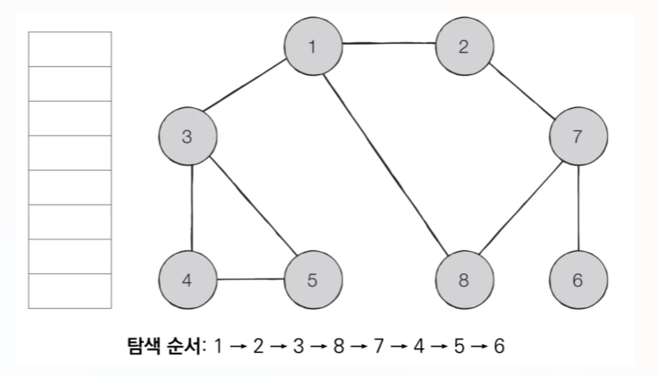

### BFS 소스코드 예제
  ```
  from collections import deque

  # 각 노드가 연결된 정보를 표현. 단, 인덱스 0은 사용 x
  graph = [
      [],
      [2, 3, 8],
      [1, 7],
      [1, 4, 5],
      [3, 5],
      [3, 4],
      [7],
      [2, 6, 8],
      [1, 7]
  ]

  # 각 노드의 방문 정보를 기록할 1차원 리스트 선언 및 초기화
  # 사용하지 않는 인덱스 0을 고려해 8이 아닌 9로 크기를 설정
  visited = [Fales] * 9

  # BFS 함수 정의
  def bfs(graph, start, visited):
    # 큐(queue) 구현을 위해 deque 객체 선언
    queue = deque([start])

    # 현재 노드를 방문 처리
    visited[start] = True

    # 큐가 빌 때까지 반복
    while queue:
      #큐에서 하나의 원소를 뽑아 출력하기
      v = queue.popleft()
      print(v, end=' ')

      # 아직 방문하지 않은 인접한 노드들을 큐에 삽입 후 방문 처리
      for i in graph[v]:
        if not visited[i]:
          queue.append(i)
          visited[i] = True
  ```
  ```
  1 2 3 8 7 4 5 6
  ```
