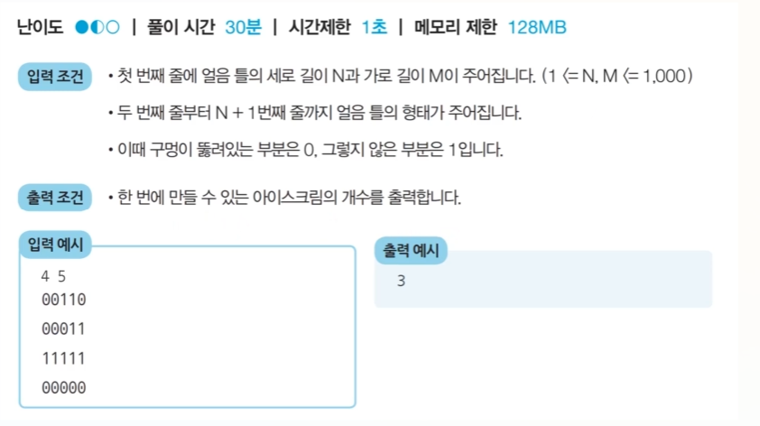
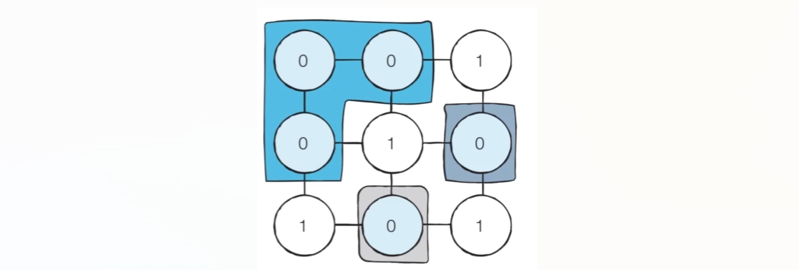
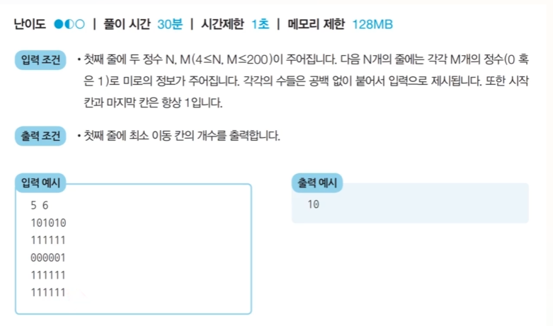
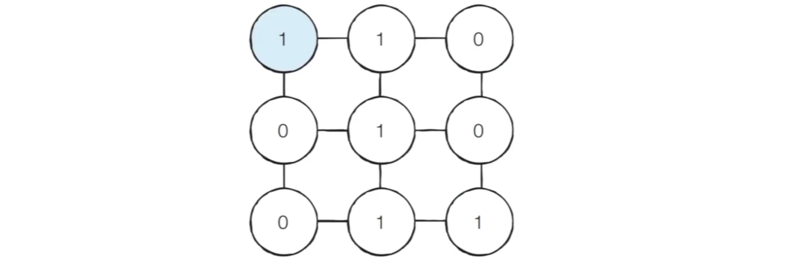
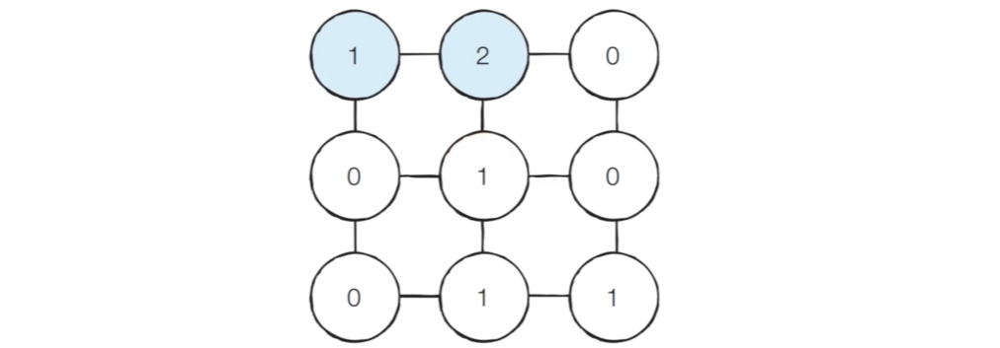
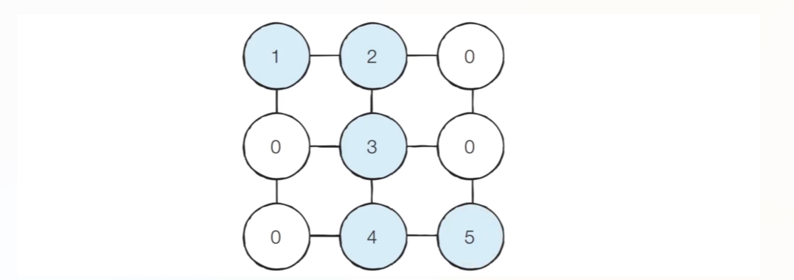

# 그래프 탐색 알고리즘: DFS/BFS
- 탐색(search)이란 많은 양의 데이터 중에서 **원하는 데이터를 찾는 과정**을 말한다.
- 대표적인 그래프 탐색 알고리즘으로는 DFS와 BFS가 있다.
- `DFS와 BFS는 코딩 테스트에서 매우 자주 등장하는 유형`이므로 반드시 숙지가 필요하다.
- [DFS/BFS를 위한 기본 자료구조](https://github.com/lgb201020/TIL/blob/main/algorithm/data_structure_for_DFS_BFS.md)

## DFS(Depth-First Search)
- DFS는 깊이 우선 탐색이라고 불리며 그래프에서 깊은 부분을 우선적으로 탐색하는 알고리즘이다.

- 즉 한 방향으로 최대한 깊이 들어간 후 더 들어갈 수 없다면 되돌아와 다른 방향으로 깊이 들어간다.

- DFS는 **스택 자료구조(혹은 재귀 함수)를 이용**하며, 구체적인 동작 과정은 다음과 같다.
  
  - 탐색 시작 노드를 스택에 삽입라고 방문 처리를 한다.
  - 스택의 최상단 노드에 방문하지 않은 인접한 노드가 하나라도 있으면 그 노드를 스택에 넣고 방문 처리를 한다.
  - 스택의 최상단 노드에 방문하지 않은 노드가 없으면 스택에서 최상단 노드를 꺼낸다.
  - 더 이상 위 두 과정을 수행 할 수 없을 때까지 반복한다.

### DFS 동작 예시
- [Step 0] 방향이 없는 무방향 그래프를 준비한다.
  - DFS는 인접 노드가 여러 개인 경우 어떤 노드부터 방문할지 기준이 필요하다.
  - 방문 기준: 번호가 낮은 인접 노드부터
  - 시작 노드: 1

- 

- [Step 1] 시작 노드인 '1'을 스택에 삽입하고 방문 처리를 한다.
- 

- [Step 2] 스택의 최상단 노드인 '1'에 방문하지 않은 인접 노드 '2','3','8'이 있다.
  - 이 중에서 가장 작은 노드인 '2'를 스택에 넣고 방문 처리를 한다. 
- 

- [Step 3] 스택의 최상단 노드인 '2'에 방문하지 않은 인접 노드 '7'이 있다.
  - 따라서 '7'을 스택에 넣고 방문 처리를 한다. 
- 

- [Step 4] 스택의 최상단 노드인 '7'에 방문하지 않은 인접 노드 '6','8'이 있다.
  - 이 중에서 가장 작은 노드인 '6'을 스택에 넣고 방문 처리를 한다. 
- 

- [Step 5] 스택의 최상단 노드인 '6'에 방문하지 않은 인접 노드가 없다.
  - 따라서 스택에서 '6'을 꺼낸다.
- 

- [Step 5] 스택의 최상단 노드인 '7'에 방문하지 않은 인접 노드 '8'이 있다.
  - 따라서 '8'을 스택에 넣고 방문 처리를 한다. 
- 

- 이러한 과정을 반복하였을 때 전체 노드의 탐색 순서(스택에 들어간 순서)는 다음과 같다.

    

### DFS 소스코드 예제
- 파이썬에서는 그래프를 표현하기 위해 2차원 리스트를 사용할 수 있다.
  ```
  graph = [
      [],
      [2, 3, 8],
      [1, 7],
      [1, 4, 5],
      [3, 5],
      [3, 4],
      [7],
      [2, 6, 8],
      [1, 7]
  ]

  # 각 노드의 방문 정보를 기록할 1차원 리스트 선언 및 초기화
  # 사용하지 않는 인덱스 0을 고려해 8이 아닌 9로 크기를 설정
  visited = [Fales] * 9
  ```
  - 노드의 번호가 1번부터 시작하는 경우가 많기 때문에 인덱스 0에 대한 내용은 비워두고 인덱스 1부터 1번 노드에 인접한 노드 정보를 담아준다.
  ```
  def dfs(graph, v, visited):
      # 현재 노드를 방문 처리
      visited[v] = True              
      print(v, end=' ')

      # 현재 노드와 연결된 다른 노드를 재귀적으로 방문
      for i in graph[v]:             
          if not visited[i]:         # 현재 노드 인접 노드 중 방문 x 인 경우 
              dfs(graph, i, visited) # 해당 노드에 대한 dfs 함수 호출해 방문 처리
  
  # 정의된 DFS 함수 호출
  dfs(graph, 1, visited)
  ```
  ```
  1 2 7 6 8 3 4 5
  ```
## BFS(Breadgh-First Search)
- BFS는 너비 우선 탐색이라고 불리며, 그래프에서 **가까운 노드부터 우선적으로 탐색하는 알고리즘** 이다.

- BFS는 **큐(queue) 자료구조**를 이용하며, 구체적인 동작 과정은 다음과 같다.
  - 탐색 시작 노드를 큐에 삽입하고 방문 처리를 한다.
  - 큐에서 노드를 꺼낸 뒤에 해당 노드의 인접 노드 중에서 방문하지 않은 노드를 모두 큐에 삽입하고 방문 처리를 한다.
  - 위 과정을 수행할 수 없을 때까지 반복한다.
- BFS는 **특정 조건에서의 최단 경로 문제**를 해결하기 위한 목적으로도 효과적으로 사용될 수 있다.
  - 각 간선의 비용이 모두 동일한 상황에서 최단 거리 문제를 해결하기 위한 목적으로 사용될 수 있다.

### BFS 동작 예시
- [Step 0] 방향이 없는 무방향 그래프를 준비한다.
  - BFS는 DFS와 마찬가지로 인접 노드가 여러 개인 경우 어떤 노드부터 방문할지 기준이 필요하다.
  - 방문 기준: 번호가 낮은 인접 노드부터
  - 시작 노드: 1
- 

- [Step 1] 시작 노드인 '1'을 큐에 삽입하고 방문 처리를 한다.
  - 원소는 위에서 들어와 아래로 나간다고 가정
- 

- [Step 2] 큐에서 노드 '1'을 꺼내고 방문하지 않은 인접 노드 '2','3','8'을 큐에 삽입하고 방문 처리한다.
- 작은 노드부터 들어가므로 노드 '2'부터 넣는다.
- 

- [Step 3] 큐에서 노드 '2'를 꺼내고 방문하지 않은 인접한 노드 '7'을 큐에 삽입하고 방문 처리한다.
- 

- [Step 4] 큐에서 노드 '3'을 꺼내고 방문하지 않은 인접한 노드 '4','5'를 큐에 삽입하고 방문 처리한다.
- 

- [Step 5] 큐에서 노드 '8'을 꺼내고 방문하지 않은 인접 노드가 없으므로 무시한다.
- 

- 이러한 과정을 반복하여 전체 노드의 탐색 순서(큐에 들어간 순서)는 다음과 같다.
- 

### BFS 소스코드 예제
  ```
  from collections import deque

  # 각 노드가 연결된 정보를 표현. 단, 인덱스 0은 사용 x
  graph = [
      [],
      [2, 3, 8],
      [1, 7],
      [1, 4, 5],
      [3, 5],
      [3, 4],
      [7],
      [2, 6, 8],
      [1, 7]
  ]

  # 각 노드의 방문 정보를 기록할 1차원 리스트 선언 및 초기화
  # 사용하지 않는 인덱스 0을 고려해 8이 아닌 9로 크기를 설정
  visited = [Fales] * 9

  # BFS 함수 정의
  def bfs(graph, start, visited):
    # 큐(queue) 구현을 위해 deque 객체 선언
    queue = deque([start])

    # 현재 노드를 방문 처리
    visited[start] = True

    # 큐가 빌 때까지 반복
    while queue:
      #큐에서 하나의 원소를 뽑아 출력하기
      v = queue.popleft()
      print(v, end=' ')

      # 아직 방문하지 않은 인접한 노드들을 큐에 삽입 후 방문 처리
      for i in graph[v]:
        if not visited[i]:
          queue.append(i)
          visited[i] = True
  ```
  ```
  1 2 3 8 7 4 5 6
  ```
## <문제> 음료수 얼려먹기
### 문제 설명
- N x M 크기의 얼음 틀이 있다. 구멍이 뚫려 있는 부분은 0, 칸막이가 존재하는 부분은 1로 표시된다. 구멍이 뚫려있는 부분끼리 상, 하, 좌, 우로 붙어 있는 경우 서로 연결되어 있는 것으로 간주된다. 이때 얼음 클의 모양이 주어졋을 때, 생성되는 총 아이스크림의 개수를 구하는 프로그램을 작성하시오. 다음 4 x 5 얼음 틀 예시에서는 아이스크림이 총 3개 생성된다.

### 문제 조건


### 문제 풀이 아이디어
- 이 문제는 DFS 혹은 BFS로 해결할 수 있다. 
- 일단 앞에서 배운 대로 얼음을 얼릴 수 있는 공간이 상, 하, 좌, 우로 연결되어 있다고 표현할 수 있으므로 그래프 형태로 모델링 할 수 있다. 
- 다음과 같이 3 x 3 크기의 얼음 틀이 있다고 가정하자.


- 해당 문제를 DFS로 풀면 다음과 같다.
  - 특정 지점의 주변 상, 하, 좌, 우를 살펴본 뒤에 주변 지점 중에서 값이 '0'이면서 아직 방문하지 않은 지점이 있다면 해당 지점을 방문한다.
  - 방문 지점에서 다시 상, 하, 좌, 우를 살펴보면서 방문을 진행하는 과정을 반복하면, 연결된 모든 지점을 방문할 수 있다.
  - 모든 노드에 대해 위 두 과정을 반복하며, 방문하지 않은 지점의 수를 카운트한다.


### 문제 풀이

    ```
    n, m = map(int, input().split())

    # 2차원 리스트의 맵 정보 입력
    graph = []
    for i in range(n):
      graph.append(list(map(int, input())))

    # DFS로 특정 노드를 방문하고 연결된 모든 노드들도 방문
    def dfs(x,y):
      # 주어진 범위(n x m)을 벗어날 경우 즉시 종료
      if x<0 or x>=n or y<0 or y>=m:
        return False
      
      # 현재 노드를 아직 방문하지 않았다면
      if graph[x][y] == 0:
        # 현재 노드 방문 처리
        graph[x][y] = 1 

        # 인접 노드들 방문 처리만 하는 목적이므로 아래 재귀적으로 호출한 함수의 반환이 뭐든 상관 없음.
        dfs(x-1,y)
        dfs(x+1,y)
        dfs(x,y-1)
        dfs(x,y+1)
        return True
      return False

    result = 0
    for i in range(n):
      for j in range(m):
        # 현재 위치에서 DFS 수행
        if dfs(i,j) == True:
          # 시작 위치에서 DFS가 수행 가능하며 수행이 완료되면 result에 +1을 함(시작 노드에 대한 dfs 함수 T/F만 필요)
          result += 1

    print(result)
    ```
- dfs 시작 노드가 0인 경우 1로 바꾸고 주변 노드에 대한 dfs 호출하고 True를 반환
- dfs 시작 노드가 1이거나 범위를 넘어서면 False를 반환
- 즉 새로운 덩어리를 발견한 시점에만 result += 1을 하고 해당 노드와 연결된 모든 노드를 방문처리 한다. 
- 해당 문제는 DFS를 활용해 네트워크의 개수를 세는 문제 유형이다.

## <문제> 미로 탈출
### 문제 설명
- A는 N x M 크기 직사각형 형태의 미로에 갇혀있다. 미로에는 여러 마리의 괴물이 있어 이를 피해 탈출해야 한다.
- A의 위치는 (1,1)이며 미로의 출구는 (N,M)의 위치에 존재하며 한 번에 한 칸씩 이동할 수 있다. 
- 이때 괴물이 있는 부분은 0으로 괴물이 있는 부분은 1로 표시되어 있다. 
- 미로는 반드시 탈출할 수 있는 형태로 제시된다.
- 이때 A가 탈출하기 위해 움직여야 하는 최소 칸의 개수를 구하라. 칸을 셀 때는 시작 칸과 마지막 칸을 모두 포함해서 계산한다.

### 문제 조건


### 문제 해결 아이디어
- BFS는 시작 지점에서 가까운 노드부터 차례대로 그래프의 모든 노드를 탐색한다.
- 상, 하, 좌, 우로 연결된 모든 노드로의 거리가 1로 동일하다.
  - 따라서 (1,1)지점부터 BFS를 수행하여 모든 노드의 최단 거리 값을 기록하면 해결할 수 있다.

- 예시로 다음과 같이 3 x 3 크기의 미로가 있다고 가하자.


- [Step 1] 처음에 (1,1)의 위치에서 시작한다.


- [Step 2] (1,1)좌표에서 상, 하, 좌, 우로 탐색을 진행하면 바로 옆 노드인 (1,2) 위치의 노드를 방문하게 되고 새롭게 방문하는 (1,2) 노드의 값을 2(시작 노드에서 해당 노드까지의 거리)로 바꾸게 된다.


- [Step 3] 마찬가지로 BFS를 계속 수행하면 결과적으로 다음과 같이 시작 노드에서부터 해당 노드까지의 최단 경로 값들이 1씩 증가하는 형태로 변경되어 노드 값으로 저장된다.


### 문제 풀이

```
from collections import deque

# N, M을 공백을 기준으로 구분하여 입력
n,m = map(int, input().split())

# 2차원 리스트의 맵 정보 입력
graph = []
for i in range(n):
  graph.append(list(map(int, input())))

# 이동할 네 가지 방향 정의(상, 하, 좌, 우)
dx = [-1,1,0,0]
dy = [0,0,-1,1]

# BFS 소스코드 구현
def dfs(x,y,graph):
  # 큐 구현을 위해 deque 객체 선언
  queue = deque()
  # 처음 위치(시작 위치) 큐에 넣음
  queue.append((x,y))
  
  # 큐가 빌 떄까지 반복
  while queue:
    x, y = queue.popleft()
    
    # 현재 위치에서 4가지 방향으로 확인
    for i in range(4):
      nx = x + dx[i]
      ny = y + dy[i]
      # 미로 공간을 벗어난 경우 무시
      if nx<0 or nx>=n or ny<0 or ny>=m:
        continue
      # 벽인 경우 무시
      if graph[nx][ny] == 0:
        continue
      # 해당 노드를 처음 방문하는 경우에만 해당 노드까지의 거리를 노드 값으로 선언해 방문 처리
      if graph[nx][ny] == 1:
        graph[nx][ny] = graph[x][y] + 1
        queue.append((nx,ny))

  return graph[n-1][m-1]

print(bfs(0,0,graph))    
```
- 나는 n-1,m-1로 가는 경로만 생각했다. 그러나 BFS는 그게 아니라 시작점에서 갈 수 있는 모든 노드까지의 최단 거리를 한 번에 계산하는 것이다.
- ***즉 최단 거리 문제는 BFS로 시작 노드로부터 모든 노드에 대한 최단 거리를 계산하고 그 중에서 목적 노드까지의 거리를 인덱스로 출력하면 되는 것이다.***