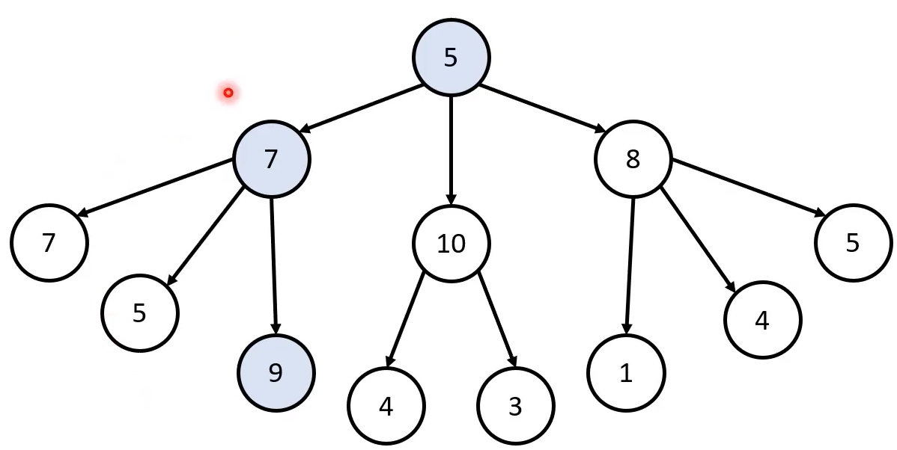
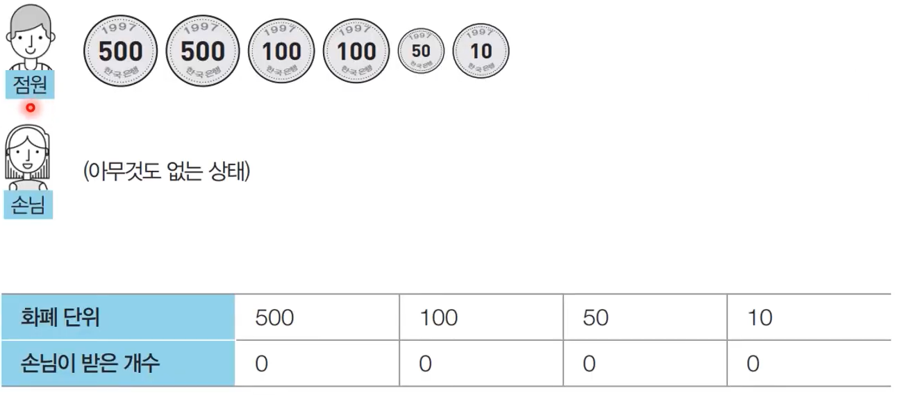
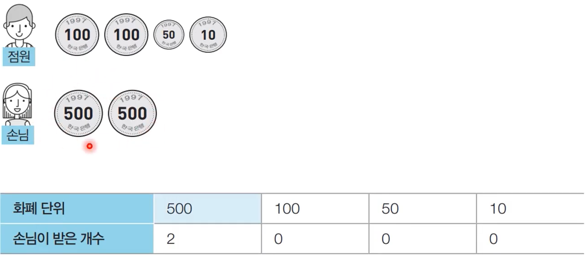
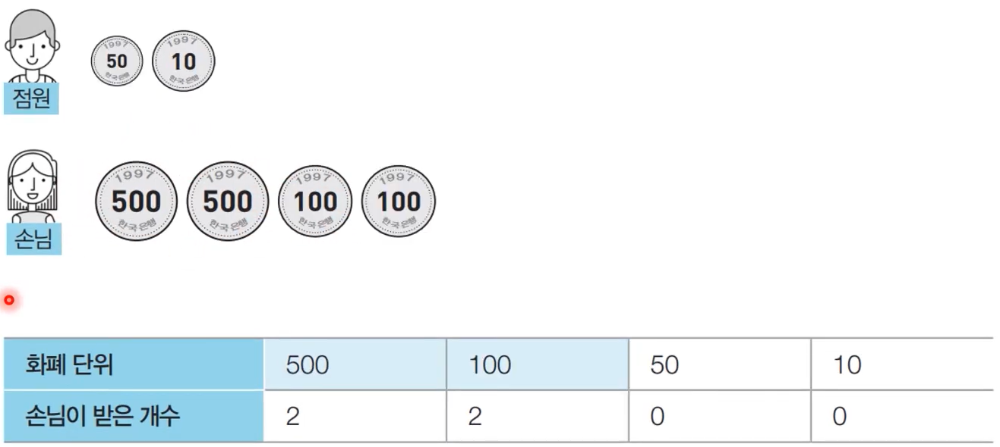
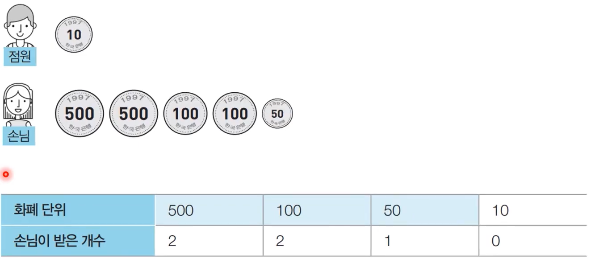
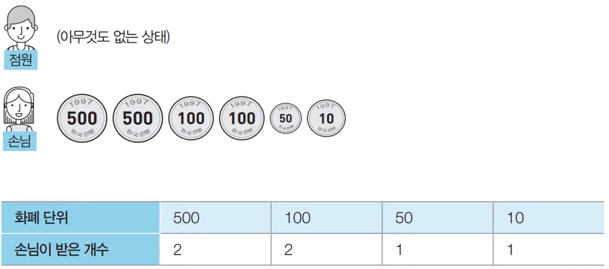
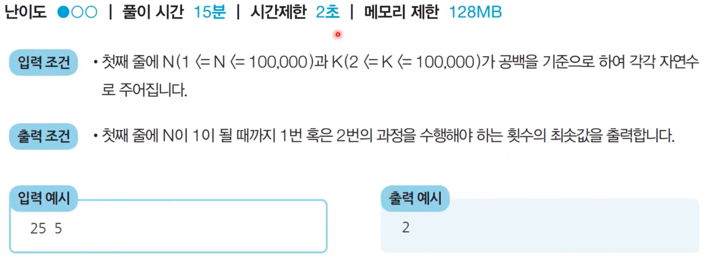
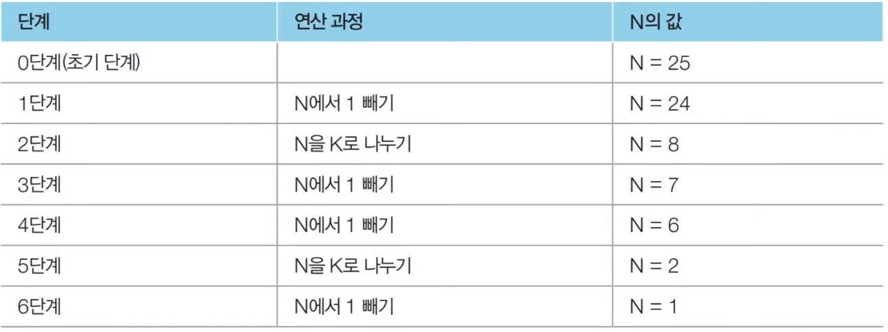
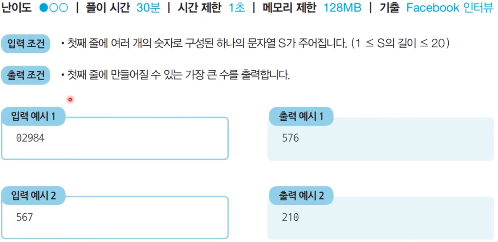
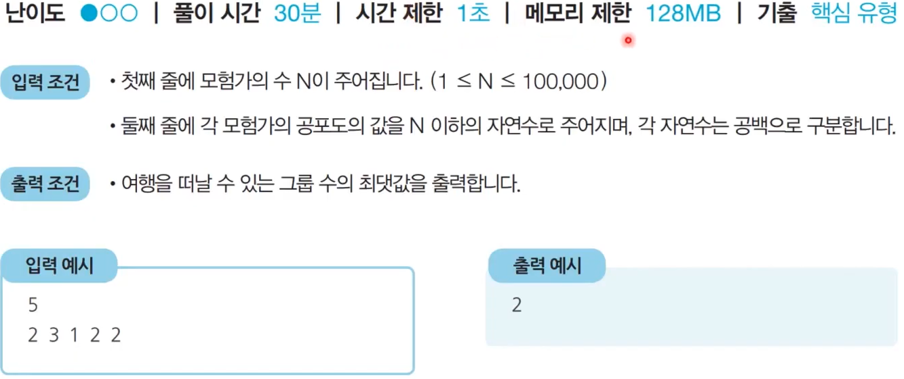

# 그리디 알고리즘
- 그리디 알고리즘은 현재 상황에서 지금 당장 좋은 것만 고르는 방법을 의미한다.
- 일반적인 그리디 알고리즘은 문제를 풀기 위한 최소한의 아이디어를 떠올릴 수 있는 능력을 요구한다.
- 그리디 해법은 그 정당성 분석이 중요하다.
  - 단순히 가장 좋아 보이는 것을 반복적으로 선택해도 최적의 해를 구할 수 있는지 검토한다.
## 그리디 알고리즘 - 문제 상황
- 루트 노드부터 시작하여 거쳐 가는 노드 값의 합을 최대로 만들고 싶을 때
  - Q. 최적의 해는 무엇인가?
  
    
  
  - Q. 단순히 매 상황에서 가장 큰 값만 고른다면 어떻게 될까? (이게 그리드 알고리즘)

    

    - 이러한 경우 전체 값을 고려해서 노드를 선택하는 것이 아니라 단순히 매 상황에서 가장 큰 값의 노드를 선택하는 것으로 최적의 해인 21보다는 낮은 값을 결과로 갖게 된다.
  - ***그리드 알고리즘은 매 순간 가장 큰 값을 기준으로 선택하는 것이 아니라 매 단계에서 지금 선택이 전체 최적해로 이어진다고 증명된 규칙에 따라 선택하는 알고리즘이다.***
  - 일반적인 상황에서 그리디 알고리즘은 최적의 해를 보장할 수 없을 때가 많다.
  - 코딩 테스트에서 대부분의 그리디 문제는 **탐욕법으로 얻은 해가 최적의 해가 되는 상황에서, 이를 추론할 수 있어야 풀리도록 출제된다.** 

## <문제> 거스름돈
### 문제 설명
- 당신은 음식점의 계산을 도와주는 점원입니다. 카운터에는 거스름돈으로 사용할 500원, 100원, 50원, 10원짜리 동전이 무한히 존재한다고 가정합니다. 손님에게 거슬러 주어야 할 돈이 N원일 때, 거슬러 줘야 할 동전의 최소 개수를 구하세요. 단, 거슬러 줘야 할 돈은 항상 10의 배수입니다.

### 문제 해결 아이디어
- 최적의 해를 빠르게 구하기 위해서는 **가장 큰 화폐 단위부터** 돈을 거슬러 주면 된다.
- N원을 거슬러 줘야 할 때, 가장 먼저 500원으로 거슬러 줄 수 있을 만큼 거슬러 준다.
  - 이후 100원, 50원, 10원짜리 동전을 차례대로 거슬러 줄 수 있을 만큼 거슬러 주면 된다.

- N = 1260일 때의 예시를 살펴보면 다음과 같다.
  - [Step 0] 초기 단계 - 남은 돈: 1,260원

    

  - [Step 1] 남은 돈: 260원

    

  - [Step 2] 남은 돈: 60원

    

  - [Step 3] 남은 돈: 10원

    

  - [Step 4] 남은 돈: 0원

    

### 정당성 분석
- 가장 큰 화폐 단위부터 돈을 거슬러 주는 것이 최적의 해를 보장하는 이유는 가지고 있는 동전 중에서 **가장 큰 단위가 항상 작은 단위의 배수이므로 작은 단위의 동전들을 종합해 다른 해가 나올 수 없기 때문이다.** 다시 말해 큰 단위가 작은 단위의 배수가 아니라면 그리디 알고리즘으로 최적의 해를 구할 수 없다.
- 그리디 알고리즘 문제에서는 이처럼 문제 풀이를 위한 최소한의 아이디어를 떠올리고 이것이 정당한지 검토할 수 있어야 한다.

### 답안 예시(python)
```
n = 1260
count = 0

array = [500, 100, 50, 10]

for coin in array:
    count += n//coin
    n %= coin

print(count)
```

### 시간 복잡도 분석
- 화폐의 종류가 K라고 할 때, 소스코드의 시간 복잡도는 $O(k)$이다.
- 위 문제에서 알고리즘의 시간 복잡도는 거슬러줘야 하는 금액과 무관하며, 동전의 전체 종류에만 영향을 받는다.

## <문제> 1이 될 때까지
### 문제 설명
- 어떤 수 N이 1이 될 때까지 다음의 두 과정 중 하나를 반복적으로 선택하여 수행한다. 단 두 번째 연산은 N이 K로 나누어 떨어질 때만 선택할 수 있다.
  
  1. N에서 1을 뺀다.
  2. N을 K로 나눈다.
   
- 예를 들어 N이 17, K가 4라고 가정하자. 이때 1번의 과정을 한 번 수행하면 N은 16이 된다. 이후 2번의 과정을 두 번 수행하면 N은 1이 된다. 결과적으로 이 경우 전체 과정을 실행한 횟수는 3이 된다. 이는 N을 1로 만드는 최소 횟수이다.
- N과 K가 주어질 때 N이 1이 될 때까지 1번 혹은 2번의 과정을 수행해야 하는 최소 횟수를 구하는 프로그램을 작성하라.

### 문제 조건


### 문제 해결 아이디어 
- 주어진 N에 대하여 **최대한 많이 나누기**를 수행하면 된다.
- N의 값을 줄일 때 **2 이상의 수로 나누는 작업이 1을 빼는 작업보다** 수를 훨씬 많이 줄일 수 있다.
- 예를 들어 N = 25, K = 3일 때 작업은 다음과 같다.


### 아이디어 정당성 분석
- N이 아무리 큰 수여도, K로 나눈다면 기하급수적으로 빠르게 줄일 수 있다.
- 즉 K가 2 이상이기만 하면, K로 나누는 것이 1을 빼는 것보다 항상 빠르게 N을 줄일 수 있고 N은 항상 1에 도달하게 된다.(최적의 해 성립)

### 답안 예시(python)

```
n, k = map(int, input().split())
result = 0

while True:
    # N을 K로 나누어 떨어지는 수가 될 때까지 빼기
    target = (n//k)*k
    result += (n-target)
    n=target

    # N이 K보다 작을 때 (더 이상 나눌 수 없을 때) 반복문 탈출
    if n<k:
        break

    # K로 나누기
    result += 1
    n //= k 

# 마지막으로 남은 수에 대하여 1씩 빼기
result += (n-1)
print(result)
```
### 시간 복잡도 분석
- 위 반복문이 1회 반복이 될 때마다 1번과 2번 과정을 모두 할 수 있고 반복 횟수에 따라서 N이 기하급수적으로 줄어들게 된다.
- 반복 루프마다 n을 확인해서 1번 혹은 2번 작업을 선택해서 할 수 있는 코드로도 쓸 수 있으나 그럴 경우 루프 1회당 각 작업 중 1개를 선택해서 해야하므로 이는 결국 복잡도를 늘리는 결과로 이어진다. 
- 위 코드의 시간 복잡도는 $O(logN)$이고 루프마다 n을 확인하는 코드의 경우 복잡도가 $O(N)$이다.

## <문제> 곱하기 혹은 더하기
### 문제 설명
- 각 자리가 숫자(0부터 9)로만 이루어진 문자열 S가 주어졌을 때, 왼쪽부터 오른쪽으로 하나씩 모든 숫자를 확인하며 숫자 사이에 'x' 혹은 '+' 연산자를 널어 결과적으로 만들어질 수 있는 가장 큰 수를 구하는 프로그램을 작성하시오. 단, +보다 x를 먼저 계산하는 일반적인 방식과는 달리, 모든 연산은 왼쪽에서부터 순서대로 이루어진다고 가정한다.
- 예를 들어 02984라는 문자열로 만들 수 있는 가장 큰 수는 ((((0+2)x9)x8)x4) = 576이다. 또한 만들어질 수 있는 가장 큰 수는 항상 20억 이하의 정수가 되도록 입력이 주어진다.
### 문제 조건


### 문제 해결 아이디어
- 대부분의 경우 + 보다 x가 더 값을 크게 만든다.
- 다만 두 수 중에서 하나라도 0 혹은 1인 경우 곱하기보다 더하기가 더 큰 값을 만든다.
- 따라서 두 수에 대하여 연산을 수행할 때, 두 수 중에서 하나라도 1 이하인 경우에는 더하기를, 두 수가 모두 2 이상인 경우에는 곱하기를 한다.
### 답안 예시(python)

```
S = input()
S_list = list(map(int, S))
temp = S_list[0]

for i in range(1,len(S_list)):
    num = S_list[i]
    # 두 수 중에서 하나라도 0 혹은 1인 경우, 곱하기보다는 더하기를 수행해야 값이 더 큼
    if num <= 1 or temp <=1:
        temp = temp + num
    else:
        temp = temp * num

result = temp
print(result)
```

## <문제> 모험가 길드
### 문제 설명
- 한 마을에 모험가가 N명 있다. 모험가 길드에서는 N명의 모험가를 대상으로 '공포도'를 측정했는데, '공포도'가 높은 모험가는 쉽게 공포를 느껴 위험 상황에서 제대로 대처할 능력이 떨어진다.
- 모험가 길드장인 A는 모험가 그룹을 안전하게 구성하고자 공포도가 x인 모험가는 반드시 x명 이상으로 구성한 모험가 그룹에 참여해야 여행을 떠날 수 있도록 규정했다.
- A는 최대 몇 개의 모험가 그룹을 만들 수 있는지 궁굼하다. N명의 모험가에 대한 정보가 주어졌을 때, 여행을 떠날 수 있는 그룹 수의 최댓값을 구하는 프로그램을 작성하시오.
- 예를 들어 N = 5이고, 각 모험가의 공포도가 각각 2, 3, 1, 2, 2라고 가정한다.
- 이 경우 그룹 1에 공포도가 1, 2, 3인 모험가를 한명씩 넣고 그룹 2에 공포도가 2인 남은 두 명을 넣게 되면 총 2개의 그룹을 만들 수 있다.
- 또한 몇 명의 모험가는 마을에 그대로 남아 있어도 되기 때문에, 모든 모험가를 특정한 그룹에 넣을 필요는 없다.

### 문제 조건


### 문제 해결 아이디어
- ***그룹을 최대한 많이 만드는 것이 목표이고 이는 다시 말해 그룹의 인원수를 최소로 최대한 적은 인원수로 그룹을 구성하도록 해야한다.***
- 길드원의 공포도를 오름차순 정렬 이후 공포도가 낮은 모험가부터 하나씩 확인한다.
- 앞에서부터 공포도를 하나씩 확인하며 현재 그룹에 포함된 모험가의 수가 현재 확인하고 있는 공포도보다 크거나 같다면 이를 그룹으로 설정한다.
- 이러한 방법을 이용하면 공포도가 오름차순으로 정렬되어 있다는 점에서, 항상 최소한의 모험가의 수만 포함하여 그룹을 결성하게 된다.

### 답안 예시(python)

```
n = int(input())
fear = list(map(int, input().split()))
fear.sort()

groups = 0            # 총 그룹 수
members = 0           # 현재 그룹에 포함된 인원 수

for x in fear:
    members += 1      # 현재 그룹에 공포도가 x인 모험가를 포함시키기
    if members >= x:  # 현재 그룹에 포함된 모험가의 수가 현재의 공포도 이상이라면 그룹 결성
        groups += 1   # 그룹이 결성 되었으므로 총 그룹 수 증가
        members = 0   # 다음 그룹 판단을 위해 그룹 모험가의 수 초기화

print(groups)
```