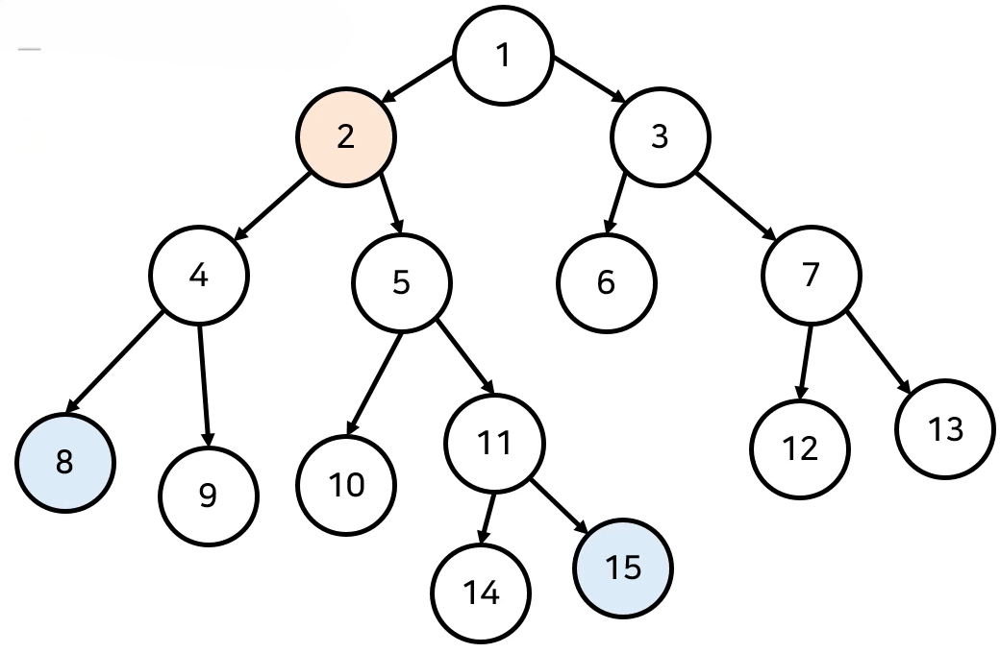
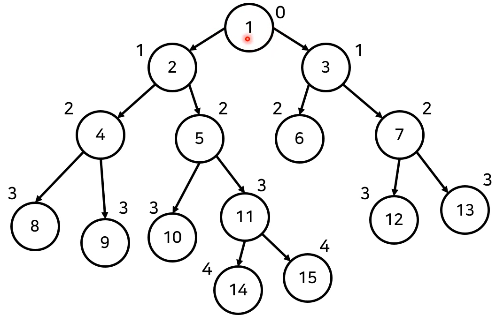
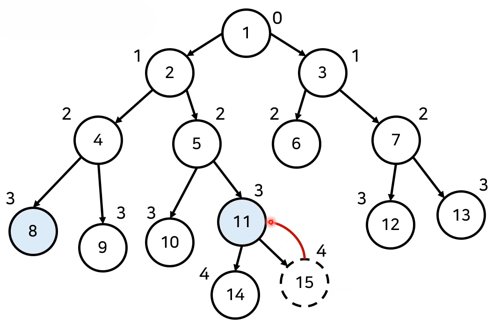
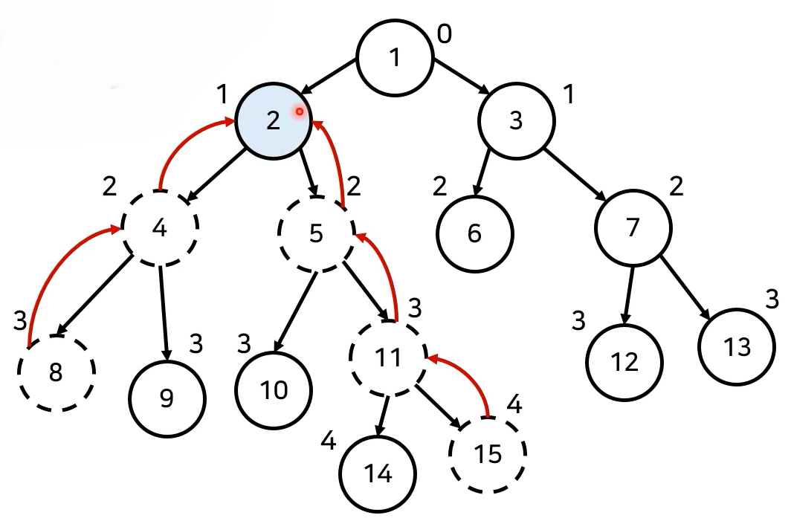
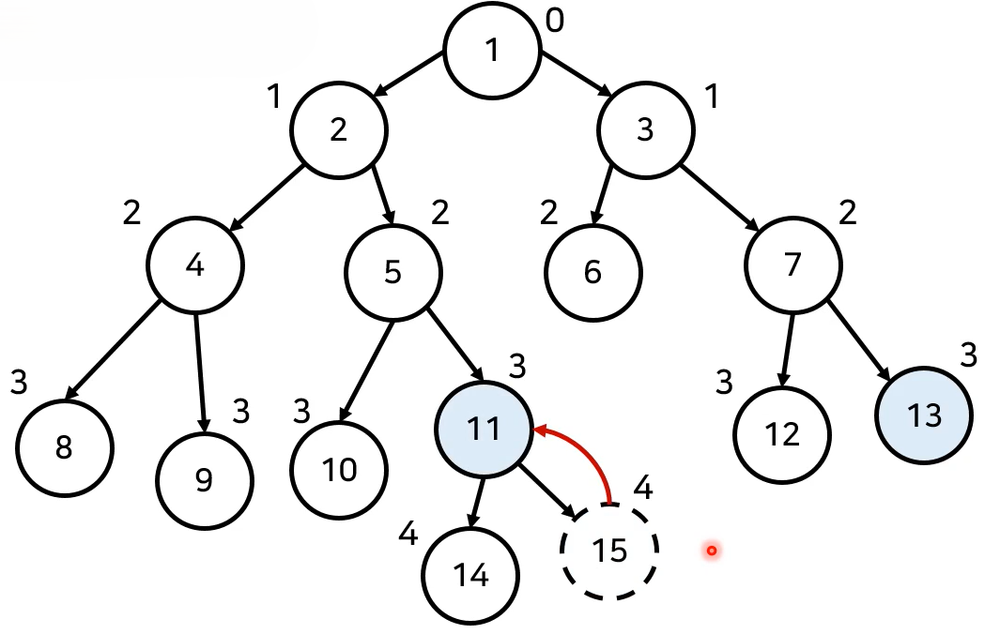
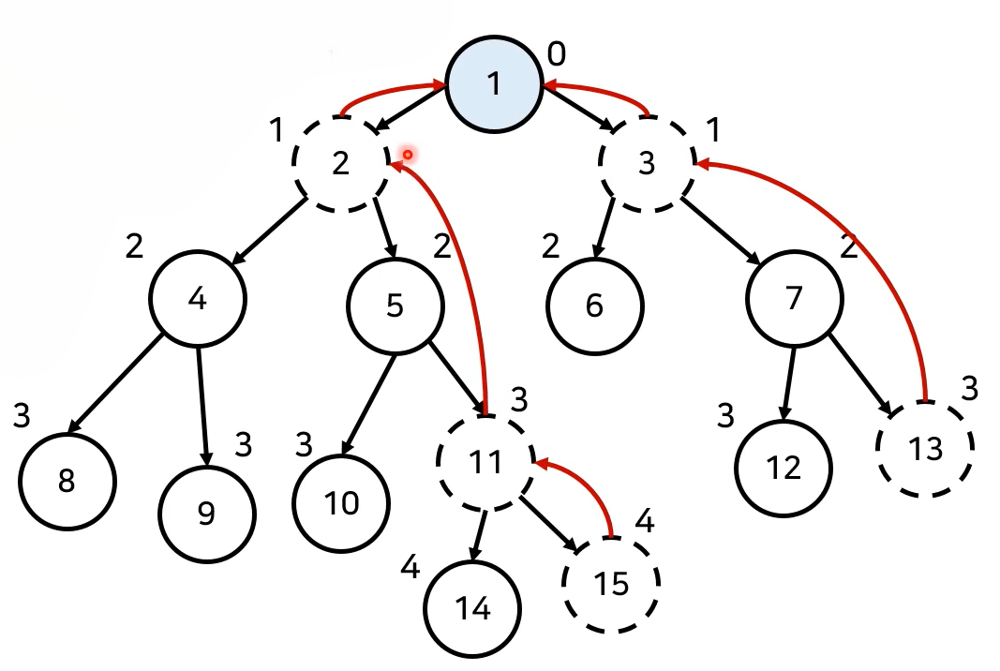

# 최소 공통 조상 LCA(Lowest Common Ancestor)
## 문제
- N(1 < N < 50,000)개의 정점으로 이루어진 트리가 주어진다. 트리의 각 정점은 1번부터 N번까지 번호가 매겨져 있으며, 루트는 1번이다. 두 노드의 쌍M(0 < M < 10,000)개가 주어졌을 때, 두 노드의 가장 가가운 공통 조상이 몇 번인지 출력하라.
- 시간 복잡도는 $O(NM)$을 넘어서는 안된다.

## 최소 공통 조상(Lowest_Common_Ancestor)
- 최소 공통 조상(LCA) 문제는 두 노드의 공통된 조상 중에서 가장 가까운 조상을 찾는 문제이다.
- 예를 들어 LCA(8번 노드, 15번 노드) -> 2번 노드가 출력되는 것이다.

    

### LCA 기본 동작
- 최소 공통 조상(LCA) 찾기 알고리즘은 다음과 같이 동작한다.
  1. DFS를 이용해 모든 노드에 대한 깊이(depth)를 계산한다.
  2. LCA를 찾을 두 노드를 확인한다.
     1. 먼저 두 노드의 깊이(depth)가 동일하도록 거슬러 올라간다.
     2. 이후 부모가 같아질 때까지 반복하여 두 노드의 부모 방향으로 거슬러 올라간다.
  3. 모든 LCA(a, b) 연산에 대하여 2번 과정을 반복한다.

### LCA 동작 과정
- [Step 0] DFS를 이용해 모든 노드에 대하여 깊이를 계산한다.

    

- [Step 1] LCA(8, 15)를 찾기 위해 먼저 두 노드의 깊이를 맞춘다.

    

- [Step 2] 이후 두 노드의 부모가 같아질 떄까지 두 노드의 부모 방향으로 거슬러 올라간다.

    

### LCA 알고리즘 구현
```
import sys
sys.setrecursionlimit(int(1e5)) # 런타임 오류를 피하기 위한 설정
n = int(input()) # 트리 노드의 개수

parent = [0]*(n+1) # 각 노드의 부모 노드 정보
d = [0]*(n+1) # 각 노드까지의 깊이
c = [0]*(n+1) # 각 노드의 깊이가 계산되었는지 여부
graph = [[] for _ in range(n+1)] # 그래프 정보(트리 정보)

for _ in range(n-1):
    a, b = map(int, input().split())
    graph[a].append(b)
    graph[b].append(a)

# 루트 노드부터 시작하여 깊이를 구하는 함수로 x는 루트 노드, depth는 0이 최초 호출
def dfs_depth(x, depth):
    c[x] = True
    d[x] = depth
    for y in graph[x]:
        # 이미 깊이 계산을 한 노드면 넘어가기
        if c[y]:
            continue
        parent[y] = x
        dfs(y, depth + 1)

# A와 B의 최소 공통 조상을 찾는 함수
def LCA(a, b):
    # 먼저 깊이가 같아질 때까지 반복
    while d[a] != d[b]:
        if d[a] > d[b]:
            a = parent[a]
        else:
            b = parent[b]
    # 노드가 같아질 때까지 거슬러 올라감
    while a != b:
        a = parent[a]
        b = parent[b]
    return a

dfs_depth(1,0) # 루트 노드는 1번 노드

m = int(input())

for i in range(m):
    a, b = map(int, input().split())
    print(LCA(a, b))

```

### LCA 알고리즘: 시간 복잡도 분석
- 매 쿼리마다 부모 방향으로 거슬러 올라가기 위해 최악의 경우 $O(N)의 시간 복잡도가 요구된다.
  - 따라서 모든 쿼리를 처리할 때의 시간 복잡도는 $O(NM)$이다.

## 개선된 LCA 알고리즘
- N과 M이 모두 최대 100,000개까지 가능하다는 조건이 있는 경우 $O(NM)$으로는 풀 수 시간 초과 판정이 난다.
- 각 노드가 거슬러 올라가는 속도를 빠르게 만들면 된다.
- 2의 제곰 형태로 거슬러 올라가도록 하면 시간 복잡도를 $O(logN)$을 보장할 수 있다.
- 메모리를 조금 더 사용하여 각 노드에 대하여 $2^i$번째 부모에 대한 정보를 기록한다고 하자. -> DP

### 개선된 LCA 알고리즘 동작 과정
- [Step 0] 모든 노드에 대하여 깊이를 계산하고 $2^i$번째 부모에 대한 정보를 별도의 테이블에 기록한다.
  - 이때 모든 노드에 대해서 $2^i$번째 부모에 대한 정보를 별도의 테이블에 기록한다.
  - 노드의 개수가 N개일 때 모두 NxlogN 만큼의 공간이 필요하다. 

    

- [Step 1] LCA(13, 15)를 구하기 위해 먼저 두 노드의 깊이를 맞춰준다.
  - 먼저 올라가야 하는 노드가 있다면 2의 제곱 꼴로 빠르게 올라갈 수 있도록 한다. 

    

- [Step 2] 이후 깊이가 동일해 졌으면 가능하면 2의 제곱 꼴로 거슬러 올라갈 수 있도록 한다.
  - 먼저 2의 제곱 꼴로 올라가 2만크 올라가고 이루 1만큼 올라가 LCA를 구한다.

    

### 개선된 LCA 알고리즘 구현
```
import sys
input = sys.stdin.readline
sys.setrecursionlimit(int(1e5)) # 런타임 오류를 피하기 위해 재귀 깊이 제한 설정
LOG = 21 # 2^20 = 1,000,000

n = int(input())
parent = [[0] * LOG for _ in range(n+1)] # 2의 제곰의 부모 노드 정보
d = [0]*(n+1) # 각 노드까지의 깊이
c = [0]*(n+1) # 각 노드의 깊이가 계산되었는지 여부
graph = [[] for _ in range(n+1)] # 그래프 정보(트리 정보)

for _ in range(n-1):
    a, b = map(int, input().split())
    graph[a].append(b)
    graph[b].append(a)

# 루트 노드부터 시작하여 깊이를 구하는 함수로 x는 루트 노드, depth는 0이 최초 호출
def dfs_depth(x, depth):
    c[x] = True
    d[x] = depth
    for y in graph[x]:
        # 이미 깊이 계산을 한 노드면 넘어가기
        if c[y]:
            continue
        parent[y][0] = x
        dfs(y, depth + 1)

# 전체 부모 관계를 설정
def set_parent():
    dfs(1,0)
    for i in range(1,LOG):
        for j in range(1, n+1):
            parent[j][i] = parent[parent[j][i-1]][i-1]

# A와 B의 LCA 찾기
def LCA(a, b):
    # 계산의 편의를 위해 항상 b가 a보다 더 깊은 노도가 되도록 함
    if d[a]>d[b]:
        a, b = b, a
    # 먼저 깊이가 동일하도록 함
    for i in range(LOG-1, -1, -1):
        if d[b] - d[a] >= (1 << i):
            b = parent[b][i]
    # 깊이를 동일하게 하는데 부모가 같아지는 경우도 있을 수 있음
    if a == b:
        return a
    for i in range(LOG-1, -1, -1):
        # 조상을 향해 거슬러 올라가기
        if parent[a][i] != parent[b][i]:
            a = parent[a][i]
            b = parent[b][i]

    # a와 b는 LCA 바로 아래의 두 자식(또는 바로 아래 노드들) 위치에 있음
    return parent[a][0]
```

### 개선된 LCA 알고리즘 시간 복잡도 분석
- 다이나믹 프로그램이을 이용해 시간 복잡도를 개선할 수 있다.
  - 세그먼트 트리를 이용하는 방법도 있다.
- 매 쿼리마다 부모를 거슬러 올라가기 위해 $O(logN)$의 복잡도가 필요하다.
  - 따라서 모든 쿼리를 처리할 때의 시간 복잡도는 $O(MlogN)$ 이다.