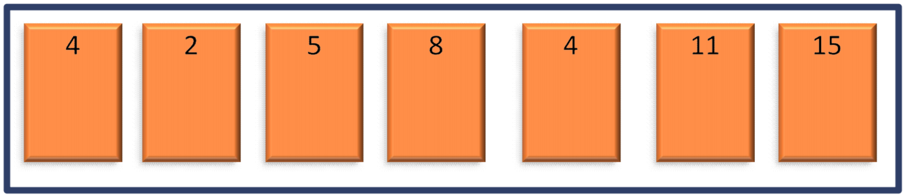
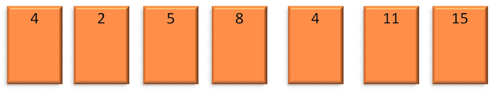
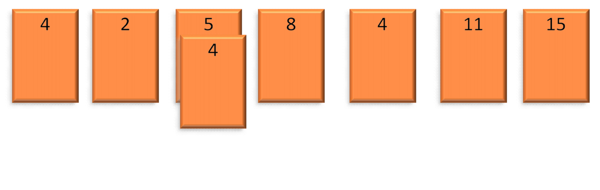
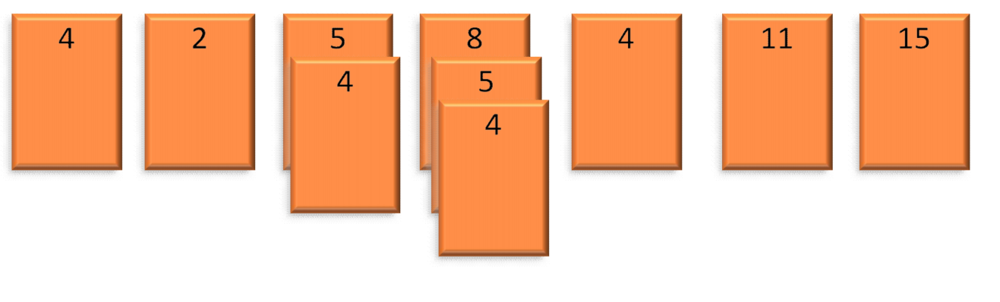
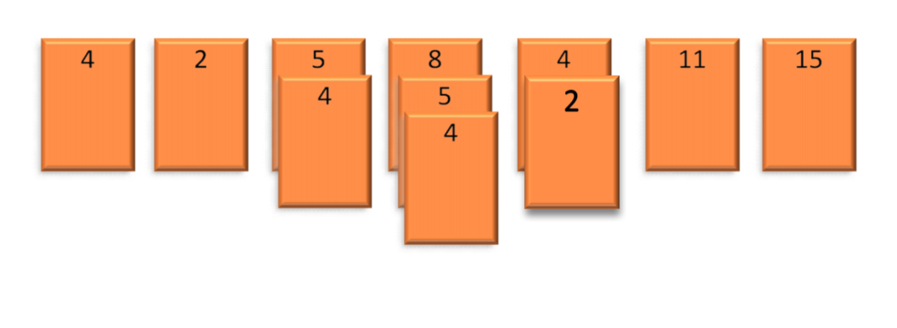
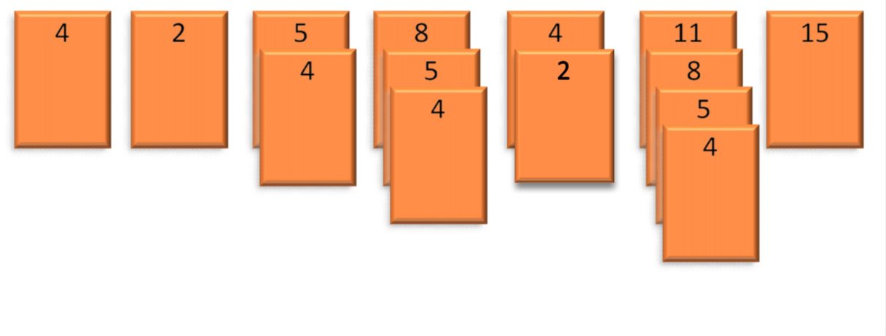
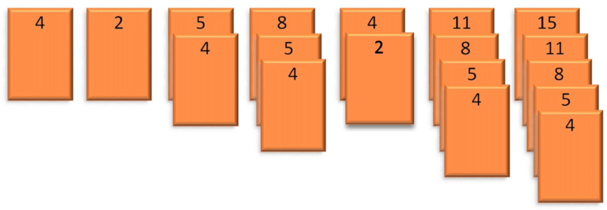
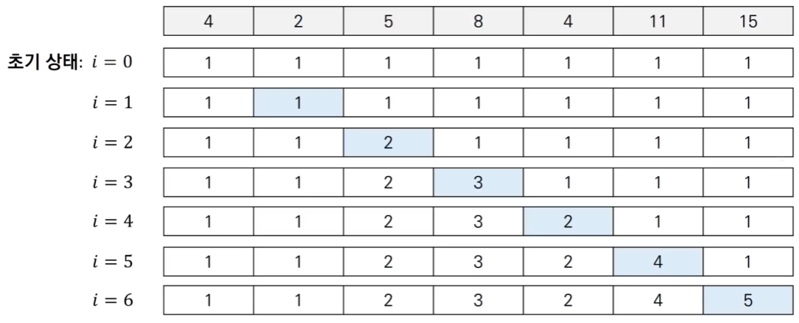

# LIS 알고리즘

## 개념
- i번째 원소를 마지막으로 쓰는 경우 중에서 array[i]만 부분 수열의 원소로 사용할 수 있으므로 i번째 원소를 마지막으로 쓰는 경우는 최소 1가지 이상을 가진다.
- 따라서 배열 D의 초기 원소 값들을 1로 초기화한다.
- i보다 작은 값 중에서 i 앞에 붙였을 때 배열의 길이가 가장 긴 길이를 D[i]로 갱신한다.

## 점화식
- $D[i]$ = $array[i]$를 마지막 원소로 가지는 부분 수열의 최대 길이

- 점화식: 모든 $0 ≤ j < i$ 에 대해, $D[i] = max(D[i], D[j]+1)$ if $array[j] < array[i]$

## 동작 예시
- [Step 0] 배열 D 원소들을 모두 1로 초기화(i = 0이 첫 번째 값이라 앞에 값이 없기 때문)
    
    

- [Step 1] i = 1 즉 값 2에 대해 2보다 작은 값 중에서 2 앞에 붙였을 때 가장 긴 경우가 있는지 확인하고 그 길이 값을 D[1]으로 갱신

    

- [Step 2] i = 2 즉 값 5에 대해 5보다 작은 값 중에서 5 앞에 붙였을 때 가장 긴 경우가 있는지 확인하고 그 길이 값을 D[2]로 갱신

    

- [Step 3] i = 3 즉 값 8에 대해 8보다 작은 값 중에서 8 앞에 붙였을 때 가장 긴 경우가 있는지 확인하고 그 길이 값을 D[3]로 갱신

    

- [Step 4] i = 4 즉 값 4에 대해 4보다 작은 값 중에서 4 앞에 붙였을 때 가장 긴 경우가 있는지 확인하고 그 길이 값을 D[4]으로 갱신

    

- [Step 5] i = 5 즉 값 11에 대해 11보다 작은 값 중에서 11 앞에 붙였을 때 가장 긴 경우가 있는지 확인하고 그 길이 값을 D[5]로 갱신

    

- [Step 6] i = 6 즉 값 15에 대해 15보다 작은 값 중에서 15 앞에 붙였을 때 가장 긴 경우가 있는지 확인하고 그 길이 값을 D[6]로 갱신

    

- 해당 과정을 거치면 결과적으로 DP 테이블은 아래 그림과 같이 완성된다.

    

- $D[i] = max(D[i], D[j]+1)$ if $array[j] < array[i]$를 반복해서 테이블 D를 전부 채웠을 때, max(D)가 배열에서 가장 긴 증가 부분 시퀀스 길이가 된다.