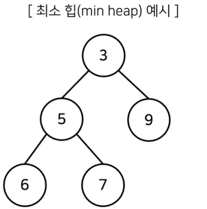
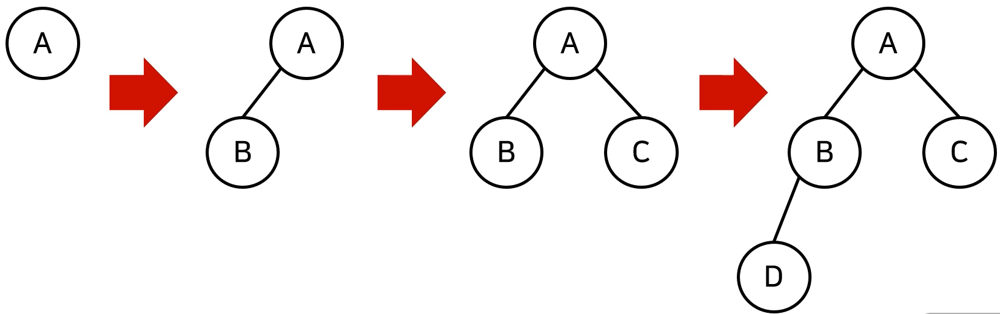
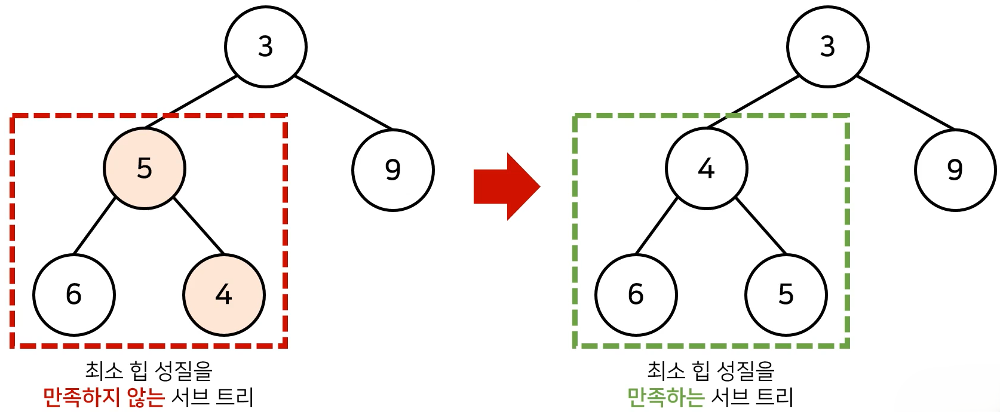
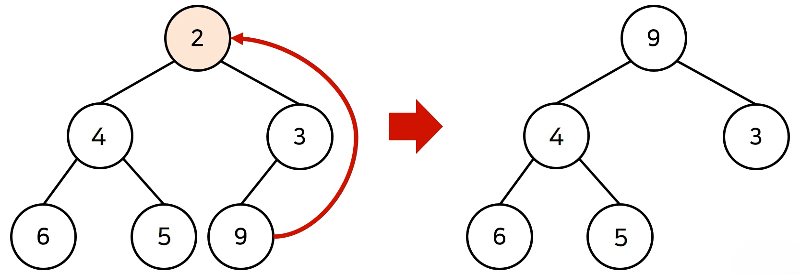
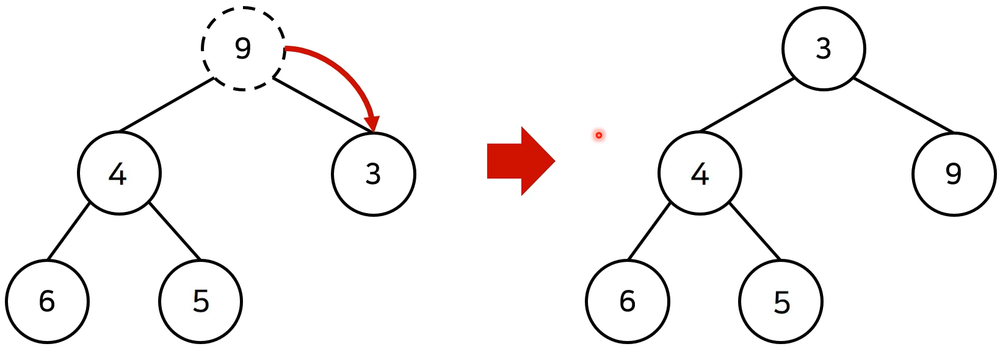

# 우선순위 큐(Priority Queue)
- **우선순위가 가장 높은 데이터를 가장 먼저 삭제**하는 자료구조이다.

- 예를 들어 여러 개의 물건 데이터를 자료구조에 넣었다가 가치가 높은 물건 데이터부터 꺼내서 확인해야 하는 경우에 우선순위 큐를 이용할 수 있다.

- python, C++, JAVA를 포함한 대부분의 프로그래밍 언어에서 **표준 라이브러리 형태로 지원**한다.

    

## 힙(Heap)
- 우선순위 큐를 구현하기 위해 사용하는 자료구조 중 하나이다.
  - 내부적으로 트리 구조를 활용하여 삽입과 삭제를 함

- **최소 힙**(**Min Heap**)과 **최대 힙**(**Max Heap**)이 있다.
  - **최소 힙**(**Min Heap**) : 값이 낮은 데이터부터 꺼내는 방식으로 동작
  - **최대 힙**(**Max Heap**) : 값이 높은 데이터부터 꺼내는 방식으로 동작

- 다익스트라 최단 경로 알고리즘을 포함해 다양한 알고리즘에서 사용된다.

- 데이터의 개수가 N개일 때, 구현 방식에 따라서 시간 복잡도를 비교하면 다음과 같다.

    

- 힙으로 구현했을 때 N개의 데이터를 힙에 넣었다가 모두 꺼내는 작엄은 정렬과 동일하다. (힙 정렬)
  - 이 경우 시간 복잡도는 $O(NlogN)$이다.

### 힙(Heap)의 특징
- 힙은 완전 이진 트리 자료구조의 일종이다.
- 힙에서는 항상 루트 노드(root node)를 제거한다.

  

- **최소 힙**(**Min Heap**)
  - 루트 노드가 가장 작은 값을 가진다.
  - 따라서 값이 낮은 데이터부터 우선적으로 제거된다.
- **최대 힙**(**Max Heap**)
  - 루트 노드가 가장 큰 값을 가진다.
  - 따라서 값이 큰 데이터부터 우선적으로 제거된다.

### 완전 이진 트리(Complete Binary Tree)
- **완전 이진 트리**란 루트(root) 노드부터 시작하여 왼쪽 자식 노드, 오른쪽 자식 노드 순서대로 데이터가 차례대로 삽입되는 트리(tree)를 의미한다.

    

### 최소 힙 구성 함수: Min-Heapify()
- (상향식) 하나의 데이터가 들어와 자식 노드로 붙게 되면 부모 노드로 거슬러 올라가며, 부모보다 자신의 값이 더 작은 경우 부모와 자식 노드의 위치를 서로 교체한다.

    

#### 힙으로 새로운 원소가 들어올 때
- 새로운 원소가 들어왔을 때 이러한 Heapify를 이용하게 되면 $O(logN)$의 시간 복잡도로 힙 성질을 유지하도록 할 수 있다.

- 기본적으로 힙 자료구조는 완전 이진 트리를 따르기 때문에 균형 잡힌 트리로서 동작한다.
- 따라서 항상 부모쪽으로 거슬러 올라가거나 부모에서 자식으로 내려올 때 최악의 경우에도 $O(logN)$의 시간 복잡도를 보장한다.

#### 힙에서 원소가 제거될 때
- 반대로 힙에서 원소가 제거되었을 때도 $O(logN)$의 시간 복잡도로 힙 성질을 유지하도록 할 수 있다.
  - 원소를 제거할 때는 가장 마지막 노드가 루트 노드의 위치에 오도록 한다.

    
  - 이후 루트 노드에서부터 하향식으로(더 작은 노드로) Heapify()를 진행한다.
  
    

### 힙 라이브러리 사용 예제: 최소 힙
```
inport heapq

# 오름차순 힙 정렬(Heap Sort)
def heapsort(iterable):
    h = []
    redult = []
    # 모든 원소를 차례대로 힙에 삽입
    for value in iterable:
        heapq.heappush(h, value)
    for i in range(len, h):
        result.append(heapq.heappop(h))
    return result

result = heapsort([1, 3, 5, 7, 8, 2, 4, 6, 8, 0])
print(result)
```
```
[0, 1, 2, 3, 4, 5, 6, 7, 8, 9]
```
- 데이터를 넣을 때 가장 작은 값이 항상 인덱스 0이 되도록 알아서 위치를 조정해서 h 리스트에 넣는다.

- 데이터를 뺄 때 즉 heappop할 때 그냥 인덱스 0에서부터 순서대로 꺼내는 것이다.

- 힙에 데이터를 하나 넣을 때 $O(logN)$의 시간 복잡도가 걸리므로 n개의 데이터를 넣은 뒤 빼는 경우 $O(NlogN)$의 시간 복잡도가 소요된다. -> 퀵 정렬 알고리즘과 동일한 시간 복잡도

### 힙 라이브러리 사용 예제: 최대 힙
```
inport heapq

# 오름차순 힙 정렬(Heap Sort)
def heapsort(iterable):
    h = []
    redult = []
    # 모든 원소를 차례대로 힙에 삽입
    for value in iterable:
        heapq.heappush(h, -value)
    for i in range(len, h):
        result.append(-heapq.heappop(h))
    return result

result = heapsort([1, 3, 5, 7, 8, 2, 4, 6, 8, 0])
print(result)
```
```
[9, 8, 7, 6, 5, 4, 3, 2, 1, 0]
```
- 기본적으로 파이썬에서는 최대 힙을 따로 제공하지 않는다.

- 따라서 데이터를 힙에 넣기 전에 데이터의 부호를 반대로 바꿔 넣고 꺼낼때도 데이터 부호를 반대로 바꾸면 된다.