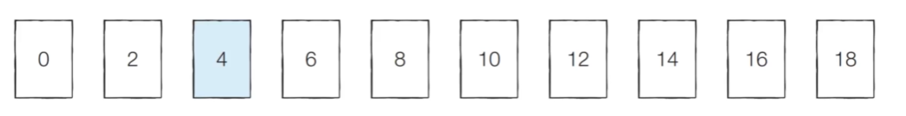
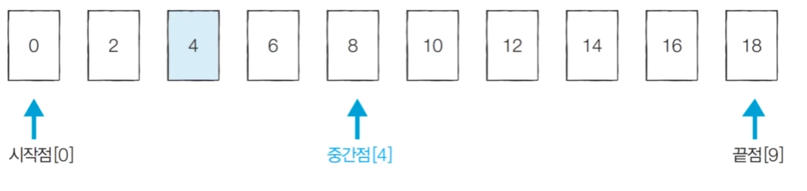
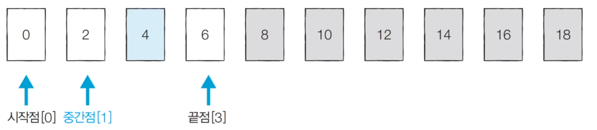
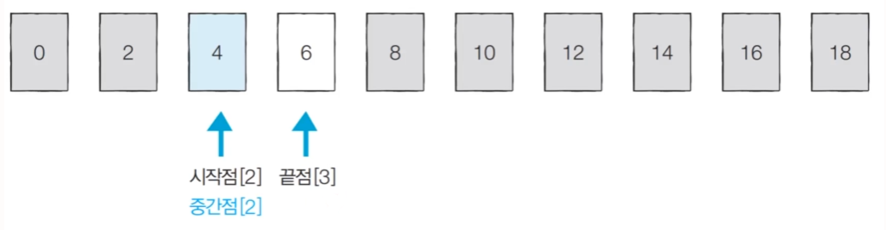
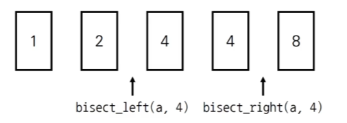
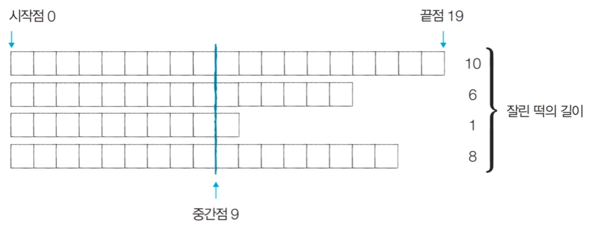
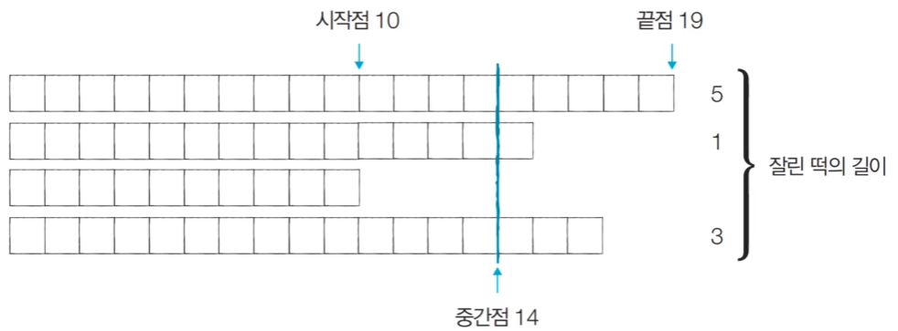
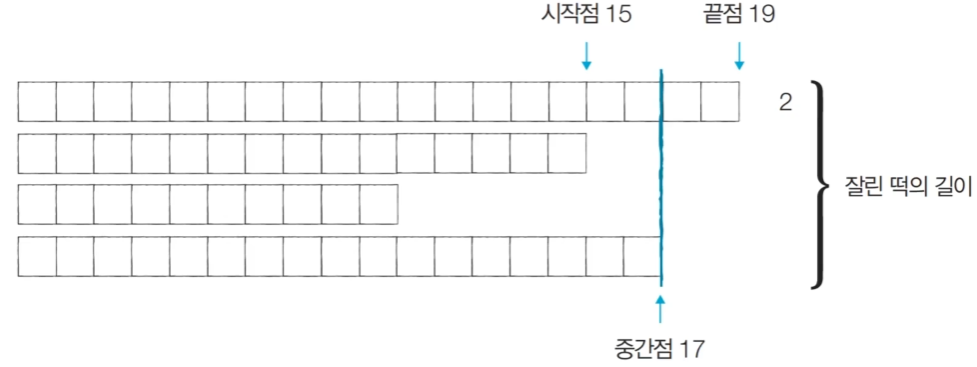
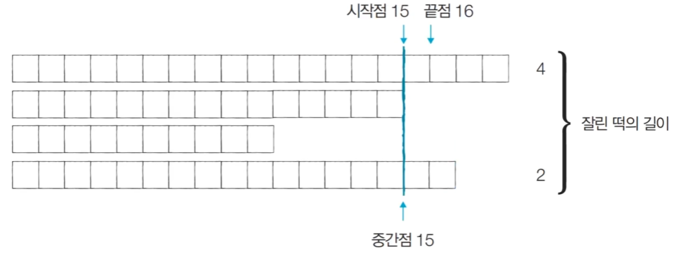

# 이진 탐색 알고리즘
- 순차 탐색: 리스트 안에 있는 **특정한 데이터를 찾기 위해 앞에서부터 데이터를 하나씩 확인**하는 방법

- 이진 탐색: 정렬되어 있는 리스트에서 **탐색 범위를 절반씩 좁혀가며 데이터를 탐색**하는 방법
  - 이진 탐색은 시작점, 끝점, 중간점을 이용하여 탐색 범위를 설정한다.
  - log 시간의 시간 복잡도를 가질 수 있다. 

## 이진 탐색 동작 예시
- 이미 정렬된 10개의 데이터 중에서 값이 4인 원소를 찾는 예시를 살펴보자.

    

- [Step 1] 시작점 : 0, 끝점 : 9, 중간점 : 4 (소수점 이하 제거)
  - 시작점, 끝점, 중간검 모두 인덱스를 의미한다.
  - $(0 + 9)/2 = 4.5$이고 소수점 제거하여 중간점이 4가 되는 것이다.

    

- [Step 2] 시작점 : 0, 끝점 : 3, 중간점 : 1
  - 찾고자 하는 값이 중간점 보다 작으면 중간점을 포함하여 오른쪽의 값들은 무시한다.

    

- [Step 3] 시작점 : 2, 끝점 : 3, 중간점 : 2
  - 찾고자 하는 값이 중간점 보다 크면 중간점을 포함하여 왼쪽의 값들은 무시한다.

    

  - 중간점과 찾고자 하는 값이 동일하면 탐색을 멈춘다.

## 이진 탐색의 시간 복잡도
- 단계마다 탐색의 범위를 2로 나누는 것과 동일하므로 **연산 횟수는 $log_2N$에 비례**한다.

- 예를 들어 초기 데이터의 개수가 32개일 때, 이상적으로 1단계를 거치면 16개 가량의 데이터만 남는다. 이후 단계가 거듭될수록 2배씩 줄어든다.

- 다시 말해 이진 탐색은 탐색 범위를 절반씩 줄이며, 시간 복잡도는 **$O(logN)$** 을 보장한다. 

## 이진 탐색 소스코드
- 재귀적 구현
    ```
    def binary_search(array, target, start, end):
        if start>end:
            return None
        mid = (start+end)//2

        # 찾은 경우 인덱스 반환
        if array[mid] == target:
            return mid

        # 중간점의 값보다 찾고자 하는 값이 작은 경우 배열의 왼쪽만 탐색
        elif array[mid]>target:
            return binary_search(array, target, start, mid-1)

        # 중간점의 값보다 찾고자 하는 값이 큰 경우 배열의 오른쪽만 탐색
        else:
            return binary_search(array, target, mid+1, end)
    ```
- 반복문으로 구현
    ```
    def binary_search(array, target, start, end):
        while start <= end:
            mid = (start+end)//2
            if array[mid] == target:
                return mid
            elif array[mid]>target:
                end = mid-1
            else:
                start = mid+1
        return None
    ```
---------------------------------------
```
# n(원소의 개수)과 target(찾고자 하는 값)을 입력
n, target = map(int, input().split())

# 전체 원소 입력
array = list(map(int, input().split()))

# 이진 탐색 수행 결과 출력
result = binary_search(array, target, 0, n-1)
if result == None:
    print("target에 해당하는 원소가 존재하지 않습니다.")
else:
    print(result + 1)
```

## 파이썬 이진 탐색 라이브러리
- `bisect_left(a, x)`: 정렬된 순서를 유지하면서 배열 a에 x를 삽입할 가장 왼쪽 인덱스를 반환(`x 이상이 처음 나타나는 위치`)

- `bisect_right(a, x)`: 정렬된 순서를 유지하면서 배열 a에 x를 삽입할 가장 오른쪽 인덱스를 반환(`x 초과가 처음 나타나는 위치`)

    

    ```
    from bisect import bisect_left, bisect_right

    a = [1, 2, 4, 4, 8]
    x = 4

    print(bisect_left(a, x))
    print(bisect_right(a, x))
    ```
    ```
    2
    4
    ```
- 값이 특정 범위에 속하는 데이터 개수 구하는 예제
    ```
    from bisect import bisect_left, bisect_right

    # 값이 [left_value, right_value]인 데이터의 개수를 반환하는 함수
    def count_by_range(a, left_value, right_value):
        right_index = bisect_right(a,right_value)
        left_index = bisect_left(a,left_value)
        return right_index - left_index

    a = [1,2,3,3,3,3,4,4,8,9]

    # 값이 4인 데이터의 개수 출력
    print(count_by_range(a,4,4))

    # 값이 [-1,3] 범위에 있는 데이터 개수 출력
    print(count_by_range(a,-1,3))
    ```
    ```
    2
    6
    ```

## 파라메트릭 서치(Parametric Search)
- 파라메트릭 서치란 **최적화 문제를 결정 문제('예' 혹은'아니오')로 바꾸어 해결하는 기법**이다.
  - 예시: 특정 조건을 만족하는 가장 알맞은 값을 빠르게 찾는 최적화 문제

- 일반적으로 코딩 테스트에서 파라메트릭 서치 문제는 **이진 탐색을 이요하여 해결**할 수 있다.

## <문제> 떡볶이 떡 만들기
### 문제 설명
- 오늘 A는 여행 가신 부모님을 대신해서 떡집 일을 하기로 했다. 오늘은 떡볶이 떡을 만드는 날이다. A네 떡볶이 떡은 재미있게도 떡볶이 떡의 길이가 일정하지 않다. 대신에 한 봉지에 들어가는 떡의 총 길이는 절단기로 잘라서 맞춰준다.

- 절단기에 높이(H)를 지정하면 줄지어진 떡을 한 번에 절단한다. 높이가 H보다 긴 떡은 H 위의 부분이 잘릴 것이고, 낮은 떡은 잘리지 않는다.

- 예를 들어 높이가 19, 14, 10, 17cm인 떡이 나란히 있고 절단기 높이를 15cm로 지정하면 자른 뒤 떡의 높이는 15, 14, 10, 15cm가 될 것이다. 잘린 떡의 길이는 차례대로 4, 0, 0, 2cm이다. 손님은 6cm만큼의 길이를 가져간다.

- 손님이 왔을 때 요청한 총 길이가 M일 때 적어도 M만큼의 떡을 얻기 위해서 절단기에 설정할 수 있는 높이의 최댓값을 구하는 프로그램을 작성하시오.

### 문제 조건


### 문제 해결 아이디어
- 적절한 높이를 찾을 때까지 이진 탐색을 수행하여 높이 H를 반복해서 조정하면 된다.

- '현재 높이로 자르면 조건을 만족할 수 있는가?'를 확인한 뒤에 조건의 만족 여부('예' 혹은 '아니오')에 따라 탐색 범위를 좁혀서 해결할 수 있다.

- 절단기의 높이는 0부터 10억까지의 정수 중 하나이다.
  - ***이렇게 큰 탐색 범위를 모면 가장 먼저 이진 탐색을 떠올려야 한다.***

- 문제에서 제시된 예시를 통해 그림으로 이해해보자.
- 여기서 중간점은 우리가 실제로 떡을 자를 때 절단기의 높이이다.
  - [Step 1] 시작점 : 0, 끝점 : 19, 중간점 : 9
    - 이때 필요한 떡의 크기: M = 6이므로, 결과 저장

    

  - [Step 2] 시작점 : 10, 끝점 : 19, 중간점 : 14
    - 이때 필요한 떡의 크기: M = 6이므로, 결과 저장

    

  - [Step 3] 시작점: 15, 끝점: 19, 중간점: 17
    - 이때 필요한 떡의 크기: M = 6이므로, 결과를 저장하지 않음
  
    

  - [Step 4] 시작점: 15, 끝점: 16, 중간점: 15
    - 이때 필요한 떡의 크기: M = 6이므로, 결과 저장

    

  - 중간점의 값은 시간이 지날수록 '**최적화된 값**'이 되기 때문에, 과정을 반복하면서 얻을 수 있는 떡 길이의 합이 필요한 떡 길이보다 크거나 같을 때마다 **중간점의 값을 기록**하면 된다.

### 문제 풀이
- 나의 풀이
    ```
    import time
    n, m = map(int, input().split())
    data = list(map(int, input().split()))

    def cutting(data, start, end):
        mid = (start + end) // 2
        temp = 0
        for i in data:
            if i>mid:
            temp += i-mid
        # 현재 mid값이 손님의 요구에 맞는 Hight 값임
        if temp == m:
            return mid

        # mid로 잘랐을 때 결과가 m보다 크면 Hight는 mid보다 큰값이고 mid와 end 사이 값임    
        elif temp > m:
            return cutting(data, mid+1, end)

        # mid로 잘랐을 때 결과가 m보다 작으면 Hight는 mid보다 작은 값이고 start와 mid 사이 값임
        else:
            return cutting(data, start, mid-1)

    start_time = time.time()
    data.sort()
    print(cutting(data, 0, max(data)))
    end_time = time.time()
    print("time :", end_time - start_time)
    ```
    ```
    4 6
    19 15 10 17
    15
    time : 0.00023603439331054688
    ```

    - 절단 높이 H는 0~end 사이에 있으며, mid를 기준으로 잘랐을 때 얻는 길이 합이 m 이상/미만인지에 따라 탐색 구간을 줄이는 이분 탐색을 반복해 최적의 H를 찾는다.

    - 이분 탐색은 반복법의 한 종류로 mid라는 값으로 값 추측을 하고 비교를 통해 값의 범위를 줄이고 새로운 mid를 계산하는 과정의 반복이다.

- 문제 풀이 예시
    ```
    n, m = map(int, input().split())
    array = list(map(int, input().split()))

    start = 0
    end = max(array)

    # 이진 탐색 수행(반복적)
    while(start<=end):
        total = 0
        mid = (start+end)//2
        for x in array:
            # 절단 후 떡의 양 계산
            if x>mid:
                total -= (x-mid)
        
        # 떡의 양이 부족한 경우 절단기의 높이를 낮춰 더 많이 자르기(왼쪽 부분 탐색)
        if total<m:
            end = mid-1
        # 떡의 양이 충분한 경우 절단기 높이를 높여 덜 자르기(오른쪽 부분 탐색)
        else:
            result = mid # 최대한 덜 잘랐을 때가 정답이므로, 여기에서 result에 기록
            start = mid+1
    print(result)
    ```
    ```
    4 6
    19 15 10 17
    15
    ```

## <문제> 정렬된 배열에서 특정 수의 개수 구하기
### 문제 설명
- N개의 원소를 포함하고 있는 수열이 오름차순으로 정렬되어 있다. 이때 이 수열에서 x가 등장하는 횟수를 계산하라. 예를 들어 수열 [1,1,2,2,2,2,3]이 있을 때 x=2라면, 현재 수열에서 값이 2인 원소가 4개이므로 4를 출력한다.

- 단, 이 문제는 시간 복잡도$O(logN)$으로 알고리즘을 설계하지 않으면 시간 초과 판정을 받는다.

### 문제 조건


### 문제 해결 아이디어
- 시간 복잡도 $O(logN)$으로 동작하는 알고리즘을 요구하고 있다.

  - 일반적인 선형 탐색으로는 시간 초과 판정을 받는다.
  - 데이터가 정렬되어 있기 때문에 이진 탐색을 수행할 수 있다.

- 특정 값이 등장하는 첫 번째 위치와 마지막 위치를 찾아 위치 차이를 계산해 문제를 해결할 수 있다.

### 문제 풀이
- 나의 답안
    ```
    from bisect import bisect_left, bisect_right

    n,x = map(int, input().split())
    array = list(map(int, input().split()))

    def count_val(array, x):
        left_index = bisect_left(array, x)
        right_index = bisect_right(array, x)
        return right_index - left_index

    print(count_val(array, x))
    ```
    - bisect_left, bisect_right를 사용함
