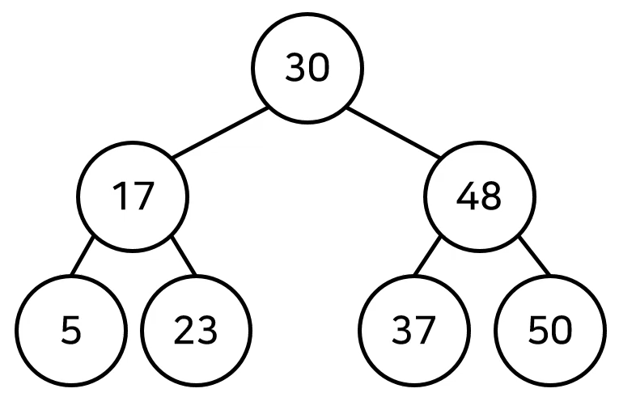
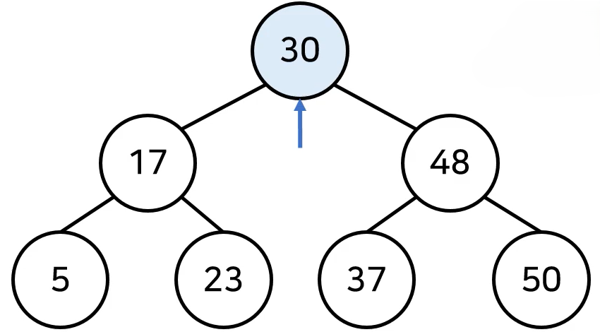
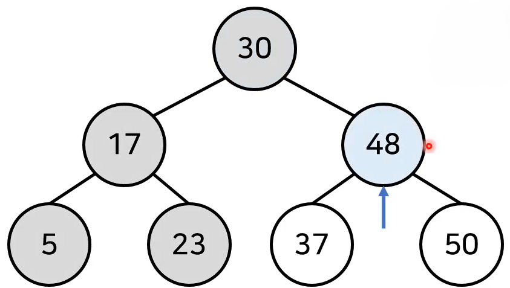
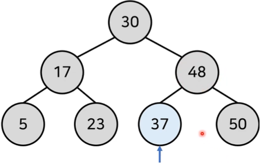
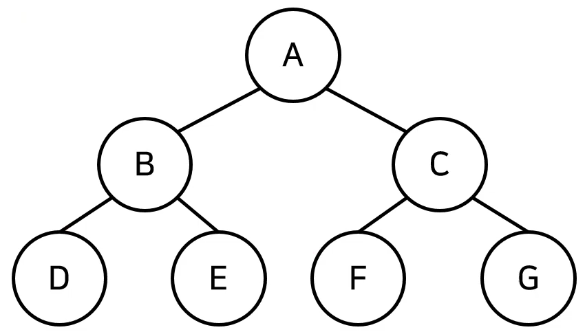

# 트리(Tree)
- 트리는 가계도와 같은 계층적인 구조를 표현할 때 사용할 수 있는 자료구조이다.
- [트리 관련 용어]
  - 루트 노드(root node): 부모가 없는 최상위 노드
  - 단말 노드(leaf node): 자식이 없는 노드
  - 크기(size): 트리에 포함된 모든 노드의 개수
  - 깊이(depth): 루트 노드부터의 거리(root node는 거리가 0)
  - 높이(height): 깊이 중 최댓값

  - 차수(degree): 각 노드의 (자식 방향) 간선 개수

- 기본적으로 트리의 크기가 **N**일 때, 전체 간선의 개수는 **N-1**개이다.

    

- 이러한 트리 자료구조는 현실에서 계층적인 자료구조를 표현할 때 자주 사용되며 가장 대표적인 예시가 가계도이다.

## 이진 탐색 트리(Binary Search Tree)
- 이진 탐색이 동작할 수 있도록 고안된 효율적인 탐색이 가능한 자료구조의 일종이다.

- 이진 탐색 트리의 특징: **왼쪽 자식 노드 < 보모 노드 < 오른쪽 자식 노드**
  - 부모 노드보다 왼쪽 자식 노드가 더 작다.
  - 부모 노드보다 오른쪽 자식 노드가 더 크다.

    

- 이진 탐색 트리가 이미 구성되어 있다고 가정하고 데이터를 조회하는 과정을 살펴보자
- 찾고자 하는 원소: 37
- [Step 1] 루트 노드부터 방문하여 탐색을 진행
  - 현재 노드와 찾는 원소 비교 -> 찾는 값이 더 크므로 오른쪽 노드 방문, 왼쪽 방향 노드 무시
  
  

- [Step 2] 현재 노드와 값을 비교 -> 찾는 원소가 더 작으므로 왼쪽 노드 방문, 오른쪽 방향 노드 무시

  

- [Step 3] 현재 노드와 값을 비교 후 원소를 찾았으므로 탐색 종료

  

- 이진 탐색 트리는 이진 탐색이 가능한 형태로 탐색을 수행할 수 있도록 하기 위해 고안된 트리 자료구조의 일종으로 이상적인 경우(좌/우가 균형이 잡혀있는 경우) $O(logN)$의 시간 복잡도를 갖는다.

## 트리의 순회(Tree Traversal)
- 트리 자료구조에 포함된 노드를 특정한 방법으로 한 번씩 방문하는 방법을 의미한다.
  - 트리의 정보를 시각적으로 확인할 수 있다.

- 대표적인 트리 순회 방법
  - **전위 순회(pre-order traverse):** 루트 노드를 먼저 방문 후 좌우를 방문한다.
  - **중위 순회(in-order traverse):** 왼쪽 자식 노드를 방문한 뒤에 루트 노드를 방문한다.
  - **후위 순회(post-order traverse):** 왼쪽 방문 후 오른쪽 방문한 뒤에 루트 노드를 방문한다.

- 예시
  

  - **전위 순회(pre-order traverse):** A-B-D-E-F-C-G
  - **중위 순회(in-order traverse):** D-B-E-A-F-C-G
  - **후위 순회(post-order traverse):** D-E-B-F-G-C-A

### 트리의 순회 구현
```
class Node:
  def __init__(self, data, left_node, right_node):
    self.data = data
    self.left_node = left_node
    self.right_node = right_node

# pre-order traverse
def pre_order(node):
  print(node.data, end = ' ')
  if node.left_node != None:
    pre_order(tree[node.left_node])
  if node.right_node != None:
    pre_order(tree[node.right_node])

# in-order traverse
def in_order(node):
  if node.left_node != None:
    in_order(tree[node.left_node])
  print(node.data, end = ' ')
  if node.right_node != None:
    in_order(tree[node.right_node])

# post-order traverse
def post_order(node):
  if node.left_node != None:
    in_order(tree[node.left_node])
  if node.right_node != None:
    in_order(tree[node.right_node])
  print(node.data, end = ' ')

n = int(input())
tree = {}

for i in range(n):
  data, left_node, right_node = input().split()
  if left_node == "None":
    left_node = None
  if right_node == "None":
    right_node = None
  tree[data] = Node(data, left_node, right_node)

pre_order(tree['A'])
print()
in_order(tree['A'])
print()
post_order(tree['A'])
```
- 트리 구조를 구현할 경우 Node 클래스를 만들어야 한다.