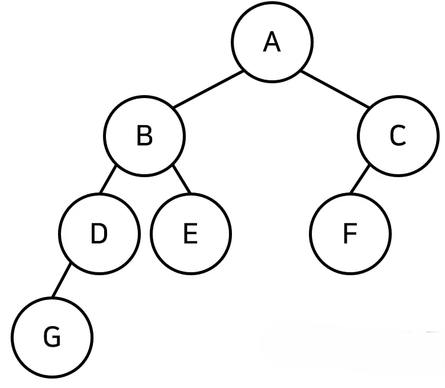

# 트리(Tree)
- 트리는 가계도와 같은 계층적인 구조를 표현할 때 사용할 수 있는 자료구조이다.
- [트리 관련 용어]
  - 루트 노드(root node): 부모가 없는 최상위 노드
  - 단말 노드(leaf node): 자식이 없는 노드
  - 크기(size): 트리에 포함된 모든 노드의 개수
  - 깊이(depth): 루트 노드부터의 거리(root node는 거리가 0)
  - 높이(height): 깊이 중 최댓값

  - 차수(degree): 각 노드의 (자식 방향) 간선 개수

- 기본적으로 트리의 크기가 **N**일 때, 전체 간선의 개수는 **N-1**개이다.

    

- 이러한 트리 자료구조는 현실에서 계층적인 자료구조를 표현할 때 자주 사용되며 가장 대표적인 예시가 가계도이다.