# 다이나믹 프로그래밍
- 다이나믹 프로그래밍은 **메모리를 적절히 사용하여 수행 시간 효율성을 비약적으로 향상시키는 방법**이다. -> 시간 복잡도 개선 방법

- 이미 계산된 결과(작은 문제)는 별도의 메모리 영역에 저장하여 다시 계산하지 않도록 한다.

- 다이나믹 프로그래밍의 구현은 일반적으로 두가지 방식(탑다운과 바텀업)으로 구성된다.

- 다이나믹 프로그래밍은 동적 계획법이라고도 부른다.
- 일반적인 프로그래밍에서 동적은 다음과 같은 의미를 갖는다.
  - 자료구조에서 동적 할당(Dynamic Allocation)은 '**프로그램이 실행되는 도중에 실행에 필요한 메모리를 할당하는 기법**'을 의미한다.
  - 반면 다이나믹 프로그래밍(Dynamic programming)에서 '다이나믹'은 별다른 의미 없이 사용된 단어이다.

## 다이나믹 프로그래밍의 조건
- 다이나믹 프로그래밍은 문제가 다음 조건을 만족할 때 사용할 수 있다.
  
  1. **최적화 부분 구조(Optimal Substructure)**
       - 큰 문제를 작은 문제로 나눌 수 있으며 작은 문제의 답을 모아서 큰 문제룰 해결할 수 있다.
  2. **중복되는 부분 문제(Overlapping Subproblem)**
        - 동일한 작은 문제를 반복적으로 해결해야 한다.

## 피보나치 수열
- 다이나믹 프로그래밍을 활용해서 해결할 수 있는 대표적인 문제 유형이다.

- 피보나치 수열은 다음과 같은 형태의 수열이며, 다이나믹 프로그래밍으로 효과적으로 계산할 수 있다.

    $1, 1, 2, 3, 5, 8, 13, 21, 34, 55, 89, \dotsc$

- **점화식**이란 인접한 항들 사이의 관계식을 의미한다.
- 피보나치 수열을 점화식으로 표현하면 다음과 같다.
  
  $a_n = a_{n-1} + a_{n-2}, a_1 = 1, a_2 = 1$

- 피보나치 수열이 계산되는 과정은 다음과 같이 표현 가능하다.
  - 프로그래밍에서 이러한 수열을 배열이나 리스트를 이용해 표현한다.

  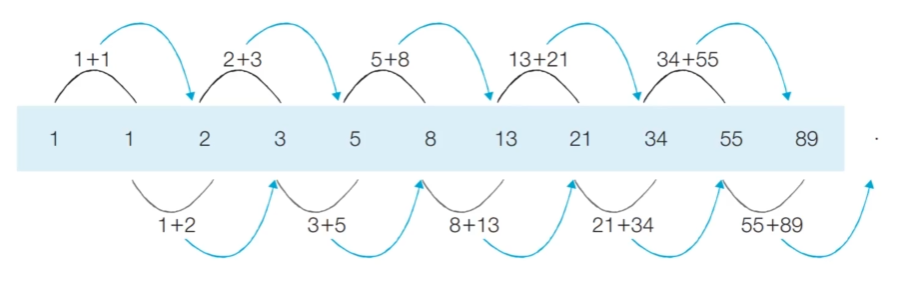

  - 다이나믹 프로그래밍에서 각각의 계산된 결과를 담기 위해서 배열이나 리스트를 사용하면 별도로 테이블과 같은 공간에 값을 기록한다고 하여 배열이나 리스트를 테이블이라고도 부른다.
- 피보나치 수열이 계산되는 과정은 다음과 같이 표현할 수 있다.
  - n번째 피보나치 수를 f(n)이라고 할 때 4번째 피보나치 수 f(4)를 구하는 과정은 다음과 같다.

  
### 피보나치 수열: 단순 재귀 소스코드
```
def fibo(n):
    if n==1 or n==2:
        return 1
    else:
        return fibo(n-1)+fibo(n-2)
print(fibo(4))
```
```
3
```
- 실제 점화식과 비교해서 봤을 때 $a_n = a_{n-1} + a_{n-2}$ 부분이 재귀적으로 호출되고 $a_1 = 1, a_2 = 1$ 부분이 재귀적 호출 종료 조건으로 사용되는 것을 볼 수 있다.

### 피보나치 수열의 시간 복잡도 - 재귀 함수로 구현
- 단순 재귀 함수로 피보나치 수열을 해결하면 지수 시간의 시간 복잡도를 갖게 된다.

- 다음과 같이 $f(2)$가 여러 번 호출되는 것을 확인할 수 있다. ***중복되는 부분 문제 발생***

    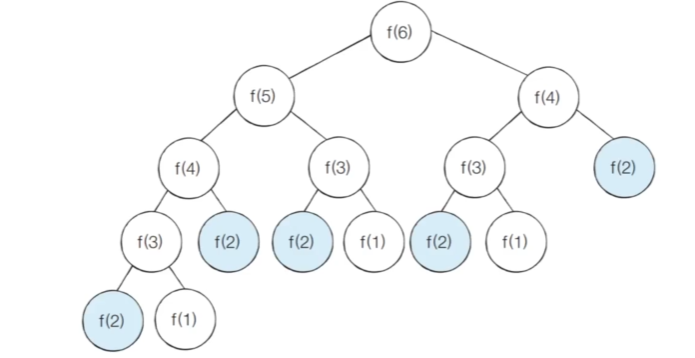

- 실제 재귀 함수를 활용해 피보나치 수열을 구현하면 시간 복잡도는 다음과 같다.
  - 세타 표기법: $\theta(1.618\dotsc^N)$
  - 빅오 표기법: $O(2^N)$

- 빅오 표기법을 기준으로 $f(30)$을 계산하기 위해 약 10억가량의 연산을 수행해야 한다.

- 재귀 문제를 보면 다음과 같은 것들을 확인해야 한다.
  - Q1. 동일한 상태가 반복되는가?
    - yes -> DP(Dynamic Programming) 가능성 99%
    - no -> DFS/백트래킹 가능성

  - Q2. 분기 수가 몇 개인가?
    - 1개 -> $O(N)$으로 대체적으로 안전함
    - 2개 이상 -> 시간 복잡도가 지수가 될 위험이 있음
  
  - Q3. 입력 크기 n이 얼마인가?
    - $n\leq 20$ -> 완전 탐색 가능(재귀 사용 가능)
    - $n\geq100$ -> 재귀 그대로 쓰면 거의 무조건 터짐

### 피보나치 수열의 효율적인 해법: 다이나믹 프로그래밍(DP)
- 다이나믹 프로그래밍의 사용 조건을 만족하는지 확인한다.
  
  1. **최적 부분 구조** : 큰 문제를 작은 문제로 나눌 수 있다.
  2. **중복되는 부분 문제** : 동일한 작은 문제를 반복적으로 해결한다.
- 피보나치 수열은 다이나믹 프로그래밍의 사용 조건을 만족한다.

### 메모이제이션(Memoization) - 탑다운 방식
- 메모이제이션은 다이나믹 프로그래밍을 구현하는 방법 중 하나이다.

- 한번 계산한 결과를 메모리 공간에 메모하는 기법이다.
  - 같은 문제를 다시 호출하면 메모했던 결과를 그대로 가져온다.
  - 별도의 테이블 즉 배열에 값을 기록해 놓는다는 점에서 **캐싱(Caching)**이라고 한다.

### 탑다운 VS 바텀업
- 탑다운(메모이제이션) 방식은 하향식이라고도 하며 바텀업 방식은 상향식이라고도 한다.
- ***탑다운과 바텀업의 공통적인 핵심은 한 번 계산한 것들은 다시 반복해서 또 계산하지 않는 것이다.***

- 탑다운 방식: 구현 과정에서 재귀 함수를 이용하며 큰 문제를 해결하기 위해 작은 문제들을 재귀적으로 호출하여 구현한다.
  - 재귀적으로 호출하는 과정에서 한 번 계산된 값을 기록하기 위해서 메모이제이션 기법을 이용함

- 바텀업 방식: 작은 문제를 하나씩 해결해 나가면서 먼저 계산했던 문제들의 값을 활용해 그 다음 문제를 차례대로 해결하며 반복문으로 구현한다.
  - 다이나믹 프로그래밍의 전형적인 형태는 바텀업 방식이다.
  - 바텀업 방식에서 사용되는 결과 저장용 리스트를 **DP 테이블**이라고 한다.

- 엄밀히 말하면 메모이제이션은 이전에 계산된 결과를 일시적으로 기록해 놓는 넓은 개념을 의미한다.
  - 따라서 메모이제이션은 다이나믹 프로그램에 국한된 개념이 아니다.
  - 한 번 계산된 결과를 담아 놓기만 하고 다이나믹 프로그래밍을 위해 활용하지 않을 수도 있다.

### 피보나치 수열: 탑다운 다이나믹 프로그래밍 소스코드
```
# 한 번 계산된 결과를 메모이제이션하기 위한 리스트 초기화
d = [0]*100

# 피보나치 함수를 재귀함수로 구현
def fibo(x):
    # 종료 조건
    if x == 1 or x == 2:
        return 1
    
    # 이미 계산했던 경우이고 테이블에 값이 저장되어 있다면 그 값을 그대로 반환
    if d[x] != 0
        return d[x]

    # 아직 계산하지 않은 문제라면 점화식에 따라 피보나치 결과 계산 및 테이블에 저장 후 반환
    else:
        d[x] = fibo(x-1)+fibo(x-2)
        return d[x]

print(fibo(99))
```
```
218922995834555169026
```

### 피보나치 수열: 바텀업 다이나믹 프로그래밍 소스코드
```
# 한 번 계산된 결과를 메모이제이션하기 위한 리스트 초기화
d = [0]*100

d[1] = 1
d[2] = 1
n=99

# 피보나치 함수 반복문으로 구현
for i in range(3,n+1):
    d[i] = d[i-1] + d[i-2]

print(d[n])
```
```
218922995834555169026
```

### 피보나치 수열: 메모이제이션 동작 분석
- 이미 계산된 결과를 메모리에 저장하면 다음과 같이 색칠된 노드만 처리할 것으로 기대할 수 있다.

    

  - 색칠된 부분은 실제로 점화식을 통해 계산되는 부분이고 나머지 점선은 이미 계산된 결과가 메모리에 존재해 단순 호출만 하는 것이다. 
  - 즉 점선은 메모리에서 값을 호출하는 것으로 상수 시간이 소요된다.
- 실제로 호출되는 함수에 대해서만 본다면 다음과 같이 방문한다.

    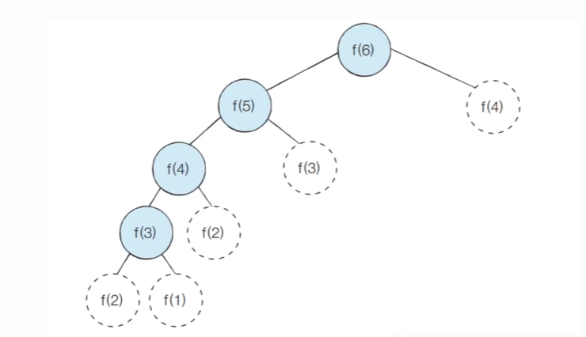

- 메모이제이션을 활용하는 경우 피보나치 수열 함수의 시간 복잡도는 $O(2^N)$에서 $O(N)$으로 줄어든다.

## 다이나믹 프로그래밍 VS 분할 정복
- 다이나믹 프로그래밍과 분할 정복은 모두 **최적 부분 구조**를 가질 때 사용할 수 있다.
  - 큰 문제를 작은 문제로 나눌 수 있으며 작은 문제의 답을 모아서 큰 문제를 해결할 수 있는 상황

- 다이나믹 프로그래밍과 분할 정복의 차이점은 **부분 문제의 중복**이다.
  - 다이나믹 프로그래밍 문제에서는 각 부분 문제들이 서로 영향을 미치며 부분 문제가 중복된다.
  - 분할 정복 문제에서는 동일한 부분 문제가 반복적으로 계산되지 않는다.

- 분할 정복의 대표적인 예시로는 퀵 정렬 알고리즘이 있다.
  - 한 번 기준 원소(pivot)가 자리를 변경해서 잡으면 그 기준 원소의 위치는 바뀌지 않는다.
  - 분할 이후 해당 피벗을 다시 처리하는 부분 문제는 호출하지 않는다.

    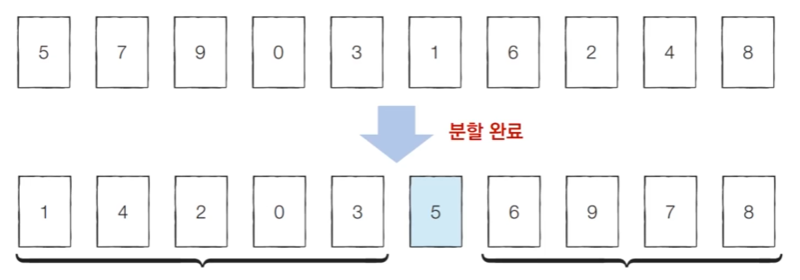

  - 퀵 정렬 뿐만 아니라 이진 탐색, 병합 정렬 등 분할 정복의 아이디어를 이용하는 다른 알고리즘 또한 마찬가지이다.

## 다이나믹 프로그래밍 문제 접근 방법
- 현재 주어진 문제가 다이나믹 프로그래밍 유형임을 파악하는 것이 중요하다.

- 가장 먼저 그리디, 구현, 완전 탐색 등의 아이디어로 문제를 해결할 수 있는지 검토한다.
  - 다른 알고리즘으로 풀이 방법이 떠오르지 않으면 다이나막 프로그래밍을 고려하면 된다.

- 일단 재귀 함수로 비효율적인 완전 탐색 프로그램을 작성한 뒤에 (탑다운) 작은 문제에서 구한 답이 큰 문제에서 그대로 사용된다면, 다이나믹 프로그래밍을 고려해 코드를 개선하면 된다.

- 일반적인 코딩 테스트 수준에서는 기본 유형의 다이나믹 프로그래밍 문제가 출제되는 경우가 많다. 

## <문제> 개미 전사
### 문제 설명
- 개미 전사는 부족한 식량을 충당하고자 메뚜기 마을의 식량창고를 몰래 공격하려고 한다. 메뚜기 마을에는 여러 개의식량 창고가 있는데 식량창고는 일직선으로 이어져 있다.

- 각 식량창고에는 정해진 수의 식량을 저장하고 있으며 개미 전사는 식량창고를 선택적으로 약탈하여 식량을 빼앗을 예정이다. 이때 메뚜기 정창병들은 일직성상에 존재하는 식량창고 중에서 서로 인접한 식량창고가 공격받으면 바로 알아챌 수 있다.

- 따라서 개미 전사가 정창병에게 들키지 않고 식량창고를 약탈하기 위해서는 최소한 한 칸 이상 떨어진 식량창고를 약탈해야 한다. 
    
    

- 예를 들어 식량창고 4개가 다음과 같이 존재한다고 가정한다.

    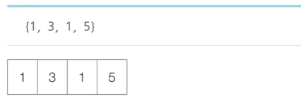

- 이때 개미 전사는 두 번째 식량창고와 네 번째 식량창고를 선택했을 때 최댓값인 총 8개의 식량을 빼앗을 수 있다. 개미 전사는 식량창고가 이렇게 일직선상일 때 최대한 많은 식량을 얻기를 원한다.

- 개미 전사를 위해 식량창고 N개에 대한 정보가 주어졌을 때 얻을 수 있는 식량의 최댓값을 구하는 프로그램을 작성하시오.

### 문제 조건
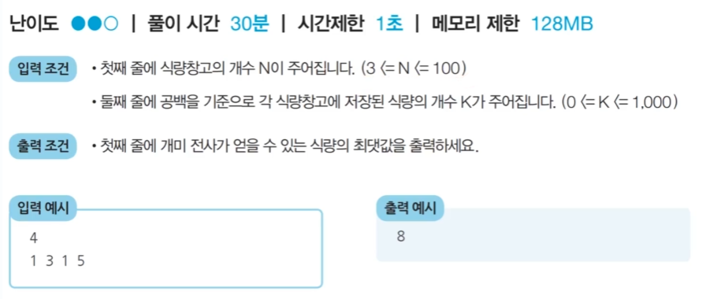

### 문제 풀이 아이디어
- 예시를 확인하면 N = 4일 때, 다음과 같은 경우들이 존재할 수 있다.
  
  - 식량을 선택할 수 있는 경우의 수는 다음과 같이 8가지이다.
  
  - 7번째 경우에서 8만큼의 식량을 얻을 수 있으므로 **최적의 해는 8**이다.

    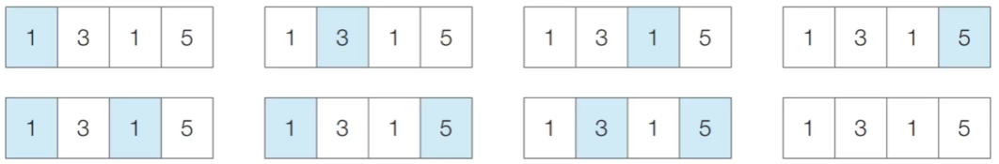

- $a_i$를 전체 N개의 식량창고 중에서 1번부터 i번째 식량창고까지 고려했을 때 최적의 해(얻을 수 있는 식량의 최댓값)이라고 하자.
  - 이렇게 되면 이제 다이나믹 프로그래밍을 적용할 수 있다.

  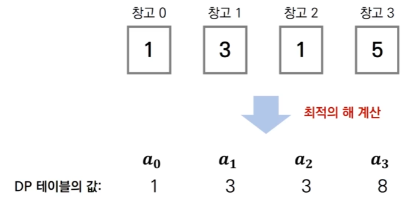

- 왼쪽부터 차례대로 식량창고를 턴다고 했을 때, 특정한 i번째 식량창고에 대해서 털지 안 털지의 여부를 결정하면, 아래 2가지 경우 중에서 더 많은 식량을 털 수 있는 경우를 선택하면 된다.

    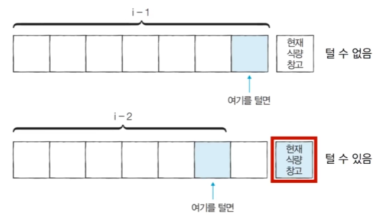
- $a_i$ = i번째 식량창고까지의 최적의 해(얻을 수 있는 식량의 최댓값)
- $k_i$ = i번째 식량창고에 있는 식량의 양
- 점화식은 $a_i = max(a_{i-1}, a_{i-2}+k_i)$이다.
- 한 칸 이상 떨어진 식량창고는 할상 털 수 있으므로 i-3이하의 경우는 고려할 필요가 없다.

### 문제 풀이
- 나의 풀이
    ```
    n = int(input())
    wh1 = list(map(int, input().split()))

    # 현재 리스트에서 최댓값을 찾음
    n1 = 0
    max1 = 0
    for i, v in enumerate(wh1):
    if v > max1:
        max1 = v
        n1 = i

    # 처음 찾은 최댓값 주변 값들을 제외한 나머지 에서 최댓값을 찾음
    n2 = 0
    max2 = 0
    for i, v in enumerate(wh1):
    if i == n1 or i == n1+1 or i == n1-1:
        continue
    if v > max2:
        max2 = v
        n2 = i

    print(max1 + max2)
    ```
    ```
    4
    1 3 1 5 
    8
    ```
    - 해당 문제는 그리드 알고리즘 문제로 보인다.
    - 우리의 목표는 값을 구하는 것이다. 따라서 굳이 리스트를 변환하거나 새로 만들 필요 없다.
    - 처음 리스트 컴프리헨션를 통해 복잡하게 구현했으나 중요한 것은 우리가 찾는 것은 단순히 값이므로 인덱스만 필요하다. 
    - 따라서 리스트 컴프리헨션으로 값을 제거 후 새롭게 리스트를 만들어 max를 할 필요 없이 조건에 맞지 않은 인덱스를 그냥 pass하면 되는 것이다.
- 풀이 예시
    ```
    n=int(input())
    array = list(map(int, input().split()))

    # 앞서 계산한 결과(a_i 값)를 저장하기 위한 DP 테이블 초기화
    d = [0] * 100

    # 다이나믹 프로그래밍 진행(바텀업)
    # 초기 값에 대한 부분
    d[0] = array[0]
    d[1] = max(array[0], array[1])

    # 점화식 부분 구현
    for i in range(2,n):
        d[i] = max(d[i-1], d[i-2] + array[i])

    print(d[n-1])
    ```
  - DP라고 판단할 수 있는 이유
    - 최댓값이나 최솟값을 구하라 -> 최적화 문제(DP 혹은 greedy 후보)
    - 인접한 창고를 동시에 선택할 수 없다. -> 이전의 선택 결과가 현재 선택에 영향을 줌(중복 문제 -> greedy가 아닌 DP)
    - 창고가 일직선으로 이어져 있다. -> 인덱스 구조

  - DP 문제를 풀기 위해서는 점화식를 구하는게 필수이다.

## <문제> 1로 만들기
### 문제 설명
- 정수 X가 주어졌을 때, 정수 X에 사용할 수 있는 연산은 다음과 같이 4가지이다.

  1. X가 5로 나누어 떨어지면, 5로 나눈다.
  2. X가 3으로 나누어 떨어지면, 3으로 나눈다.
  3. X가 2로 나누어 떨어지면, 2로 나눈다.
  4. X에서 1을 뺀다.

- 정수 X가 주어졌을 때, 연산 4개를 적절히 사용해서 값을 1로 만들거자 한다. 연산을 사용하는 횟수의 최솟값을 출력하시오. 예를 들어 정수가 26이면 다음과 같이 계산해서 3번의 연산이 최솟값이다.
  - 26 -> 25 -> 5 -> 1

### 문제 조건
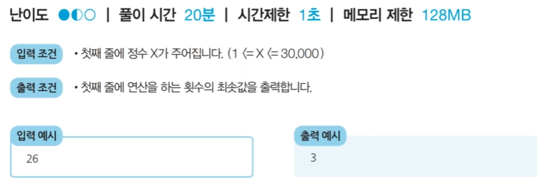

### 문제 풀이 아이디어
- 피보나치 수열 문제를 도식화한 것처럼 함수가 호출되는 과정을 그림으로 나타내면 다음과 같다.
  - **최적 부분 구조**와 **중복되는 부분 문제**를 만족한다.
   
  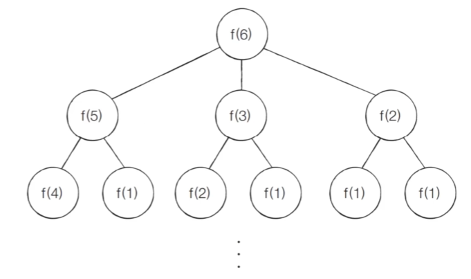

  - X가 6인 경우의 최적의 해는 1을 뺀 X가 5일 때의 최적의 해 f(5), 2를 나눈 X가 3일 때의 최적의 해 f(3), 3을 나눈 X가 2일 때의 최적의 해 f(2) 중에서 가장 작은 값을 선택해 +1을 해서 f(6)을 구할 수 있다.
  
  - 즉 매 상황마다 각각 4가지 경우에 대한 부분 문제를 확인해보고 부분 문제들 중에서 가장 작은 값을 가지는 경우를 선택해 1을 더한 값으로 현재의 Optimal Solution을 구하면 된다.
  
  - 이 문제에서는 5를 나누었을 때 값을 더 많이 줄일 수 있는 것처럼 보이지만 다른 연산들을 적절히 섞어서 더 값을 빠르게 줄일 수 있는 경우가 존재할 수 있다. 

  - $a_i$ = i를 1로 만들기 위한 최소한의 연산 횟수 라고 하자
  
  - 이때 점화식은 $a_i = min(a_{i-1}, a_{i/2}, a_{i/3}, a_{i/5}) + 1$로 쓸 수 있다. 단 1을 빼는 연산을 제외하고는 해당 수로 나누어떨어질 때에 한해 점화식을 적용할 수 있다.

### 문제 풀이
- 나의 풀이
    ```
    n = int(input())
    cnt = 0

    while (n > 1):
        r = n%5
        if r == 3:
            n = n//3
        elif r == 2:
            n = n//2
        elif r == 0:
            n = n//5
        else:
            n = n-1
        cnt += 1

    print(cnt)  
    ```
  - 여기서 내가 생각한 풀이의 방향성은 큰 수로 나눠야지 횟수를 최소한으로 가져갈 수 있다. 그리고 나머지가 2,3인 경우 두 번, 세 번 뺄셈 연산을 하지 말고 그냥 2,3으로 나누면 되고 나머지가 그 외 것들이면 -1을 빼서 5로 나누던 3,2로 나누면 된다.

- 풀이 예시
    ```
    x = int(input())

    # 앞서 계산된 결과를 저장하기 위해 DP 테이블을 초기화
    dp = [0] * 30001

    # 바텀업 방식의 DP
    for i in range(2,x+1):
        # 일단 현재 수에서 1을 빼는 경우를 먼서 d[i]로 선언
        d[i] = d[i-1]+1

        # 현재 수가 2로 나누어 떨어지는 경우
        if i%2 == 0:
            # i에서 1을 뺀 경우와 2로 나눈 경우 중 뭐가 더 작은지 비교 후 d[i] 갱신
            d[i] = min(d[i], d[i//2]+1)

        # 현재 수가 3로 나누어 떨어지는 경우
        if i%3 == 0:
            # i에서 1을 뺀 경우와 3으로 나눈 경우 중 뭐가 더 작은지 비교 후 d[i] 갱신
            d[i] = min(d[i], d[i//3]+1)
        
        # 현재 수가 5로 나누어 떨어지는 경우
        if i%5 == 0:
            # i에서 1을 뺀 경우와 5로 나눈 경우 중 뭐가 더 작은지 비교 후 d[i] 갱신
            d[i] = min(d[i], d[i//3]+1)

    print(d[x])
    ```
    - 점화식을 굳이 사칙 연산으로만 생각하지 말고 min, max 등등을 모두 고려해서 작성해야 한다. 
      - 나는 점화식을 사칙 연산으로만 생각해서 점화식을 못 구했고 따라서 그리드 알고리즘으로 풀이를 했음

## <문제> 효율적인 화폐 구성
### 문제 설명
- N가지 종류의 화폐가 있다. 이 화폐들의 개수를 최소한으로 이용해서 그 가치의 합이 M원이 되도록 하려고 한다. 이때 각 종류의 화폐는 몇 개라도 사용할 수 있다.

- 예를 들어 2원, 3원 단위의 화폐가 있을 때는 15원을 만들기 위해 3원 5개를 사용하는 것리 가장 최소한의 화폐 개수이다.

- M원을 만들기 위한 최소한의 화폐 개수를 출력하는 프로그램을 작성하시오. 

### 문제 조건
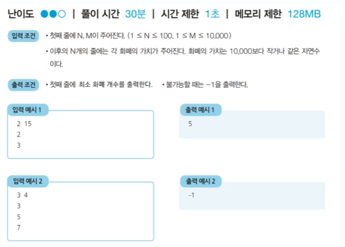

### 문재 해결 아이디어
- $a_i$ = 금액 i를 만들 수 있는 최소한의 화폐 개수

- k = 각 화폐의 단위
- **점화식**: 각 화폐 단위인 k를 하나씩 확인하며
  - $a_{i-k}$를 만든는 방법이 존재하는 경우: $a_i = min(a_i,a_{i-k}+1)$
  - $a_{i-k}$를 만든는 방법이 존재하지 않는 경우: $a_i = INF$

- 예시: N = 3, M = 7이고, 각 화폐 단위가 2, 3, 5인 경우
  - [Step 0]

    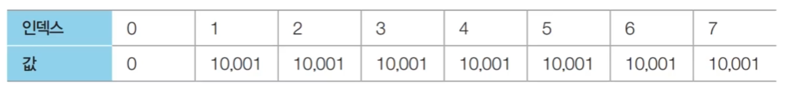

    - 여기서 index는 화폐 단위로 구성해야 하는 값을 의미하며 1~10,000까지의 값을 입력받은 화폐 단위로 구성하는 것이다. 
    - 여기서 value는 화폐 단위로 index를 구성하기 위한 화폐의 개수이다.
    - 먼저 각 인덱스에 해당하는 값으로 INF 값을 설정한다.
    - INF는 조건에서 화폐 단위로 만들 수 없는 수를 의미하며 본 문제에서는 10,001을 사용한다.
  
  - [Step 1]
  
    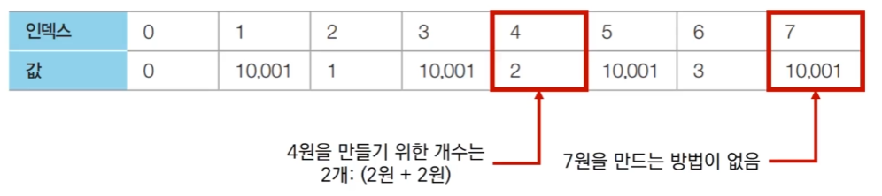

    - 첫 번째 화폐 단위인 2를 확인한다.
    - 점화식에 따라 리스트를 갱신한다.
    - 첫 번째 시행의 경우를 보자면 인덱스 2의 경우 인덱스 0의 경우+1과 2의 경우를 비교해 작은 값을 인덱스 2의 값으로 설정
  
  - [Step 2]

    

    - 두 번째 화폐 단위인 3을 확인한다.
    - 점화식에 따라 리스트를 갱신한다.

  - [Step 3]

    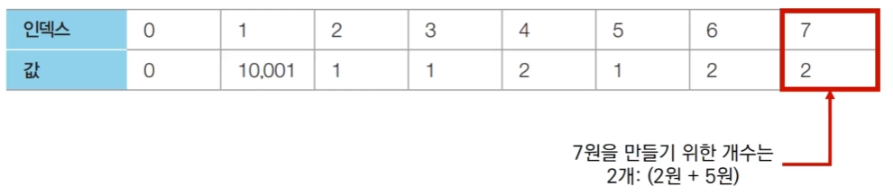

    - 세 번째 화폐 단위인 3을 확인한다.
    - 점화식에 따라 리스트를 갱신한다.

### 문제 풀이
```
# dp의 인덱스가 현재 화폐 단위로 구성해야 하는 값이고 dp의 value는 화폐의 개수이다.
dp=[10001]*(m+1)

# DP 진행(바텀업)
dp[0] = 0
for i in range(n):
  for j in range(p[i], m+1):

    # (i-k)원을 만드는 방법이 존재하는 경우
    if dp[j-p[i]] != 10001:
      dp[j] = min(dp[j], dp[j-p[i]]+1)

if d[m] == 10001:
  print(-1)
else:
  print(dp[m])
```
- 나의 사고 과정
  - 완전 탐색은 불가능하다고 생각함. 경우가 너무 많음
  - 최적화 문제이고 무조건 단위가 큰 화폐의 개수가 많다고 조건을 만족하는 것은 아님 -> 그리드는 탈락
    - 문제는 이렇게만 생각해서 정확히 DP, BFS, 투 포인터, 이진 탐색 중 무슨 유형에 해당하는지 알 수 없음

- DP인지 판단하기 위한 사고 과정
  - 최댓값, 최솟값을 구하는 것인지?
  - 선택이 누적되는지?
  - 같은 상태가 반복되는지?
  - DP는 “최적화/카운팅 + 부분 문제 분해 + 중복 계산” 문제다.

- 문제 풀이를 위한 사고
  - m원을 직접 바로 계산하는 것이 아니라 더 작은 금액의 답을 재사용해서 풀이할 수 있나?
    - i원을 만들 때 필요한 최소 동전 개수가 DP의 상태가 되겠구나!

  - 점화식을 만드는데 막히는 가장 큰 이유는 처음부터 모든 동전을 전부 고려했기 때문이다.
    - 마지막에 무슨 동전을 쓸까를 고려해야함
    - i원을 만드는 최적의 해가 존재한다고 가정하자
    - 그 최적의 해의 마지막 동전이 k였다고 하면, 그 이전은 i-k원을 만드는 최적의 해여야 한다.
    - 가능한 모든 동전 K에 대해서 `dp[i] = min(dp[i], dp[i-k] + 1) (단, i-k ≥ 0이고 dp[i-k]가 가능할 때)`
    - 이때 DP가 헷갈리는 경우 **불가능**을 먼저 어떻게 표현할지부터 정하면 편해짐
    - **점화식은 마지막 선택으로 쪼갤 수 있나?** 에서 나온다.

## <문제> 금광
### 문제 설명
- n x m 크기의 금광이 있다. 금광은 1 x 1 크기의 칸으로 나누어져 있으며, 각 칸은 특정한 크기의 금들이 들어있다. 

- 채굴자는 첫 번째 열부터 출발하여 금을 캐기 시작한다. 맨 처음에는 첫 번째 열의 어느 행에서든 출발할 수 있다. 이후 m-1번에 걸쳐 매번 오른쪽 위, 오른쪽, 오른쪽 아래 3가지 중 하나의 위치로 이동해야 한다. 결과적으로 채굴자가 얻을 수 있는 금의 최대 크기를 출력하는 프로그램을 작성하시오.

  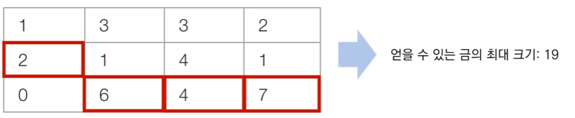

### 문제 조건
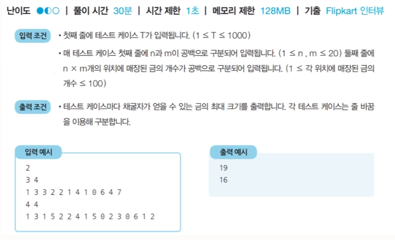

### 문제 해결 아이디어
- 금광의 모든 위치에 대하여 다음의 세가지만 고려하면 된다.
  - 왼쪽 위에서 오는 경우
  - 왼쪽 아해에서 오는 경우
  - 왼쪽에서 오는 경우

- 세 가지 경우 중에서 가장 많은 금을 가지고 있는 경우를 테이블에 갱신해주어 문제를 해결한다. 

  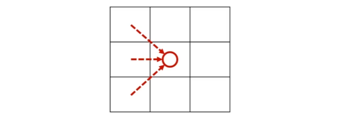

- $array[i][j]$ = i행 j열에 존재하는 금의 양

- $dp[i][j]$ = i행 j열까지의 최적의 해

- 점화식은 다음과 같다.
  - $dp[i][j] = array[i][j] + max(dp[i-1][j-1], dp[1][j-1], dp[i+1][j-1])$

- 이때 테이블에 접근할 때마다 리스트의 범위를 벗어나지 않는지 체크해야 한다.

- 금광 문제를 DP로 해결하는 과정은 다음과 같다.

  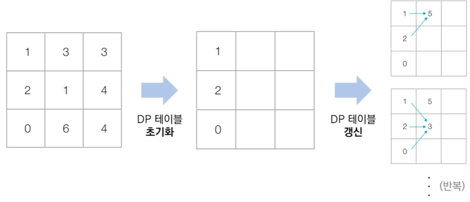


### 문제 풀이
- 나의 풀이: 문제 해결 아이디어를 참고함(dp를 2차원 배열로도 만들어서 사용 가능하다는 생각을 못함)
  ```
  t = int(input())
  for _ in range(t):
    n,m = map(int, input().split())
    data = list(map(int, input().split()))
    dp = [data[i:i+m] for i in range(0,len(data),m)]

    # 완전 탐색 불가능(n*3^m)
    # 시작점에서부터 선택 가능한 것 중 최댓값을 고른다고 해서 전체 결과가 최대가 되는건가?
    # 선택해서 최적의 경우를 찾는거
    # 3개중 1개를 고르는 문제가 반복
    # -> DP문제다.

    # i번째의 경우만 생각함
    # dp[i][k] = max(dp[i][k] + dp[i-1][k-1], dp[i][k] + dp[i][k-1], dp[i][k] + dp[i+1][k-1])

    for k in range(1,m):
      for i in range(n):
        if i == 0:
          dp[i][k] = max(dp[i][k] + dp[i][k-1], dp[i][k] + dp[i+1][k-1])
        elif i == n-1:
          dp[i][k] = max(dp[i][k] + dp[i-1][k-1], dp[i][k] + dp[i][k-1])
        else:
          dp[i][k] = max(dp[i][k] + dp[i-1][k-1], dp[i][k] + dp[i][k-1], dp[i][k] + dp[i+1][k-1])

    print(max([dp[i][m-1] for i in range(n)]))
  ```
  - 편의상 초기 금광 데이터를 담는 변수를 따로 사용하지 않고 바로 DP 테이블에 초기 데이터를 담아 테이블을 갱신해 값을 덮어씌우는 방식으로 진행함.
  - dp[i-1][k-1] , dp[i][k-1] , dp[i+1][k-1]가 각각 해당 위치에서의 Optimal Solution이라는 "가정"을 갖고 
    - $dp[i][j] = gold[i][j] + max(dp[i-1][j-1], dp[1][j-1], dp[i+1][j-1])$로 
  
  - 계산해 (i, k)에서의 누적 금에 대한 Optimal Solution을 계산한다.
    - 수학적으로는 귀납법 구조를 활용
  - dp가 반드시 1차원 리스트라고 생각하면 안된다!

- 풀이 예시
  ```
  for t in range(int(input())):
    # 금광 정보 입력
    n,m = map(int, input().split())
    array = list(map(int, input().split()))

    # DP를 위한 2차원 DP 테이블 초기화
    dp = []
    index = 0
    for i in range(n):
      dp.append(array[index:index+m])
      index += m
    
    # DP 진행
    for j in range(1,m):
      for i in range(n):
        # 왼쪽 위에서 오는 경우
        if i == 0:
          left_up = 0
        else:
          left_up = dp[i-1][j-1]
        
        # 왼쪽 아래에서 오는 경우
        if i == n-1:
          left_down = 0
        else:
          left_down = dp[i+1][j-1]
        
        # 왼쪽에서 오는 경우
        left = dp[i][j-1]

        # 점화식 부분
        dp[i][j] = dp[i][j] + max(left_up,left,left_down)
    
    result = 0
    for i in range(n):
      result = max(result, dp[i][m-1])
    print(result)
  ```