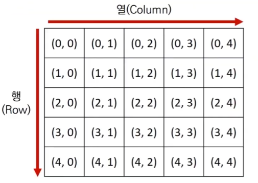
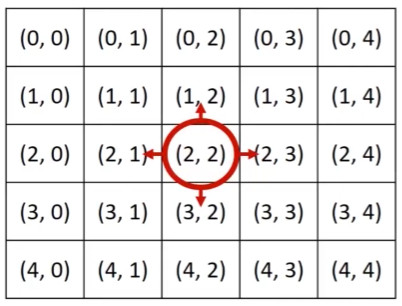
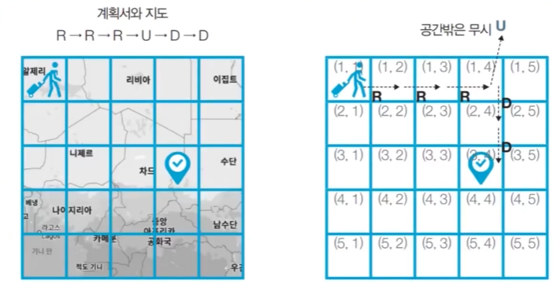
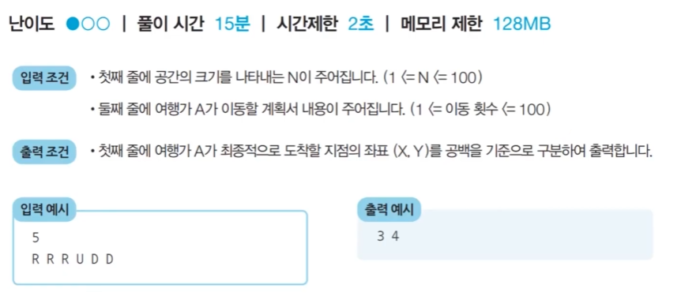
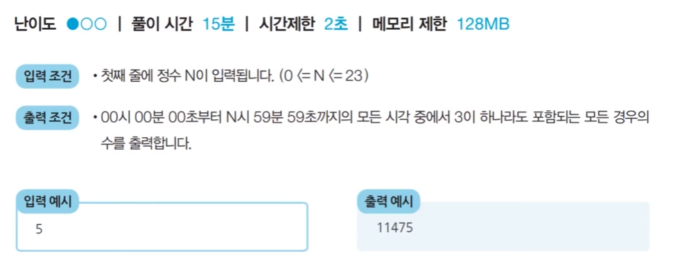

# 구현
- 구현이란, 머리속에 있는 알고리즘을 소스코드로 바꾸는 과정이다.
- 일반적으로 특정 문제를 구현 유형의 문제라고 부를 때는 대개 문제에서 요구하는 내용이 구현에 초점이 맞춰져 있거나 구현이 어려운 문제를 의미한다.

- 구현 유형의 예시는 다음과 같다.
  - 알고리즘은 간단한데 코드가 지나칠 만큼 길어지는 문제
  - 실수 연산을 다루고, 특정 소수점 자리까지 출력해야 하는 문제
  - 문자열을 특정한 기준에 따라서 끊어 처리해야 하는 문제
  - 적절한 라이브러리를 찾아서 사용해야 하는 문제

- 일반적으로 많은 기업 코딩 테스트 문제에서는 2차원 공간에서의 처리를 요구하는 경우가 많다.

  - 알고리즘 문제에서의 2차원 공간은 행렬(Matrix)의 의미로 사용된다.
  - **실제 코딩 테스트에서도 다양한 시뮬레이션 문제에서 2차원 공간을 가정하는 상황이 많이 등장한다.**    
  - 2차원 배열과 수학에서의 행렬은 동일한 개념이다.
  - 행렬에서 가장 왼쪽 위 원소가 첫번째 원소이고 세로축을 행(Row), 가로축을 열(Column)이라고 한다.
  - 열(Column)은 오른쪽으로 이동할수록 증가하고, 행(Row)은 아래로 이동할수록 증가한다.

- **시뮬레이션 및 완전 탐색 문제에서는 2차원 공강에서의 방향 벡터가 자주 활용된다.**

    ```
    # 동, 북, 서, 남 -> 행렬은 직각 좌표계를 시계 방향으로 90도 회전한 형태
    dx = [0, -1, 0, 1]
    dy = [1, 0, -1, 0]

    # 현재 위치
    x, y = 2, 2

    for i in range(4):
        # 다음 위치로 이동
        nx = x + dx[i]
        ny = y + dy[i]
    ```
  - x는 행을 의미하고 y는 열을 의미한다.
  - 동쪽은 행은 변화가 없고 열을 기준으로 1증가하는 것이므로 오른쪽으로 이동
  - 북쪽은 행을 기준으로 1만큼 빼주는 것이므로 위쪽으로 이동
  - 서쪽은 행은 변화가 없고 열을 기준으로 1만큼 빼주는 것이므로 왼쪽으로 이동
  - 남쪽은 행을 기준으로 1만큰 더해주는 것이므로 아래쪽으로 이동 

## <문제> 상하좌우
### 문제 설명
- 여행가 A는 N x N 크기의 정사각형 공간 위에 서 있다. 이 공간은 1 x 1 크기의 정사각형으로 나누어져 있다. 가장 왼쪽 위 좌표는 (1, 1)이며, 가장 오른쪽 아래 좌표는 (N, N)에 해당한다. 여행가 A는 상, 하, 좌, 우 방향으로 이동할 수 있으며, 시작 좌표는 항상 (1, 1) 이다. 우리 앞에는 여행가 A가 이동할 계획이 적힌 계획서가 놓여 있다.
  
- 계획서에는 하나의 줄에 띄어쓰기를 기준으로 하여 L, R, U, D 중 하나의 문자가 반복적으로 적혀 있다. 각 문자의 의미는 다음과 같다.
  - L: 왼쪽으로 한 칸 이동
  - R: 오른쪽으로 한 칸 이동
  - U: 위로 한 칸 이동
  - D: 아래로 한 칸 이동

- 이때 여행가 A가 N x N 크기의 정사각형 공간을 벗어나는 움직임은 무시된다. 예를 들어 (1, 1)의 위치에서 L 혹은 U를 만나면 무시된다. 다음은 N = 5인 지도와 계획서이다.

    

### 문제 조건


### 문제 해결 아이디어 
- 이 문제는 요구사항대로 충실히 구현하면 되는 문제이다.
- 일련의 명령에 따라서 개체를 차례대로 이동시킨다는 점에서 시뮬레이션(Simulation) 유형으로도 분류되며 구현이 중요한 대표적인 문제 유형이다.
  - 다만, 알고리즘 교재나 문제 풀이 사이트에 따라서 다르게 일컬을 수 있으므로, 코딩 테스트의 시물레이션 유형, 구현 유형, 완전 탐색 유형은 서로 유사한 점이 많다는 정도로만 기억하면 된다.

### 풀이
- 나의 답안
    ```
    n = int(input())
    plans = input().split()

    r, c = 0, 0

    # 계획서에서 순서대로 하나씩 뽑아서 L,R,U,D 중 뭐인지 확인 후 값을 변경
    for p in plans:
        nr, nc = r, c
        if p == 'L':
            nc -= 1
        elif p == 'R':
            nc += 1
        elif p == 'U':
            nr -= 1
        elif p == 'D':
            nr += 1

        # 변경한 값이 범위 내에 정상적으로 있는지 확인 후 최종 r, c 업데이트
        if 0 <= nr < n and 0 <= nc < n:
            r, c = nr, nc
    print(r + 1, c + 1)
    ```
- 답안 예시
    ```
    n = int(input())
    x, y = 1, 1
    plans = input().split()

    # L, R, U, D에 따른 이동 방향 -> 방향 벡터 설정
    dx = [0, 0, -1, 1]
    dy = [-1, 1, 0, 0]
    move_types = ['L', 'R', 'U', 'D']

    # 이동 계획을 하나씩 확인
    for plan in plans:
        # 이동 여부와 이동 후 좌표 구하기
        for i in range(len(move_types)):
            if plan == move_types[i]:
                nx = x + dx[i]
                ny = y + dy[i]
        # 공간을 벗어나는 경우 무시
        if nx < 1 or ny < 1 or nx > n or ny > n:
            continue

        # 이동 후 좌표를 현재 좌표로 선언하며 이동을 수행
        x, y = nx, ny

    print(x, y)
    ```
## <문제> 시각
### 문제 설명
- 정수 N이 입력되면 00시 00분 00초부터 N시 59분 59초까지의 모든 시각 중에서 3이 하나라도 포함되는 모든 경우의 수를 구하는 프로그램을 작성하라. 예를 들어 1을 입력했을 때 다음은 3이 하나라도 포함되어 있으므로 세어야 하는 시각이다.
  - 00시 00분 03초
  - 00시 13분 30초
- 반면에 다음은 3이 하나도 포함되어 있지 않으므로 세면 안 되는 시각이다.
  - 00시 02분 55초
  - 01시 27분 45초

### 문제 조건


### 문제 해결 아이디어 
- 이 문제는 가능한 모든 시각의 경우를 하나씩 모두 세서 풀 수 있는 문제이다.

- 하루는 86,400초이므로 00시 00분 00초부터 23시 59분 59초까지의 모든 경우는 86,400가지이다.
- 따라서 단순히 시각을 1씩 증가시키면서 3이 하나라도 포함되어 있는지를 확인하면 된다. 컴퓨터는 86,400가지의 경우를 전부 확인하는데 1초도 안걸린다. (실제로 0.0094초 걸림)
- 파이썬은 초당 2000만번 연산이 가능하다고 생각하고 문제를 풀면 된다.
- 이러한 유형은 완전 탐색(Brute Forcing) 문제 유형이라고 불리며 이는 가능한 경우의 수를 모두 검사해보는 탐색 방법을 의미한다.
### 풀이
- 나의 답안
    ```
    n = int(input())
    count = 0

    for h in range(n + 1):
        for m in range(60):
            for s in range(60):
                digit = [
                    h // 10, h % 10,
                    m // 10, m % 10,
                    s // 10, s % 10
                ]
                if 3 in digit:
                    count += 1

    print(count)
    ```
- 답안 예시
    ```
    h = int(input())
    count = 0

    for i in range(h+1):
        for j in range(60):
            for k in range(60):
                if '3' in str(i) + str(j) + str(k):
                    count += 1
    print(count)
    ```
  - 굳이 리스트 안에 시,분,초 값을 넣을 필요 없이 문자열로 변환해 시,분,초를 모두 이어 붙이면 in 연산자를 사용해서 찾을 수 있음.