# 소수 판별 알고리즘
## 소수
- **소수**란 1보다 큰 자연수 중에서 1과 자기 자신을 제외한 자연수로는 나누어떨어지지 않는 자연수이다.
  - 6은 1,2,3,6으로 나누어떨어지므로 소수가 아니라
  - 7은 1과 7을 제외하고는 나누어떨어지지 않으므로 소수이다.

- 코딩 테스트에서는 어떠한 자연수가 소수인지 아닌지 판별해야 하는 문제가 자주 출제된다.

### 소수 판별: 기본적인 알고리즘
```
def is_prime_number(x):
    # 2부터 (x - 1)까지의 모든 수를 확인하며
    for i in range(2, x):
        # x가 해당 수로 나누어떨어진다면
        if x % i == 0:
            return False # 소수가 아님
    return True
```
### 소수 판별: 기본적인 알고리즘 성능 분석
- 2부터 X - 1까지의 모든 자연수에 대하여 연산을 수행해야 한다.
  - 모든 수를 하나씩 확인한다는 점에서 시간 복잡도는 $O(X)$ 이다.
  - 소수 판단으로 들어오는 수가 커지면 커질수록 연산량이 선형적으로 증가한다.

### 약수의 성질
- **모든 약수가 가운데 약수를 기준으로 곱셈 연산에 대해 대칭**을 이루는 것을 알 수 있다.
  - 예를 들어 16의 약수는 1, 2, 4, 8, 16이다.
  - 이때 2 X 8 = 16은 8 X 2 = 16과 대칭이다.

- 따라서 특정한 자연수의 모든 약수를 찾을 때 **가운데 약수(제곱근)까지만 확인**하면 된다.
  - 예를 들어 16이 2로 나누어떨어진다는 것은 8로 나누어떨어진다는 것을 의미한다.

    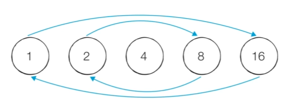

### 소수 판별: 개선된 알고리즘
```
import math

# 소수 판별 함수
def is_prime_number(x):
    # 2부터 x의 제곱근까지의 모든 수를 확인하며
    for i in range(2, int(math.sqrt(x))+1):
        # x가 해당 수로 나누어떨어진다면
        if x % i == 0:
            return False    # 소수가 아님
    return True             # 소수임
```

### 소수 판별: 개선된 알고리즘 성능 분석
- 2부터 X의 제곱근(소수점 이하 무시)까지의 모든 자연수에 대하여 연산을 수행한다.
  - 시간 복잡도는 $O(\sqrt{N})$이다.

### 다수의 소수 판별
- **에라토스테네스의 체 알고리즘:** 특정한 수의 범위 안에 존재하는 각각의 자연수들이 소수인지 아닌지를 한 번에 계산하는 알고리즘이다.

### 다수의 소수 판별: 에라토스테네스의 체 알고리즘
- 다수의 자연수에 대하여 소수 여부를 판별할 때 사용하는 대표적인 알고리즘이다.
- 에라토스테네스의 체는 N보다 작거나 같은 모든 소수를 찾을 때 사용할 수 있다.
- 에라토스테네스의 체 알고리즘의 구체적인 동작 과정은 다음과 같다.
  1. 2부터 N까지의 모든 자연수를 나열한다.
  2. 남은 수 중에서 아직 처리하지 않은 가장 작은 수 i를 찾는다.
  3. 남은 수 중에서 i의 배수를 모두 제거한다. (i는 제거하지 않는다.)
      - i의 배수를 모두 지웠다는 말은 i를 약수로 갖는 모든 수를 지웠음을 의미한다.
      - 남은 값들은 i를 약수로 갖지 않는 수이고 이들 중 가장 작은 값은 소수이다. 
      - 예를 들어 2를 선택했다면 2의 배수를 모두 지우고 다음 시행에서 3을 택한다. 이후 4는 이미 지워졌고 5를 택하고 이를 계속 반복해 소수만 남긴다.
  4. 더 이상 반복할 수 없을 때까지 2번과 3번 과정을 반복한다.

### 에라토스테네스의 체 알고리즘 동작 예시
- [초기 단계] 2부터 26까지의 모든 자연수를 나열한다. (N = 26)

    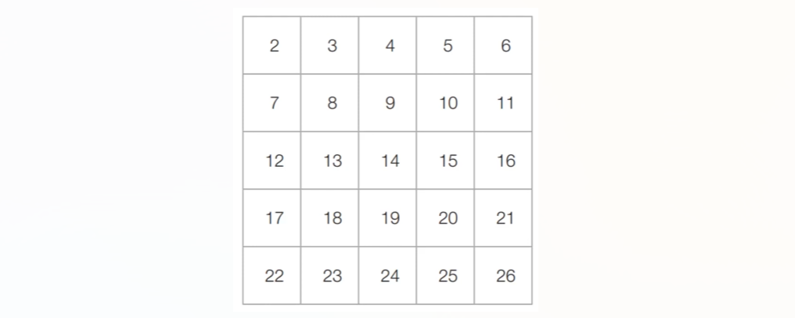

- [Step 1] 아직 처리하지 않은 가장 작은 수 2를 제외한 2의 배수를 모두 제거한다.

    

- [Step 2] 아직 처리하지 않은 가장 작은 수 3을 제외한 3의 배수를 모두 제거한다.

    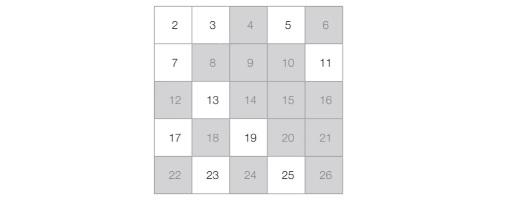

- [Step 3] 아직 처리하지 않은 가장 작은 수 5를 제외한 5의 배수를 모두 제거한다.

    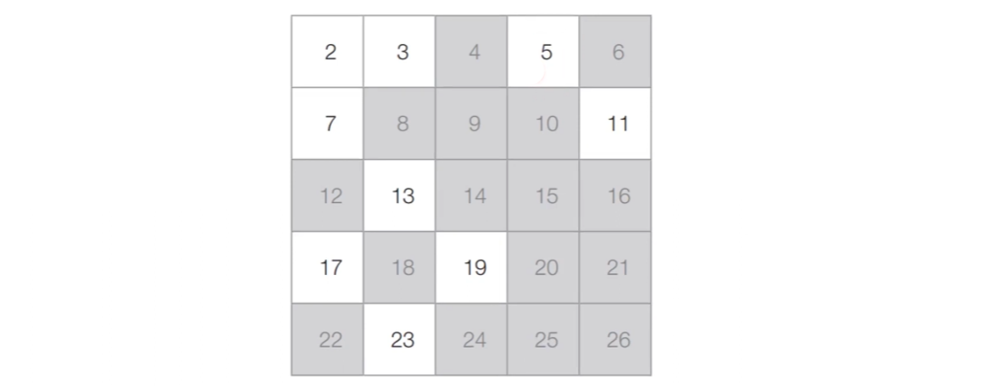

- [Step 4] 마찬가지의 과정을 반복했을 때 최종적인 결과는 다음과 같다.

    

- 추가적으로 약수의 설질은 이러한 에라토스테네스의 체 알고리즘에도 적용 가능하다.
  - N을 26이라고 설정했다면 N의 제곱근dms 5와 6사이 값이 된다. 이때 5까지만 확인을하면서 이러한 과정을 진행하면 성공적으로 알고리즘 수행이 가능하다.
  - 에라토스테네스의 체 알고리즘은 결국 소수를 제외한 모든 합성수를 제거하는 알고리즘이다.
  - N을 합성수 형태로 쓰면 N = a x b이고 a, b는 각각 $\sqrt{N}$보다 작다. 다시말해 $\sqrt{N}$ 이하 숫자의 배수로 반드시 표현된다는 것이다.
  - √N 이하 숫자들의 배수만 제거하면 범위 내 모든 합성수가 제거된다.

### 에라토스테네스의 체 알고리즘: 구현
```
import math

n = 1000 # 2~1000까지의 모든 수에 대하여 소수 판별

# 처음에는 모든 수가 소수(True)라고 초기화한다.
array = [True for _ in range(n+1)]

# 에라토스테네스의 체 알고리즘 수행
# 2부터 n의 제곱근까지의 모든 수를 확인
for i in range(2, int(math.sqrt(n)+1)):
    if array[i] == True: # i가 소수인 경우(남은 수인 경우)
        
        # i를 제외한 i의 모든 배수를 지우기
        j = 2
        while i*j<=n:
            array[i*j] = False
            j += 1

# 모든 소수 출력
for i in range(2, n+1):
    if array[i]:
        print(i, end=' ')
```

### 에라토스테네스의 체 알고리즘 성능 분석
- 에라토스테네스의 체 알고리즘의 시간 복잡도는 선형 시간에 가까울 정도로 매우 빠르다.
  - 시간 복잡도는 $O(Nlog(logN))$이다.

- 에라토스테네스의 체 알고리즘은 다수의 소수를 찾아야 하는 문제에서 효과적으로 사용될 수 있다. 
  - 하지만 각 자연수에 대한 소수 여부를 저장해야 하므로 **메모리가 많이 필요**하다.
  - **10억**이 소수인지 아닌지 판별해야 할 때 에라토스테네스의 체를 사용하면 10억개의 원소를 담을 리스트가 필요하다. 즉 경우에 따라 메모리 효율성이 떨어질 수 있다.

# 투 포인터(Two Pointers) 알고리즘
- **투 포인터 알고리즘**은 리스트에 순차적으로 접근해야 할 때 두 개의 점의 위치를 기록하면서 처리하는 알고리즘이다.

- 흔히 2, 3, 4, 5, 6, 7번 학생을 지목해야 할 때 간단히 '2번부터 7번까지의 학생'이라고 부르곤 한다.

- 리스트에 담긴 데이터에 순차적으로 접근해야 할 때는 **시작점**과 **끝점** 2개의 점으로 접근할 데이터의 범위를 표현할 수 있다.

## 투 포인터 알고리즘을 통해 해결 가능한 대표적인 문제: 특정한 합을 가지는 부분 연속 수열 찾기
### 문제 설명
- N개의 자욘수로 구성된 수열이 있다.
- **합이 M인 부분 연속 수열의 개수**를 구해보라.
- 수행 시간 제한은 $O(N)$이다.

    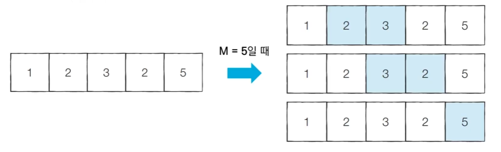

### 문제 해결 아이디어
- 투 포인터를 활용해 다음과 같은 알고리즘으로 문제 해결이 가능하다.
  1. 시작점(start)과 끝점(end)이 첫 번째 원고의 인덱스(0)를 가리키도록 한다.
  2. 현재 부분합이 M과 같다면, 카운트 한다.
  3. 현재 부분합이 M보다 작다면, end를 1 증가시킨다.
  4. 현재 부분합이 M보다 크거나 같다면, start를 1 증가시킨다.
  5. 모든 경우를 확인할 때까지 2번부터 4번까지의 과정을 반복한다.

- M = 5
- [초기 단계] 시작점과 끝점이 첫 번재 원소의 인덱스를 가리키도록 한다.
  - 현재의 부분합은 1이므로 무시한다.
  - 현재 카운트: 0

    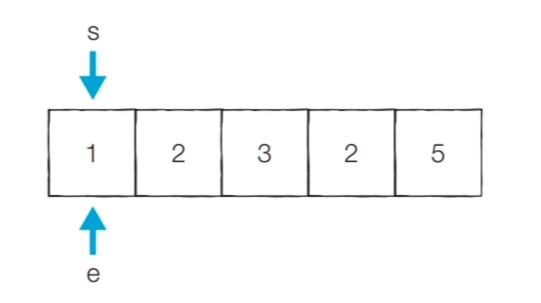

- [Step 1] 이전 단계에서의 부분합이 1이었기 때문에 end를 1 증가시킨다.
  - 현재의 부분합은 3이므로 무시한다.
  - 현재 카운트: 0

    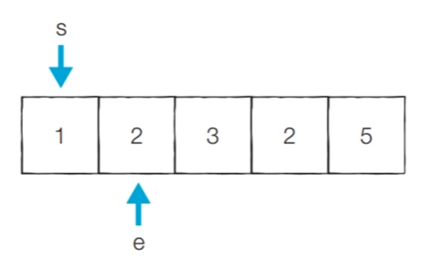

- [Step 2] 이전 단계에서의 부분합이 3이었기 때문에 end를 1 증가시킨다.
  - 현재의 부분합은 6이므로 무시한다.
  - 현재 카운트: 0

    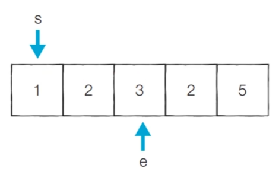

- [Step 3] 이전 단계에서의 부분합이 6이었기 때문에 start를 1 증가시킨다.
  - 현재의 부분합은 5이므로 카운트를 증가시킨다.
  - 현재 카운트: 1

    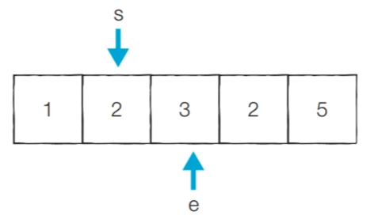

- [Step 4] 이전 단계에서의 부분합이 5이었기 때문에 start를 1 증가시킨다.
  - 현재의 부분합은 3이므로 무시한다.
  - 현재 카운트: 1

    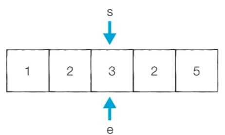

- [Step 5] 이전 단계에서의 부분합이 3이었기 때문에 end를 1 증가시킨다.
  - 현재의 부분합이 5이므로 카운트를 증가시킨다.
  - 현재 카운트: 2

    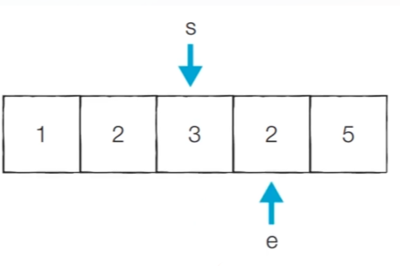

- [Step 6] 이전 단계에서의 부분합이 5이었기 때문에 start를 1 증가시킨다.
  - 현재의 부분합은 2이므로 무시한다.
  - 현재 카운트: 2

    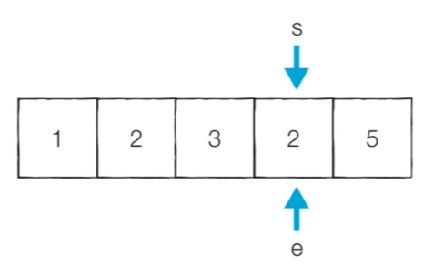

- [Step 7] 이전 단계에서의 부분합이 2이었기 때문에 end를 1 증가시킨다.
  - 현재의 부분합이 7이므로 무시한다.
  - 현재 카운트: 2

    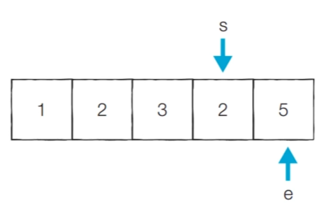

- [Step 8] 이전 단계에서의 부분합이 7이었기 때문에 start를 1 증가시킨다.
  - 현재의 부분합은 5이므로 카운트를 증가시킨다.
  - 현재 카운트: 3

    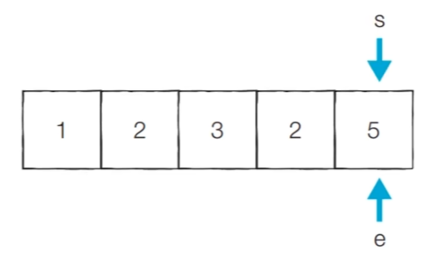

### 문제 풀이
```
n = 5                   # 데이터의 개수 N
m = 5                   # 찾고자 하는 부분합 M
data = [1, 2, 3, 2, 5]  # 전체 수열

count = 0
interval_sum = 0
end = 0

# start를 차례대로 증가시키며 반복
for start in range(n):
    # end를 가능한 만큼 이동시키기
    while inteval_sum < m and end < n:
        interval_sum += data[end]
        end += 1
    
    # 부분합이 m일 때 카운트 증가
    if interval_sum == m:
        count += 1
    interval_sum -= data[start]

print(count)
```

# 구간 합(Interval Sum)
- 구간 합 문제: 연속적으로 나열된 N개의 수가 있을 때 *특정 구간의 모든 수를 합한 값을 계산하는 문제*

- 예를 들어 5개의 데이터로 구성된 수열 {10, 20, 30, 40, 50}이 있다고 가정하자.
  - 두 번째 수부터 네 번째 수까지의 합은 20 + 30 + 40 = 90 이다.
  - 구간 합을 구하는 문제가 1번만 실행된다면 단순히 선형 탐색을 통해 값을 가져와 구간 합 연산을 할 것이다. 
  - 하지만 구간합을 구하는 문제가 여러 번 발생한다면 선형 탐색으로는 한계가 있다.

## 구간 합 빠르게 계산하기
### 문제 설명
- N개의 정수로 구성된 수열이 있다.
- M개의 쿼리(Query) 정보가 주어진다.
  - 각 쿼리는 Left와 Right로 구성된다.
  - 각 쿼리에 대하여 [Left, Right] 구간에 포함된 데이터들의 합을 출력해야 한다.
- 수행 시간 제한은 $O(N+M)$이다.

### 문제 해결 아이디어
- **접두사 합(Prefix Sum):** 배열의 맨 앞부터 특정 위치까지의 합을 미리 구해 놓은 것
- 접두사 합을 활용한 알고리즘은 다음과 같다.
  - N개의 수 위치 각각에 대하여 접두사 합을 계산하여 P에 저장한다.
  - 매 M개의 쿼리 정보를 확인할 때 구간 합은 P[Right] - P[Left-1]이다.

    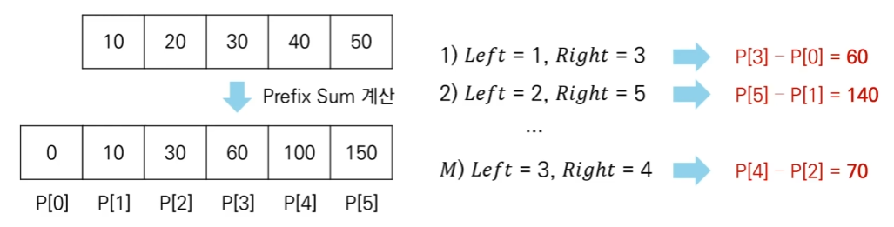

- 흔히 어떠한 문제 해결을 위해서 사전에 계산된 결과를 미리 기록해 놓고 그러한 결과를 이용해서 실제 문제들을 빠르게 구할 수 있도록하는 원리라고 생각하면 된다.

### 구간 합 빠르게 계산하는 코드
```
# 데이터의 개수 N과 데이터 입력받기
n = 5
data = [10, 20, 30, 40, 50]

# 접두사 합(Prefix Sum) 배열 계산
sum_value = 0
prefix_sum = [0]
for i in range(data):
  sum_value += i
  prefix_sum.append(sum_value)

# 구간 합 계산(세 번째 수부터 네 번째 수까지)
left  = 3
right = 4
print(preix_sum[right] - prefix_sum[left-1])
```
