# 기타 그래프 알고리즘
## 서로소 집합
- 서로소 집합(Disjoint Sets)이란 **공통 원소가 없는 두 집합**을 의미한다.
    
    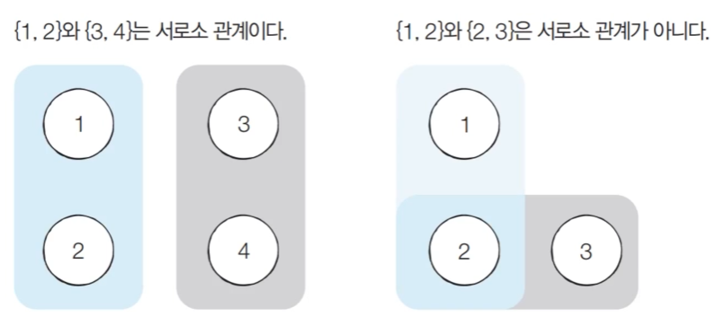

### 서로소 집합 자료구조
- **서로소 부분 집합들로 나누어진 원소들의 데이터를 처리하기 위한 자료구조**이다.

- 서로소 판별을 위해 사용할 수 있는 자료구조이다.

- 서로소 집합 자료구조는 두 종류의 연산을 지원한다.

  - **합집합(Union):** 두 개의 원소가 포함된 집합을 하나의 집합으로 합치는 연산이다.

  - **찾기(Find):** 특정한 원소가 속한 집합이 어떤 집합인지 알려주는 연산이다.

- 서로소 집합 자료구조는 **합치기 찾기(Union Find) 자료구조**라고 불리기도 한다.

### 서로소 집합 자료구조: 동작 과정
- 여러 개의 합치기 연산이 주어졌을 때 서로소 집합 자료구조의 동작 과정은 다음과 같다.
  1. 합집합(Union) 연산을 확인하여, 서로 연결된 두 노드 A, B를 확인한다.
     1. A와 B의 루트 노드 A', B'를 각각 찾는다.
     2. A'를 B'의 부모 노드로 설정한다.
  2. 모든 합집합(Union) 연산을 처리할 때까지 1번의 과정을 반복한다.

### 서로소 집합 자료구조: 동작 과정 예시
- 처리할 연산들: *Union(1,4), Union(2,3), Union(2,4), Union(5,6)*
- [초기 단계] 노드의 개수 크기의 부모 테이블을 초기화한다.
  - 처음에는 모두 노드 번호의 부모를 자기 자신으로 초기화한다.
  - 즉 초기 단계에서는 6개가 각각 서로 다른 집합이다.

    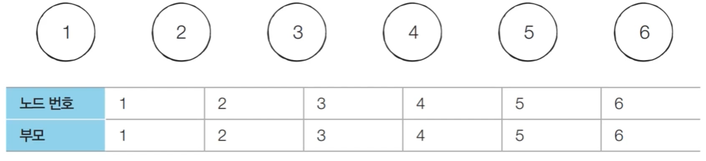

- 처리할 연산들: ***Union(1,4)***, *Union(2,3), Union(2,4), Union(5,6)*
- [Step 1] 노드 1과 노드 4의 루트 노드를 각각 찾는다. 현재 루트 노드는 각각 1과 4이므로 더 큰 번호에 해당하는 루트 노드 4의 부모를 1로 설정한다.
  - 더 큰 번호에 해당하는 루트 노드 4의 부모를 1로 설정하지 않고 반대로 노드 1의 부모를 4로 설정할 수 있다. 
  - 다만 일반적으로 번호가 더 큰 루트 노드가 더 작은 루트 노드를 가리키도록 하여 테이블을 갱신한다.
  
    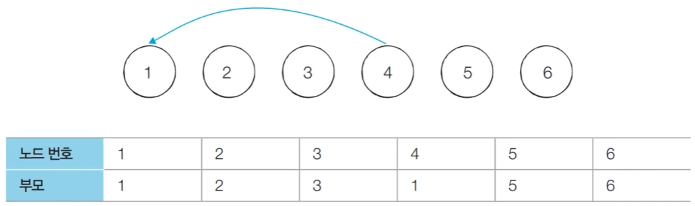

- 처리할 연산들: ***Union(1,4)***, ***Union(2,3)***, *Union(2,4), Union(5,6)*
- [Step 2] 노드 2와 노드 3의 루트 노드를 각각 찾는다. 현재 루트 노드는 각각 2와 3이므로 더 큰 번호에 해당하는 루트 노드 3의 부모를 2로 설정한다.

    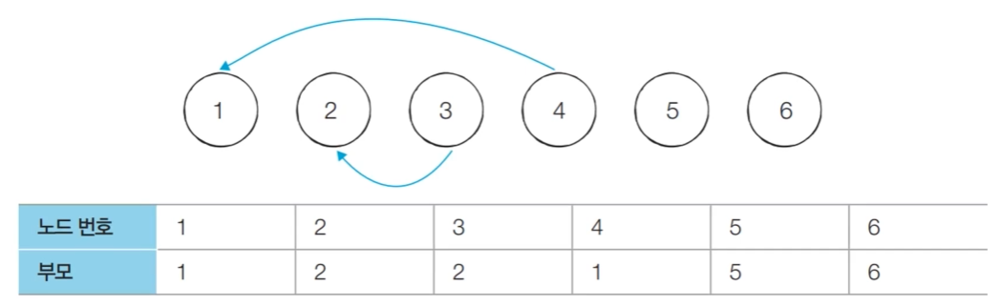

- 처리할 연산들: ***Union(1,4), Union(2,3), Union(2,4)***, *Union(5,6)*
- [Step 3] 노드 2와 노드 4의 루트 노드를 각각 찾는다. 현재 루트 노드는 각각 2와 1이므로 더 큰 번호에 해당하는 루트 노드 2의 부모를 1로 설정한다.
- 현재 테이블은 부모 노드에 대해 기록하는 테이블이며 루트 테이블이 아니다. 
- 현재 노드 3과 노드 4는 같은 집합으로 연결되어있다. 그러나 노드 3의 부모는 노드 2이고 노드 4의 부모는 노드 1이다. 이처럼 단순히 한번 확인하는 것으로는 같은 집합임을 확인할 수 없고 부모 노드를 타고 끝까지 올라가 둘의 루트 노드가 같은지 아닌지 확인하여 같은 집합인지 아닌지 판단한다.

    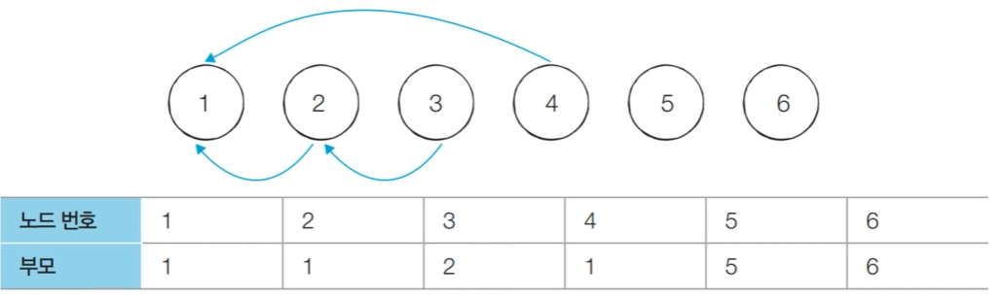

- 처리할 연산들: ***Union(1,4), Union(2,3), Union(2,4), Union(5,6)***
- [Step 4] 노드 5와 노드 6의 루트 노드를 각각 찾는다. 현재 루트 노드는 각각 5와 6이므로 더 큰 번호에 해당하는 루트 노드 6의 부모를 5로 설정한다.

    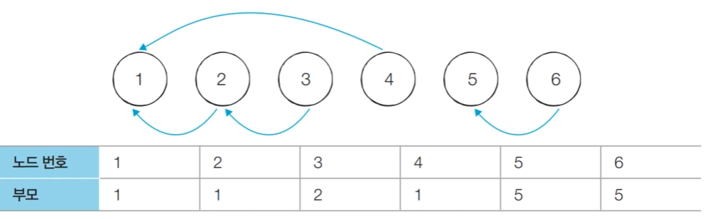

### 서로소 집합 자료구조: 연결성
- 서로소 집합 자료구조에서는 연결성을 통해 손쉽게 집합의 형태와 몇 개의 집합이 존재하는 지를 확인할 수 있다.

    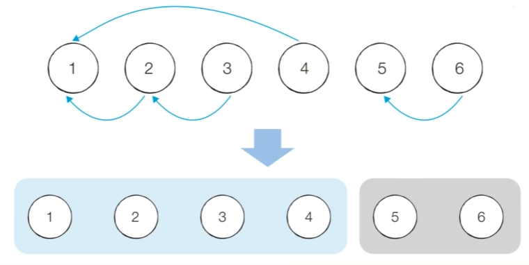

- 이와 같이 하나의 루트 노드를 갖고 하나의 트리 형태로 구성된 그래프를 같은 집합이라고 할 수 있다.

- 왼쪽에 하나의 그래프가 형성되어 있고 이 부분 그래프는 루트를 1로 가지고 총 4개의 원소가 서로 연결되어 있다는 것을 확인할 수 있다. 

- 오른쪽에 또 다른 그래프는 루트가 5인 원소가 2개로 구성된 집합임을 확인할 수 있다.

- 결과적으로 2개의 집합으로 나눠진다는 것을 알 수 있고 왼쪽 집합과 오른쪽 집합은 서로소 관계이다.

- 기본적인 형태의 서로소 집합 자료구조에서는 루트 노드에 즉시 접근할 수 없다.
  - 루트 노드를 찾기 위해 **부모 테이블을 계속해서 확인하며 거슬러 올라가야 한다.**
- 다음 예시에서 노드 3의 루트를 찾기 위해서는 노드 2를 거쳐 노드 1에 접근해야 한다.

- 실제 함수상에서 재귀적으로 거슬러 올라가며 자신의 루트 노드가 무엇인지 확인할 수 있다.

    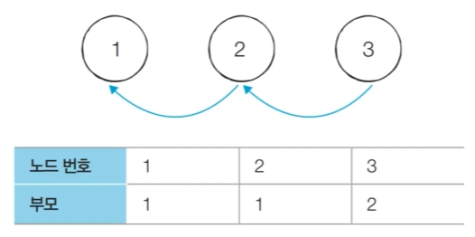

### 서로소 집합 자료구조: 기본적인 구현
```
# 특정 원소가 속한 집합 찾기
def find_parent(parent, x):
  # 루트 노드를 찾을 때까지 재귀 호출
  if parent[x] != x:
    return find_parent(parent, parent[x])
  return x

# 두 원소가 속한 집합 합치기
def union_parent(parent, a, b):
  a = find_parent(parent, a)
  b = find_parent(parent, b)
  if a < b:
    parent[b] = a
  esle:
    parent[a] = b

# 노드의 개수와 간선(Union 연산)의 개수 입력 받기
v, e = map(int, input().split())

# 부모 테이블 초기화
parent = [0] * (v+1)

# 부모 테이블상에서, 부모를 자기 자신으로 초기화
for i in range(1, v+1):
  parent[i] = i

# Union 연산
for i in range(e):
  a, b = map(int, input().split())
  union_parent(parent, a, b)

# 각 원소가 속한 집합 출력하기
print('각 원소가 속한 집합: ', end='')
for i in range(1, v+1):
  print(find_parent(parent, i), end=' ')

print()

# 부모 테이블 내용 출력하기
print('부모 테이블: ', end='')
for i in range(1, v+1):
  print(parent[i], end=' ')
```

### 서로소 집합 자료구조: 기본적인 구현 방법의 문제점
- 합집합(Union) 연산이 편향되게 이루어지는 경우 찾기(Find) 함수가 비효율적으로 동작한다.
- 최악의 경우 찾기(Find) 함수가 모든 노드를 다 확인하게 되어 시간 복잡도가 $O(V)$가 된다.
  - 다음과 같이 {1,2,3,4,5}의 총 5개의 원소가 존재하는 상황을 보자
  - 수행된 연산들: *Union(4,5), Union(3,4), Union(2,3), Union(1,2)*

  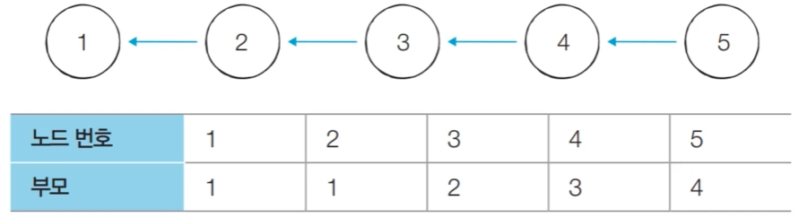

### 서로소 집합 자료구조: 경로 압축
- 찾기(Find) 함수를 최적화하기 위한 방법으로 경로 압축(Path Compression)을 이용할 수 있다.
  - 찾기(Find) 함수를 재귀적으로 호출한 뒤에 부모 테이블 값을 바로 갱신한다.
  - 부모 테이블의 부모가 루트 노드가 됨
    ```
    # 특정 원소가 속한 집합을 찾기
    def find_parent(parent, x):
      # 루트 노드가 아니라면, 루트 노드를 찾을 때까지 재귀적으로 호출하며 부모 테이블을 바로 갱신
      if parent[x] != x:
        parent[x] = find_parent(parent, parent[x])
      return parent[x]
    ```
- 경로 압축 기법을 적용하면 각 노드에 대하여 찾기(Find) 함수를 호출한 이후에 해당 노드의 루트 노드가 바로 부모 노드가 된다.
- 동일한 예시에 대해서 **모든 합집합(Union) 함수를 처리한 후 각 원소에 대하여 찾기(Find) 함수를 수행하면 다음과 같이 부모 테이블이 갱신**된다.
- 기본적인 방법에 비하여 시간 복잡도가 개선된다.

  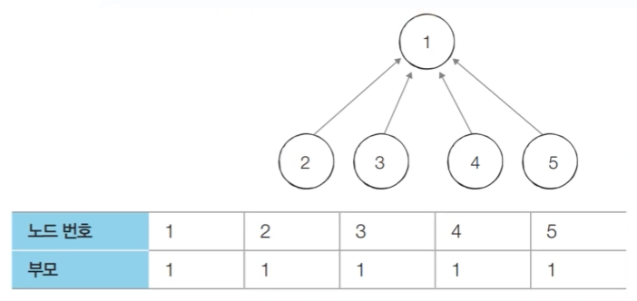

### 서로소 집합 자료구조: 경로 압축
```
# 특정 원소가 속한 집합을 찾기
def find_parent(parent, x):
  # 루트 노드가 아니라면, 루트 노드를 찾을 때까지 재귀적으로 호출하며 부모 테이블을 바로 갱신
  if parent[x] != x:
    parent[x] = find_parent(parent, parent[x])
  return parent[x]

# 두 원소가 속한 집합 합치기
def union_parent(parent, a, b):
  a = find_parent(parent, a)
  b = find_parent(parent, b)
  if a < b:
    parent[b] = a
  esle:
    parent[a] = b

# 노드의 개수와 간선(Union 연산)의 개수 입력 받기
v, e = map(int, input().split())

# 부모 테이블 초기화
parent = [0] * (v+1)

# 부모 테이블상에서, 부모를 자기 자신으로 초기화
for i in range(1, v+1):
  parent[i] = i

# Union 연산
for i in range(e):
  a, b = map(int, input().split())
  union_parent(parent, a, b)

# 각 원소가 속한 집합 출력하기
print('각 원소가 속한 집합: ', end='')
for i in range(1, v+1):
  print(find_parent(parent, i), end=' ')

print()

# 부모 테이블 내용 출력하기
print('부모 테이블: ', end='')
for i in range(1, v+1):
  print(parent[i], end=' ')
```
- 여기서 1 ← 2 ← 3 ← 4 ← 5가 있다고 할 때, find_parent(parent, 4)를 하면 2, 3번 노드도 부모 테이블에서 부모 노드가 루트 노드인 1번 노드로 갱신된다. 따라서 시간 복잡도가 $O(V)$ 보다 개선된다.

### 서로소 집합을 활용한 사이클 판별
- 서로소 집합은 **무방향 그래프 내에서의 사이클을 판별**할 때 사용할 수 있다.
  - 참고로 방향 그래프에서의 사이클 여부는 DFS를 이용하여 판별할 수 있다.
- **사이클 판별 알고리즘**은 다음과 같다.
1. 각 간선을 하나씩 확인하며 두 노드의 루트 노드를 확인한다.
   1. 루트 노드가 서로 다르다면 두 노드에 대하여 합집합(Union) 연산을 수행한다.
   2. 루트 노드가 서로 같다면 사이클이 발생한 것이다.
2. 그래프에 포함되어 있는 모든 간선에 대하여 1번 과정을 반복한다.
### 서로소 집합을 활용한 사이클 판별: 동작 과정
- [초기 단계] 모든 노드에 대하여 자기 자신을 부모로 설정하는 형태로 부모 테이블을 초기화한다.

  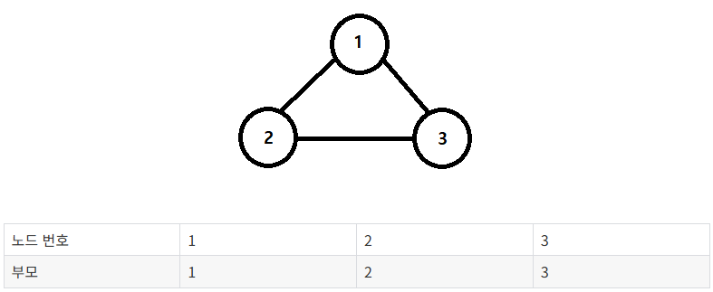

- [Step 1] 간선(1, 2)를 확인한다. 노드 1과 노드 2의 루트 노드는 각각 1과 2이다. 따라서 더 큰 번호에 해당하는 노드 2의 부모 노드를 1로 변경한다.

  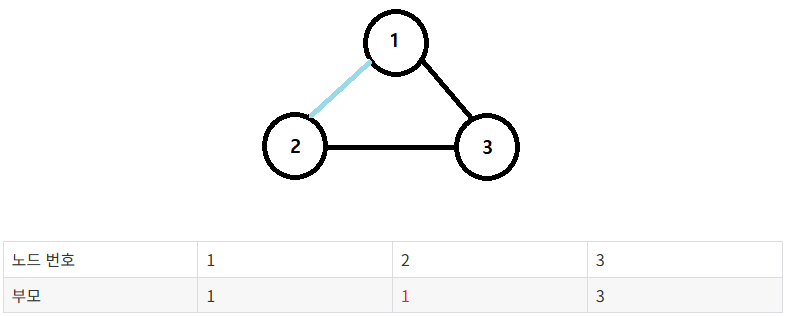

- [Step 2] 간선(1, 3)를 확인한다. 노드 1과 노드 3의 루트 노드는 각각 1과 3이다. 따라서 더 큰 번호에 해당하는 노드 3의 부모 노드를 1로 변경한다.

  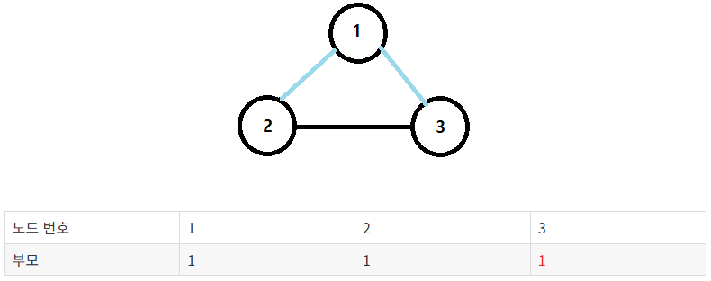

- [Step 3] 간선(2, 3)를 확인한다. 노드 2과 노드 3의 루트 노드는 모두 1이다. 따라서 **루트 노드가 같기 때문에 사이클이 발생**한 것이다.

  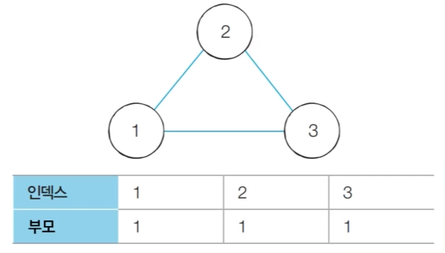


### 서로소 집합을 활용한 사이클 판별: 코드 구현
```
# 특정 원소가 속한 집합을 찾기
def find_parent(parent, x):
  # 루트 노드를 찾을 때까지 재귀 호출
  if parent[x] != x:
    parent[x] = fine_parent(parent, parent[x])
  return parent[x]

# 두 원소가 속한 집합을 합치기
def union_parent(parent, a, b):
  a = find_parent(parent, a)
  b = find_parent(parent, b)
  if a < b:
    parent[b] = a
  else:
    parent[a] = b

# 노드의 개수와 간선(Union 연산)의 개수 입력 받기
v, e = map(int, input().split())

# 부모 테이블 초기화
parent = [0] * (v+1)

# 부모 테이블상에서, 부모를 자기 자신으로 초기화
for i in range(1, v+1):
  parent[i] = i

cycle = False

for i in range(e):
  a, b = map(int, input().split())
  # 사이클이 발생한 경우 종료
  if find_parent(parent, a) == find_parent(parent, b):
    cycle = True
    break
  else:
    union_parent(parent, a, b)

if cycle:
  print('사이클 발생')
else:
  print('사이클 발생 없음')
```

## 신장 트리
- 그래프에서 모든 노드를 포함하면서 사이클이 존재하지 않는 부분 그래프를 의미한다.
  - 즉 **모든 노드를 유지한 채, 사이클을 만들지 않도록 간선을 최소한으로 선택한 구조이다.**
  - 모든 노드가 포함되어 서로 연결되면서 사이클이 존재하지 않는다는 조건이 트리의 조건이기도 하다.
  - 사이클이 존재하면 신장 트리가 아니다.

    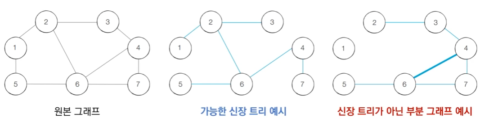

  - 신장 트리는 모든 노드가 연결되어 있으나 일부 간선을 사용하지 않아도 괜찮도록 해준다는 점에서 최소 연결로 모든 노드를 연결하는 문제에서 효과적이다.

### 최소 신장 트리
- 최소한의 비용으로 구성되는 신장 트리를 찾아야 하는 문제가 최소 신장 트리 문제이다.
- 예를 들어 N개의 도시가 존재하는 상황에서 두 도시 사이에 도로를 놓아 **전체 도시가 서로 연결**될 수 있게 도로를 설치하는 경우
  - 두 도시 A, B를 선택했을 때 A에서 B로 이동하는 경로가 반드시 존재하도록 도로를 설치한다.
  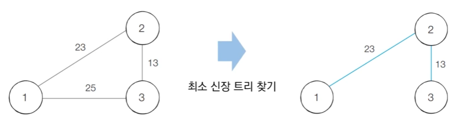

### 크루스칼 알고리즘
- 대표적인 **최소 신장 트리 알고리즘**이다.

- 그리디 알고리즘으로 분류된다.

- 최소 신장 트리에 포함되어있는 간선의 개수는 전체 노드의 개수 - 1 이다.

- 구체적인 동작은 다음과 같다.
  1. 간선 데이터를 비용에 따라 오름차순으로 정렬한다. -> 비용이 적은 간선부터 확인

  2. 간선을 하나씩 확인하며 현재의 간선이 사이클을 발생시키는지 확인한다.
     1. 사이클이 발생하지 않는 경우 최소 신장 트리에 포함시킨다.
     
     2. 사이클이 발생하는 경우 최소 신장 트리에 포함시키지 않는다.
  3. 모든 간선에 대하여 2번 과정을 반복한다.

### 크루스칼 알고리즘: 동작 과정
- [초기 단계] 그래프의 모든 간선 정보에 대하여 **오름차순 정렬**을 수행한다.
  - 비용이 적은 가선부터 처리하도록 함
  
  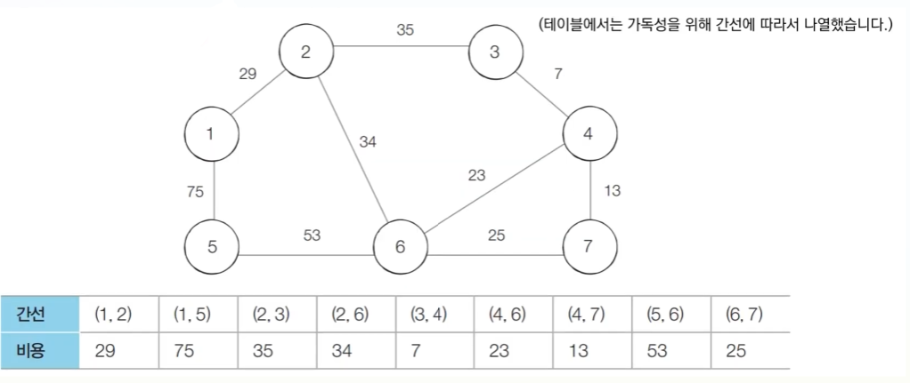

- [Step 1] 아직 처리하지 않은 간선 중에서 가장 짧은(비용이 적은) 간선인 (3,4)를 선택하여 처리한다.
  - 현재 3, 4번 노드는 같은 집합에 속해있지 않기 때문에 Union 함수를 호출함
  
  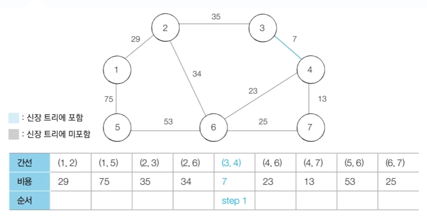

- [Step 2] 아직 처리하지 않은 간선 중에서 가장 짧은(비용이 적은) 간선인 (4,7)를 선택하여 처리한다.
  - 현재 4, 7번 노드도 마찬가지로 같은 집합에 속해있지 않기 때문에 Union 함수를 호출함
  
  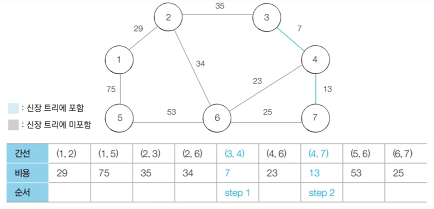

- [Step 3] 아직 처리하지 않은 간선 중에서 가장 짧은(비용이 적은) 간선인 (4,6)를 선택하여 처리한다.
  - 현재 4, 6번 노드도 마찬가지로 같은 집합에 속해있지 않기 때문에 Union 함수를 호출함
  
  

- [Step 4] 아직 처리하지 않은 간선 중에서 가장 짧은(비용이 적은) 간선인 (6,7)를 선택하여 처리한다.
  - 현재 6, 7번 노드는 이미 같은 집합에 속해있기 때문에 해당 간선은 무시하고 넘어간다.
  
  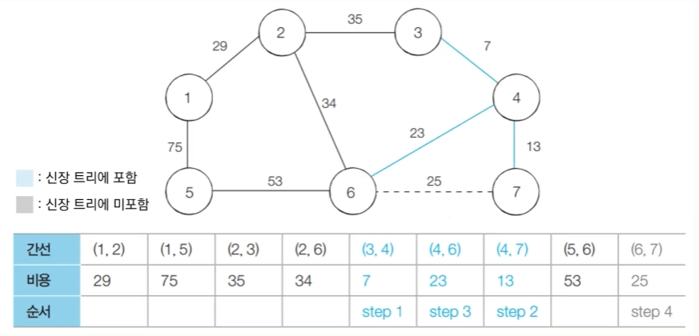

- [Step 5] 아직 처리하지 않은 간선 중에서 가장 짧은(비용이 적은) 간선인 (1,2)를 선택하여 처리한다.
  - 현재 1, 2번 노드는 같은 집합에 속해있지 않기 때문에 Union 함수를 호출함

  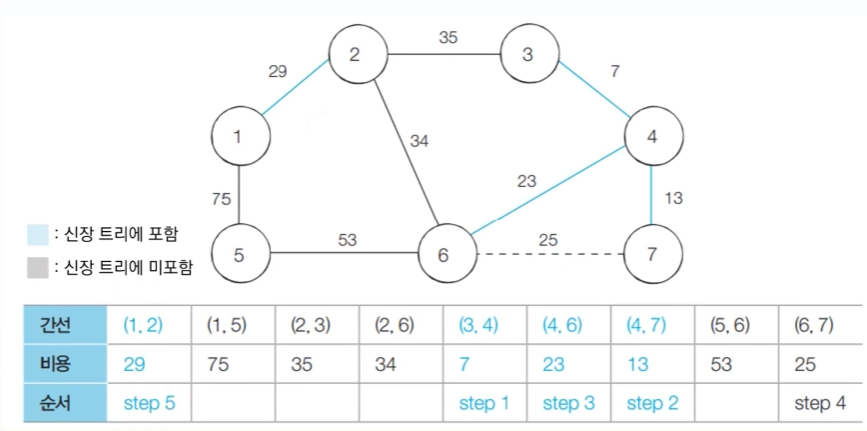

- [Step 6] 아직 처리하지 않은 간선 중에서 가장 짧은(비용이 적은) 간선인 (2,6)를 선택하여 처리한다.
  - 현재 2, 6번 노드는 같은 집합에 속해있지 않기 때문에 Union 함수를 호출함

  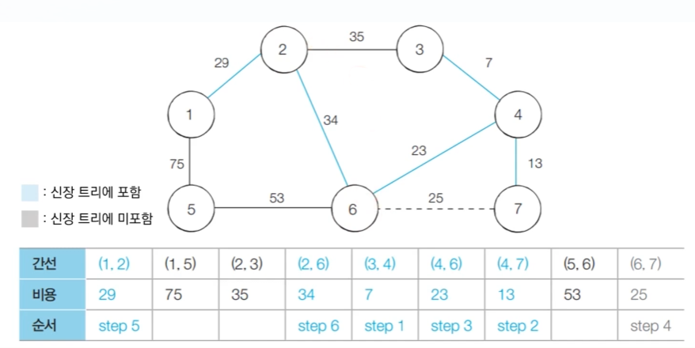

- [Step 7] 아직 처리하지 않은 간선 중에서 가장 짧은(비용이 적은) 간선인 (2,3)를 선택하여 처리한다.
  - 현재 2, 3번 노드는 이미 같은 집합에 속해있기 때문에 해당 간선은 무시하고 넘어간다.
  
  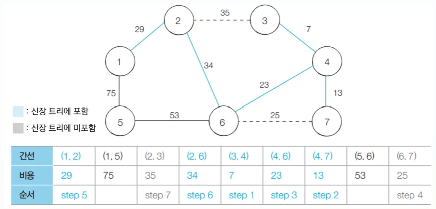  

- [Step 8] 아직 처리하지 않은 간선 중에서 가장 짧은(비용이 적은) 간선인 (5,6)를 선택하여 처리한다.
  - 현재 5, 6번 노드는 같은 집합에 속해있지 않기 때문에 Union 함수를 호출함

  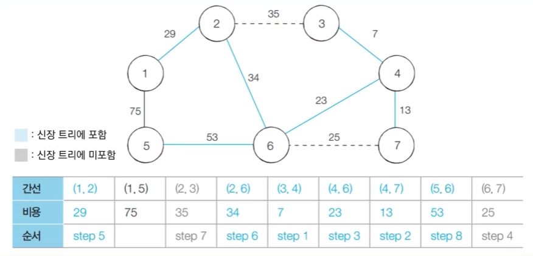

- [Step 9] 아직 처리하지 않은 간선 중에서 가장 짧은(비용이 적은) 간선인 (1,2)를 선택하여 처리한다.
  - 현재 1, 2번 노드는 이미 같은 집합에 속해있기 때문에 해당 간선은 무시하고 넘어간다.
  
  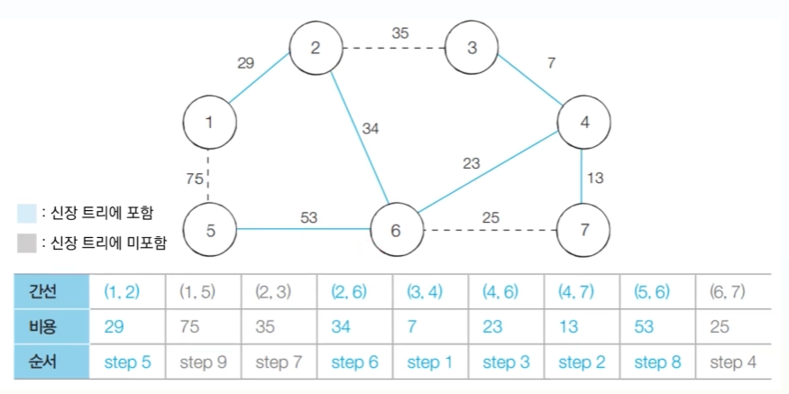 

- [알고리즘 수행 결과]
  - 최소 신장 트리에 포함되어 있는 간손의 비용만 모두 더하면 그 값이 최종 비용에 해당한다.

  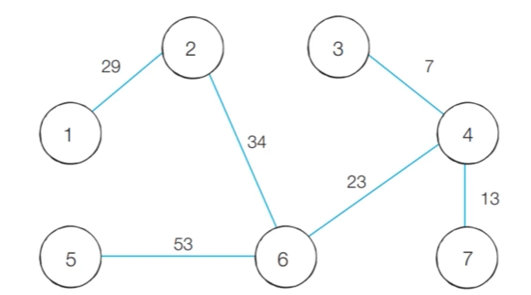

### 쿠르스칼 알고리즘: 코드 구현
```
# 특정 원소가 속한 집합을 찾기
def find_parent(parent, x):
  # 루트 노들르 찾을 때까지 재귀 호출
  if parent[x] != x:
    parent[x] = find_parent(parent, parent[x])
  return parent[x]

def union_parent(parent, a, b):
  a = find_parent(parent, a)
  b = find_parent(parent, b)
  if a < b:
    parent[b] = a
  else:
    parent[a] = b

# 노드의 개수와 간선(Union 연산)의 개수 입력
v, e = map(int, input().split())

# 부모 테이블 초기화
parent = [0] *(v+1)

# 모든 간선을 담을 리스트와 최종 비용을 담을 변수
edges = []
result = 0

# 부모 테이블상에서 부모를 자기 자신으로 초기화
for i in range(1, v+1):
  parent[i] = i

# 모든 간선에 대한 정보를 입력 받기
for _in range(e):
  a, b, cost = map(int, input().split())
  # 비용순으로 정렬하기 위해 튜플의 첫 번째 원소를 비용으로 설정
  edges.append((cost, a, b))

# 간선을 비용순으로 정렬
edges.sort()

# 간선을 하나씩 확인하며
for edge in edges:
  cost, a, b = edge
  # 사이클이 발생하지 않는 경우에만 집합에 포함
  if find_parent(parent, a) != find_parent(parent, b):
    union_parent(parent, a, b)
    result += cost

print(result)
```
- 파이썬에서는 리스트의 원소가 튜플이고 튜플의 원소가 여러 개일 때는 튜플의 첫 번째 원소를 기준으로 정렬을 수행한다.

### 크루스칼 알고리즘 성능 분석
- 크루스칼 알고리즘은 간선의 개수가 E개일 때, $O(ElogE)$의 시간 복잡도를 가진다.
- 크루스칼 알고리즘에서 가장 많은 시간을 요구하는 곳은 간선 정렬을 수행하는 부분이다.
  - 표준 라이브러리를 이용해 E개의 데이터를 정렬하기 위한 시간 복잡도는 $O(ElogE)$이다.