# 최단 경로 알고리즘
- 최단 경로 알고리즘은 가장 짧은 경로를 찾는 알고리즘을 의미한다.

- 다양한 문제 상황
  - 한 지점에서 다른 한 지점까지의 최단 경로
  - 한 지점에서 다른 모든 지점까지의 최단 경로
  - 모든 지점에서 다른 모든 지점까지의 최단 경로

- 각 지점은 그래프에서 노드로 표현
- 지점 간 연결된 도로는 그래프에서 간선으로 표현 
  - 간선은 문제에 따라 도로나 통로 등으로 표현된다.

## 다익스트라 알고리즘
- **특정한 노드**에서 출발하여 **다른 모든 노드**로 가는 최단 경로를 계산한다.

- 다익스트라 최단 경로 알고리즘은 음의 간선이 없을 때 정상 동작한다.
  - 현실 세계의 도로(간선)은 음의 간선으로 표현되지 않는다. 
  - 현실 세계의 길 찾기 문제에서 사용될 수 있는 알고리즘이다.
- 다익스트라 최단 경로 알고리즘은 그리디 알고리즘으로 분류된다.
  - **매 상황에서 가장 비용이 적은 노드를 선택**해 임의의 과정을 반복한다. 
  - 단, 기본적으로 길찾기 문제는 다이나믹 프로그래밍이 적용된 문제이다.

### 다익스트라 알고리즘 동작 과정
- 알고리즘의 동작 과정은 다음과 같다.

  1. 출발 노드를 설정한다.
  2. 최단 거리 테이블을 초기화한다.  
       - 자기 자신은 0, 나머지 모든 노드에 대해서는 무한으로 초기화
  3. 방문하지 않은 노드 중에서 최단 거리가 가장 짧은 노드를 선택한다. (그리디 알고리즘 유형)
  4. 해당 노드를 거쳐 다른 노드로 가는 비용을 계산하여 최단 거리 테이블을 갱신한다.
  5. 위 과정에서 3번과 4번을 반복한다.
     
     - 모든 노드에 대해서 방문 처리가 끝났을 때 전체 노드까지의 모든 최단 거리를 알 수 있다.
     
     - 최단 경로까지 알기 위해서는 별도의 로직이 추가로 필요하다. (일반적인 코테에서는 경로까지 구하라고 하지 않음)

- 다익스트라 알고리즘 동작 과정에서 최단 거리 테이블은 각 노드에 대한 현재까지의 최단 거리 정보를 갖고 있다.

    
- 처리 과정에서 더 짧은 경로를 찾으면 '이제부터는 이 경로가 제일 짧은 경로야'라고 갱신한다.  

    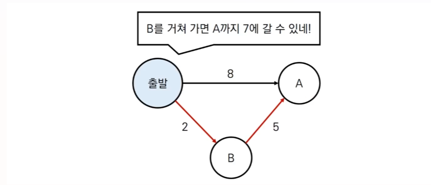

### 다익스트라 알고리즘: 동작 과정 살펴보기
- [초기 상태] 그래프를 준비하고 출발 노드를 설정한다.
  - 방문하지 않은 노드 중에서 가장 거리가 짧은 노드를 매번 선택해서 해당 노드를 거쳐가는 경로를 확인해 테이블을 갱신

    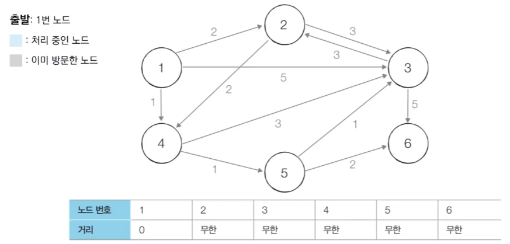

- [Step 1] 방문하지 않은 노드 중에서 최단 거리가 가장 짧은 노드인 1번 노드를 방문해서 처리한다.
  - 1번 노드를 통해서 이동 가능한 방문하지 않은 노드는 2, 3, 4번 노드이다.
  - 1번을 거쳐갈 때 1번까지의 거리 + 1번에서 2, 3, 4번 노드까지의 거리로 계산해 테이블에 갱신한다.

    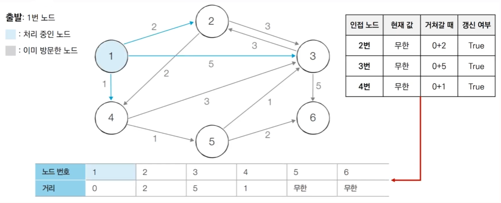

- [Step 2] 방문하지 않은 노드 중에서 최단 거리 값이 현재 테이블에 가장 작은 노드인 4번 노드를 방문해서 처리한다.
  - 4번 노드와 인접한 노드는 3, 5번 노드이다.
  - 방문한 노드는 해당 노드까지 가기 위한 거리 비용이 고정되고 더 이상 갱신하지 않는다.
  - 4번 노드까지 가기 위한 비용은 1로 결정이 되어서 더 이상 바뀌지 않는다.
  - 4번 노드에서 3번 노드까지 4번 노드에 가기 위한 비용까지 고려했을 때 값이 4이므로 기존의 테이블의 값인 5보다 작고 따라서 값을 갱신한다.
  - 5번 노드도 마찬가지로 갱신한다.

    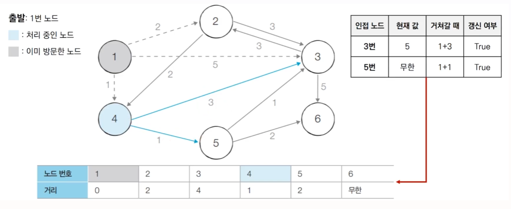

- [Step 3] 방문하지 않은 노드 중에서 최단 거리 값이 현재 테이블에 가장 작은 노드인 2번 노드를 방문해서 처리한다.
  - 현재 테이블에서 2번과 5번 노드가 같은 거리 값을 갖고 이런 경우 노드 번호가 더 낮은 노드부터 처리한다.
  - 2번 노드로 가는 최단 거리 값이 고정된다.
  - 2번에 인점한 노드는 4, 3번 노드가 있으나 4번은 고정되어 있으므로 3번 노드만 갱신 여부를 확인한다.
  - 현재 값보다 거쳐갈 때의 값이 더 크면 갱신하지 않는다.

    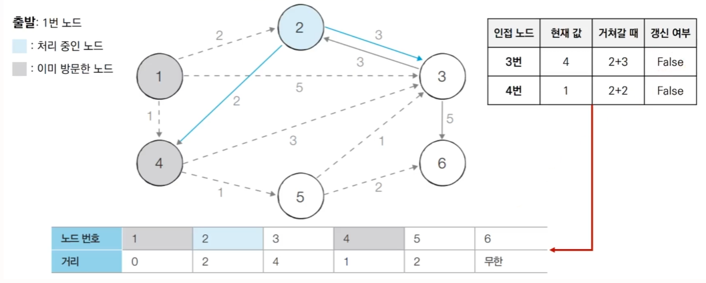

- [Step 4] 방문하지 않은 노드 중에서 최단 거리 값이 현재 테이블에 가장 작은 노드인 5번 노드를 방문해서 처리한다.
  - 5번 노드에 대한 최단 경로 테이블 값을 고정한다.
  - 5번 노드의 인점 노드인 3, 6번 노드에 대한 최단 경로 테이블 갱신 여부를 확인해 갱신한다.

    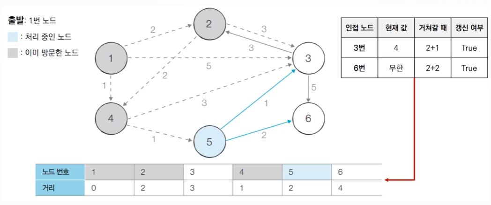

- [Step 5] 방문하지 않은 노드 중에서 최단 거리 값이 현재 테이블에 가장 작은 노드인 3번 노드를 방문해서 처리한다.
  - 3번 노드에 대한 최단 경로 테이블 값을 고정한다.
  - 3번 노드에 인점한 노드 갱신 여부 확인 및 갱신

    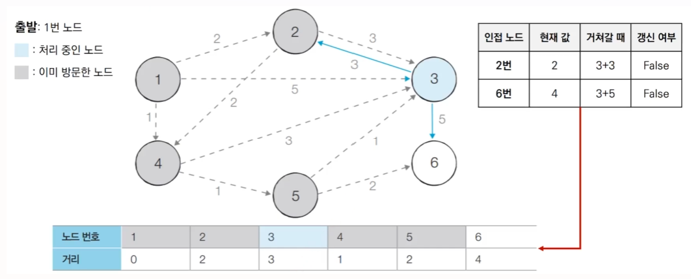

- [Step 5] 방문하지 않은 노드 중에서 최단 거리 값이 현재 테이블에 가장 작은 노드인 6번 노드를 방문해서 처리한다.
  - 6번 노드에 대한 최단 경로 테이블 값을 고정한다.
  - 다만 마지막 노드는 굳이 처리하지 않아도 된다.

    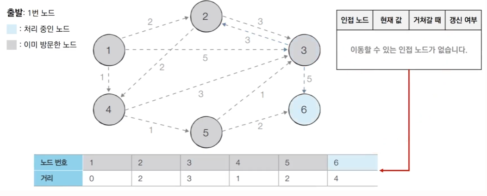

### 다익스트라 알고리즘의 특징
- 그리드 알고리즘: **매 상황에서 방문하지 않은 가장 비용이 적은 노드를 선택** 임의의 과정을 반복한다.

- 단계를 거치며 ***한 번 처리된 노드의 최단 거리는 고정***되어 더 이상 바뀌지 않는다.

  - **한 단계당 하나의 노드에 대한 최단 거리를 확실히 찾는 것으로 이해**할 수 있다.
- 다익스트라 알고리즘 수행 완료 후 **테이블에 각 노드까지의 최단 거리 정보가 저장**된다.
  - 완벽한 형태의 최단 경로를 구하려면 소스코드에 추가적인 기능을 더 넣어야 한다.

### 다익스트라 알고리즘: 간단 구현
- 단계마다 방문하지 않은 노드 중에서 최단 거리가 가장 짧은 노드를 선택하기 위해 **매 단계마다 1차원 테이블의 모든 원소를 확인**(**순차 탐색**)합니다.

    ```
    import sys
    input = sys.stdin.readline
    INF = int(1e9) # 무한을 의미하는 값으로 10억을 설정

    # 노드의 개수, 간선의 개수를 입력받기
    n, m = map(int, input().split())

    # 시작 노드 번호를 입력받기
    start = int(input())

    # 각 노드에 연결되어 있는 노드에 대한 정보를 담는 리스트를 만들기
    graph = [[] for i in range(n+1)]

    # 방문한 적이 있는지 체크하는 목적의 리스트 만들기
    visited = [False] * (n+1)

    # 방문한 적이 있는지 체크하는 목정의 리스트를 만들기
    distance = [INF] * (n+1)

    # 모든 간선 정보를 입력받기
    for _ in range(m):
        a, b, c = map(int, input().split())
        # a번 노드에서 b번 노드로 가는 비용이 c라는 의미
        graph[a].append((b,c))

    # 방문하지 않은 노드 중에서, 최단 거리 테이블에서 거리 값이 가장 작은 노드의 번호를 반환
    def get_smallest_node(): 
        min_value = INF
        index = 0 # 가장 최단 거리가 짧은 노드(인덱스)
        for i in range(1,n+1):
            if distance[i] < min_value and not visited[i]:
                min_value = distance[i]
                index = i
        return index

    def dijkstra(start):
        # 시작 노드에 대해서 초기화
        distance[start] = 0
        visited[start] = True
        for j in graph[start]:
            distance[j[0]] = j[1]

        # 시작 노드를 제외한 전체 n-1개의 노드에 대해 반복
        for i in range(n-1):
            # 현재 최단 거리가 가장 짧은 노드를 꺼내서, 방문 처리
            now = get_smallest_node()
            visited[now] = True
            # 현재 노드와 연결된 다른 노드를 확인
            for j in graph[now]:
                cost = distance[now] + j[1]
                # 현재 노드를 거쳐서 다른 노드로 이동하는 거리가 더 짧은 경우
                if cost < distance[j[0]]:
                    distance[j[0]] = cost

    # 다익스트라 알고리즘 수행
    dijkstra(start)

    # 모든 노드로 가기 위한 최단 거리를 출력            
    for i in range(1, n+1):
        # 도달할 수 없는 경우, 무한이라고 출력
        if distance[i] == INF:
            print("INFINITY")
        # 현재 인덱스 번호에 해당하는 노드에 도달할 수 있는 경우 최단 거리를 출력
        else:
            print(distance[i])
    ```

### 다익스트라 알고리즘: 간단 구현에 대한 성능 분석
- 총 $O(V)$번에 걸쳐서 최단 거리가 가장 짧은 노드를 매번 선형 탐색해야 한다.

- 따라서 전체 시간 복잡도는 $O(V^2)$이다.

- 일반적으로 코딩 테스트의 최단 경로 문제에서 전체 노드의 개수(V)가 5000개 이하라면 이 코드로 문제를 해결할 수 있다.
  - 하지만 노드의 개수가 10,000개를 넘어가면 문제가 된다.

### 우선순위 큐(Priority Queue)
- **우선순위가 가장 높은 데이터를 가장 먼저 삭제**하는 자료구조이다.

- 예를 들어 여러 개의 물건 데이터를 자료구조에 넣었다가 가치가 높은 물건 데이터부터 꺼내서 확인해야 하는 경우에 우선순위 큐를 이용할 수 있다.

- python, C++, JAVA를 포함한 대부분의 프로그래밍 언어에서 **표준 라이브러리 형태로 지원**한다.

    

### 힙(Heap)
- 우선순위 큐를 구현하기 위해 사용하는 자료구조 중 하나이다.
  - 내부적으로 트리 구조를 활용하여 삽입과 삭제를 함

- **최소 힙**(**Min Heap**)과 **최대 힙**(**Max Heap**)이 있다.
  - **최소 힙**(**Min Heap**) : 값이 낮은 데이터부터 꺼내는 방식으로 동작
  - **최대 힙**(**Max Heap**) : 값이 높은 데이터부터 꺼내는 방식으로 동작

- 다익스트라 최단 경로 알고리즘을 포함해 다양한 알고리즘에서 사용된다.

    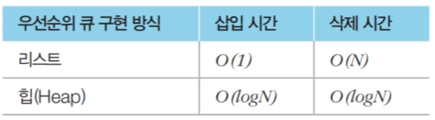

### 힙 라이브러리 사용 예제: 최소 힙
```
inport heapq

# 오름차순 힙 정렬(Heap Sort)
def heapsort(iterable):
    h = []
    redult = []
    # 모든 원소를 차례대로 힙에 삽입
    for value in iterable:
        heapq.heappush(h, value)
    for i in range(len, h):
        result.append(heapq.heappop(h))
    return result

result = heapsort([1, 3, 5, 7, 8, 2, 4, 6, 8, 0])
print(result)
```
```
[0, 1, 2, 3, 4, 5, 6, 7, 8, 9]
```
- 데이터를 넣을 때 가장 작은 값이 항상 인덱스 0이 되도록 알아서 위치를 조정해서 h 리스트에 넣는다.

- 데이터를 뺄 때 즉 heappop할 때 그냥 인덱스 0에서부터 순서대로 꺼내는 것이다.

- 힙에 데이터를 하나 넣을 때 $O(logN)$의 시간 복잡도가 걸리므로 n개의 데이터를 넣은 뒤 빼는 경우 $O(NlogN)$의 시간 복잡도가 소요된다. -> 퀵 정렬 알고리즘과 동일한 시간 복잡도

### 힙 라이브러리 사용 예제: 최대 힙
```
inport heapq

# 오름차순 힙 정렬(Heap Sort)
def heapsort(iterable):
    h = []
    redult = []
    # 모든 원소를 차례대로 힙에 삽입
    for value in iterable:
        heapq.heappush(h, -value)
    for i in range(len, h):
        result.append(-heapq.heappop(h))
    return result

result = heapsort([1, 3, 5, 7, 8, 2, 4, 6, 8, 0])
print(result)
```
```
[9, 8, 7, 6, 5, 4, 3, 2, 1, 0]
```
- 기본적으로 파이썬에서는 최대 힙을 따로 제공하지 않는다.

- 따라서 데이터를 힙에 넣기 전에 데이터의 부호를 반대로 바꿔 넣고 꺼낼때도 데이터 부호를 반대로 바꾸면 된다.

### 다익스트라 알고리즘: 개선된 구현 방법
- 단계마다 방문하지 않은 노드 중에서 최단 거리가 가장 짧은 노드를 선택하기 위해 힙(Heap) 자료구조를 이용한다.

- 다익스트라 알고리즘이 동작하는 기본 원리는 동일하다.
  - 현재 가장 가까운 노드를 저장해 놓기 위해서 힙 자료구조를 추가적으로 이용한다는 점이 다르다.
  - 현재의 최단 거리가 가장 짧은 노드를 선택해야 하므로 최소 힙(Min Heap)을 사용한다.

### 다익스트라 알고리즘: 동작 과정 살펴보기 (우선순위 큐)
- [초기 상태] 그래프를 준비하고 출발 노드를 설정하여 우선순위 큐에 삽입한다.
  - 큐에 데이터를 넣을 때 튜플 형태로 데이터를 묶는 과정에서 **첫번째 원소를 거리로 설정하게 되면 거리를 기준으로 거리가 더 작은 원소가 먼저 나올 수 있도록 큐가 구성됨**
  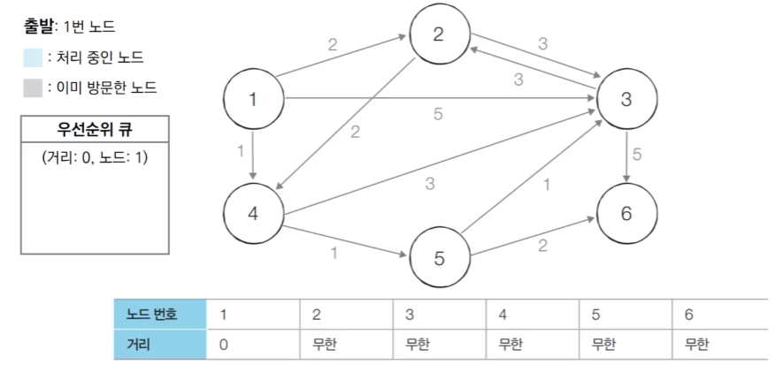

  - 매 단계마다 우선순위 큐에서 원소를 꺼내 해당 노드까지의 거리를 확인한 뒤 그 노드로 가서 그 노드를 거쳐 가는 각각의 노드들까지 확인하면 된다.

- [Step 1] 우선순위 큐에서 원소를 꺼낸다. 1번 노드는 아직 방문하지 않았으므로 이를 처리한다.

  - 1번 노드를 방문 처리하고 최단 거리 테이블에서 1번 노드까지 최단 거리 값을 고정
  - 현재 방문한 노드의 인접 노드까지의 최단 거리를 확인 후 최단 거리 테이블 갱신
  - 최단 거리 테이블의 값을 갱신하는 경우만 해당 노드를 우선순위 큐에 넣는다.

  

- [Step 2] 우선순위 큐에서 원소를 꺼낸다. 4번 노드는 아직 방문하지 않았으므로 이를 처리한다.

  - 4번 노드를 방문 처리하고 최단 거리 테이블에서 4번 노드까지 최단 거리 값을 고정
  - 현재 방문한 노드의 인접 노드까지의 최단 거리를 확인 후 최단 거리 테이블 갱신
  - 최단 거리 테이블의 값을 갱신하는 경우만 해당 노드를 우선순위 큐에 넣는다.
  - 갱신 전에 들어가 있던 3번 노드는 갱신 이후의 3번 노드가 또 들어와 우선순위 큐에서 아래로 밀려남

  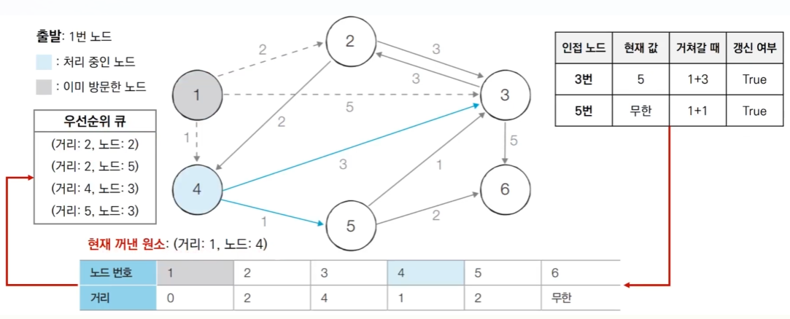

- [Step 3] 우선순위 큐에서 원소를 꺼낸다. 2번 노드는 아직 방문하지 않았으므로 이를 처리한다.
  - 2번 노드를 방문 처리하고 최단 거리 테이블에서 2번 노드까지 최단 거리 값을 고정
  - 현재 방문한 노드의 인접 노드까지의 최단 거리를 확인 후 최단 거리 테이블 갱신
  - 갱신한 노드가 없어 우선순위 큐에는 새로 들어온 것이 없음

  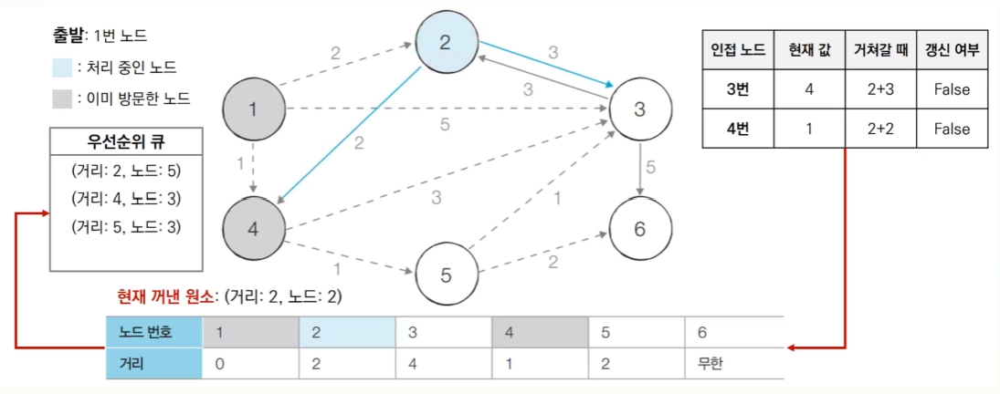

- [Step 4] 우선순위 큐에서 원소를 꺼낸다. 5번 노드는 아직 방문하지 않았으므로 이를 처리한다.
  - 5번 노드를 방문 처리하고 최단 거리 테이블에서 5번 노드까지 최단 거리 값을 고정
  - 현재 방문한 노드의 인접 노드까지의 최단 거리를 확인 후 최단 거리 테이블 갱신
  - 최단 거리 테이블의 값을 갱신하는 경우만 해당 노드를 우선순위 큐에 넣는다.
  - 갱신 전에 들어가 있던 3번 노드는 갱신 이후의 3번 노드가 또 들어와 우선순위 큐에서 아래로 밀려남

  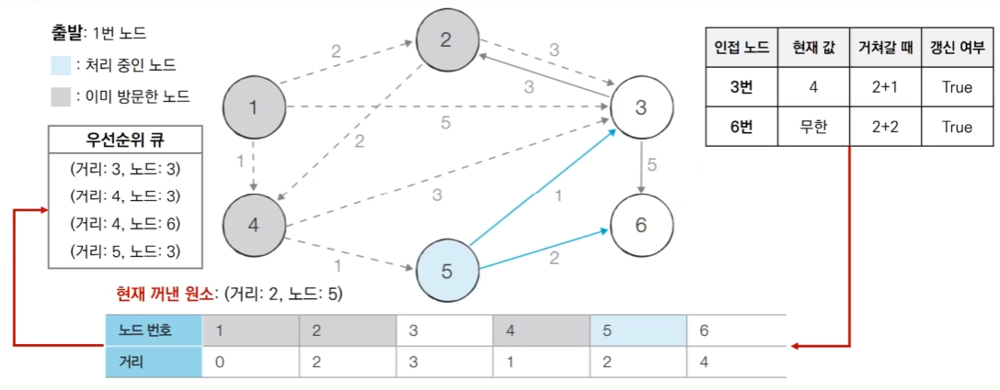

- [Step 5] 우선순위 큐에서 원소를 꺼낸다. 3번 노드는 아직 방문하지 않았으므로 이를 처리한다.
  - 3번 노드를 방문 처리하고 최단 거리 테이블에서 3번 노드까지 최단 거리 값을 고정
  - 현재 방문한 노드의 인접 노드까지의 최단 거리를 확인 후 최단 거리 테이블 갱신
  - 갱신한 노드가 없어 우선순위 큐에는 새로 들어온 것이 없음

  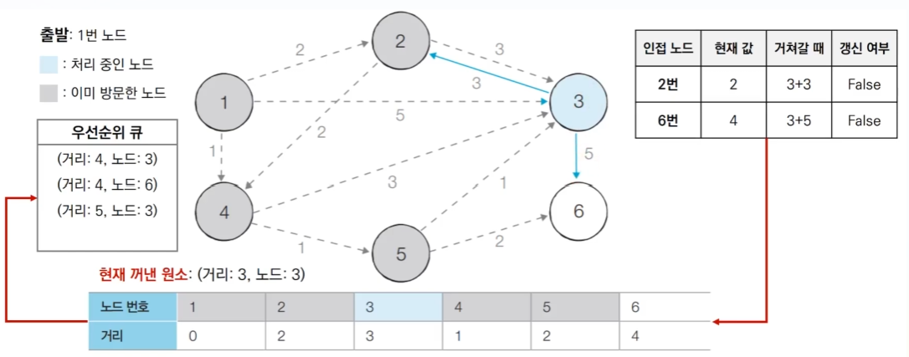

- [Step 6] 우선순위 큐에서 원소를 꺼낸다. 3번 노드는 이미 방문했기 때문에 무시
  - 이때 별도로 방문 여부를 기록하는 테이블을 쓸 필요 없이 해당 노드의 거리 값과 최단 거리 테이블에 저장된 3번 노드 거리값을 비교
  - 우선순위 큐에서 꺼낸 노드 거리 값이 더 크면 꺼낸 노드를 무시하고 다음 과정으로 넘어감

  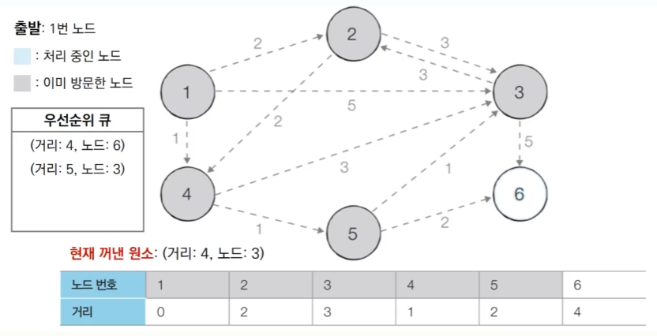

- [Step 7] 우선순위 큐에서 원소를 꺼낸다. 6번 노드는 아직 방문하지 않았으므로 이를 처리한다.
  - 6번 노드를 방문 처리하고 최단 거리 테이블에서 6번 노드까지 최단 거리 값을 고정
  - 현재 방문한 노드의 인접 노드까지의 최단 거리를 확인 후 최단 거리 테이블 갱신
  - 갱신한 노드가 없어 우선순위 큐에는 새로 들어온 것이 없음

  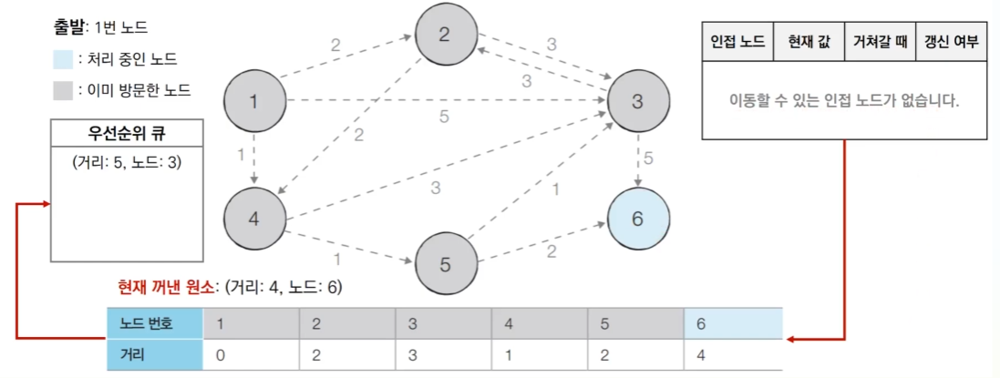

- [Step 8] 우선순위 큐에서 원소를 꺼낸다. 3번 노드는 이미 방문했으므로 무시한다.

  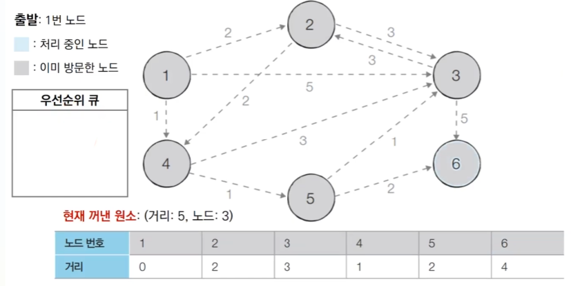

### 다익스트라 알고리즘: 개선된 구현 방법
  ```
  import sys
  input = sys.stdin.readline
  INF = int(1e9) # 무한을 의미하는 값으로 10억을 설정

  # 노드의 개수, 간선의 개수를 입력받기
  n, m = map(int, input().split())

  # 시작 노드 번호를 입력받기
  start = int(input())

  # 각 노드에 연결되어 있는 노드에 대한 정보를 담는 리스트를 만들기
  graph = [[] for i in range(n+1)]

  # 방문한 적이 있는지 체크하는 목적의 리스트 만들기
  visited = [False] * (n+1)

  # 방문한 적이 있는지 체크하는 목정의 리스트를 만들기
  distance = [INF] * (n+1)

  # 모든 간선 정보를 입력받기
  for _ in range(m):
      a, b, c = map(int, input().split())
      # a번 노드에서 b번 노드로 가는 비용이 c라는 의미
      graph[a].append((b,c))

  def dijkstra(start):
    q = []
    # 시작 노드로 가기 위한 최단 경로는 0으로 설정하여, 큐에 삽입
    heapq.heappush(q, (0, start))
    distance[start] = 0

    while q: # 큐가 비어있지 않다면 계속 반복
      # 가장 최단 거리가 짧은 노드에 대한 정보 꺼내기
      dist, now = heapq.heappop(q)
      # 현재 노드가 이미 처리된 적이 있는 노드라면 무시
      if distance[now] < dist:
        continue
      for i in graph[now]:
        cost = dist + i[1]
        # 현재 노드를 거쳐서, 다른 노드로 이동하는 거리가 더 짧은 경우
        if cost < distance[i[0]]:
          distance[i[0]] = cost           # 최단 거리 테이블 갱신
          heapq.heappush(q,(cost, i[0]))  # Heap에 갱신한 (거리, 노드) 추가

  # 다익스트라 알고리즘 수행
  dijkstra(start)

  # 모든 노드로 가기 위한 최단 거리를 출력            
  for i in range(1, n+1):
      # 도달할 수 없는 경우, 무한이라고 출력
      if distance[i] == INF:
          print("INFINITY")
      # 현재 인덱스 번호에 해당하는 노드에 도달할 수 있는 경우 최단 거리를 출력
      else:
          print(distance[i])
  ```
- 기존의 가장 최단 거리가 짧은 노드를 선택하는 함수를 더 이상 사용하지 않음.

- 방문처리 목적으로 쓰던 visited라는 테이블이 사용되지 않음.

- 방문한 적이 있는 노드의 경우 이미 최단 거리이므로 최단 거리보다 작은 값이 있을 수 없고 이러한 점을 활용해 continue로 무시하고 넘어감

- 최단 거리 갱신 후 Heap에도 갱신한 노드를 추가함

### 다익스트라 알고리즘: 개선된 구현 방법 성능 분석
- 힙 자료구소를 이용하는 다익스트라 알고리즘의 시간 복잡도는 **$O(ElogV)$** 이다.

- 노드를 하나씩 꺼내 검사하는 반복문(while문)은 노드의 개수 V 이상의 횟수로 처리되지 않는다. 
  - 결과적으로 현재 우선순위 큐에서 꺼낸 노드와 연결된 다른 노드들을 확인하는 총횟수는 최대 간선의 개수(E)만큼 연산이 수행될 수 있다.

- 직관적으로 전체 과정은 E개의 원소를 우선순위 큐에 넣었다가 모두 빼내는 연산과 매우 유사하다.
  - 시간 복잡도를 $O(ElogE)$로 판단할 수 있다.
  - 중복 간선을 포함하지 않는 경우에 이를 $O(ElogV)$로 정리할 수 있다. 
    - $O(ElogE)$ -> $O(ElogV^2)$ -> $O(2ElogV)$ -> $O(ElogV)$

## 플로이드 워셜 알고리즘
- 모든 노드에서 다른 모든 노드까지의 최단 경로를 모두 계산한다.

- 플로이드 워셜(Flotd-Warshall) 알고리즘은 다익스트라 알고리즘과 마찬가지로 **단계별로 거쳐 가는 노드를 기준으로 알고리즘을 수행**한다.
  - 다만 매 단계마다 방문하지 않은 노드 중에 최단 거리르 갖는 노드를 찾는 과정이 필요없다.

- 플로이드 워셜은 2차원 테이블에 최단 거리 정보를 저장한다.

- 플로이드 워셜 알고리즘은 다이나믹 프로그래밍 유형에 속한다.
  - 점화식에 맞게 3중 반복문을 이용해서 2차원 테이블을 갱신하는 방법으로 동작한다.
  - 다익스트라 알고리즘에 비해 구현 난이도는 쉬운 편이나 시간 복잡도가 $O(N^3)$이다.
  - 노드의 개수가 적은 상황에서 효과적이나 노드와 간선의 수가 많아지면 다익스트라 알고리즘을 사용한 것이 더 효과적이다.

### 플로이드 워셜 알고리즘 점화식
- 각 단계마다 **특정한 노드 k 를 거쳐 가는 경우를 확인**한다.
  - a에서 b로 가는 최단 거리보다 a에서 k를 거쳐 b로 가는 거리가 더 짧은지 검사한다.
- 점화식은 다음과 같다.
  
  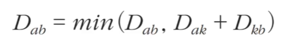

### 플로이드 워셜 알고리즘: 동작 과정 살펴보기
- [초기 상태] 그래프를 준비하고 각 노드에서 인접한 노드들을 확인해 최단 거리 테이블을 초기화한다.
  - 현재 테이블에서 행은 출발 노드, 열은 도착 노드이다.
  
  - 기본 점화식: $D_{ab} = min(D_{ab}, D_{ak}+D_{kb})$
  
  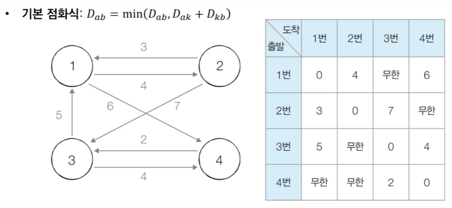

- [Step 1] 1번 노드를 거쳐가는 경우를 고려하여 테이블을 갱신한다.
  - 점화식: $D_{ab} = min(D_{ab}, D_{a1}+D_{1b})$
  - 2중 반복문을 통해 모든 a에서 모든 b로 가는 경우를 하나씩 확인하면서 최단 거리를 갱신
  - 갱신되는 부분만 최단 거리 테이블에서 하늘색으로 표시
  
  - 1번 노드를 거쳐가는 경우를 확인하는 것이므로 1번 노드를 시점, 종점으로 갖는 최단 거리는 고려 X, 갱신 X

  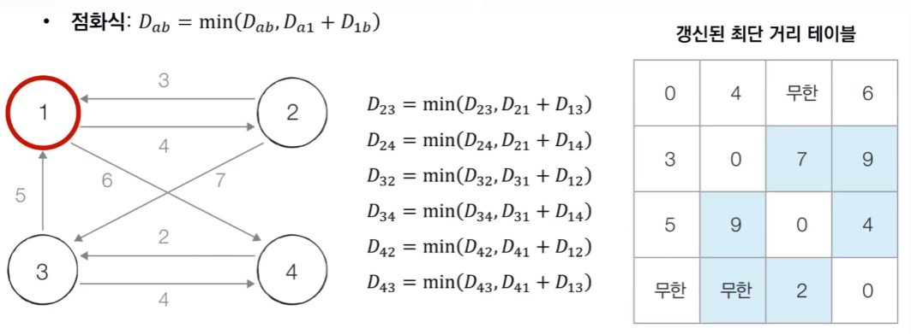


- [Step 2] 2번 노드를 거쳐가는 경우를 고려하여 테이블을 갱신한다.
  - 점화식: $D_{ab} = min(D_{ab}, D_{a2}+D_{2b})$
  
  - 갱신되는 부분만 최단 거리 테이블에서 하늘색으로 표시
  - 2번 노드를 거쳐가는 경우를 확인하는 것이므로 2번 노드를 시점, 종점으로 갖는 최단 거리는 고려 X, 갱신 X
  
  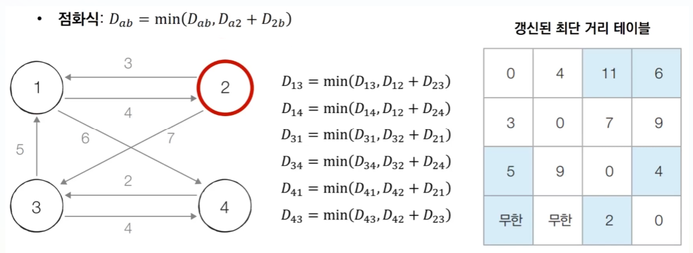


- [Step 3] 3번 노드를 거쳐가는 경우도 마찬가지로 점화식 확인 후 테이블을 갱신한다.
  - 점화식: $D_{ab} = min(D_{ab}, D_{a3}+D_{3b})$

  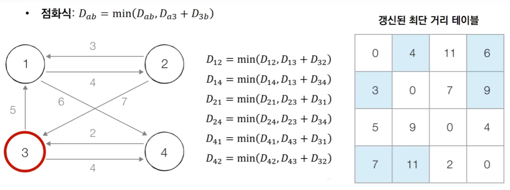

- [Step 4] 4번 노드를 거쳐가는 경우도 마찬가지로 점화식 확인 후 테이블을 갱신한다.
  - 점화식: $D_{ab} = min(D_{ab}, D_{a4}+D_{4b})$

  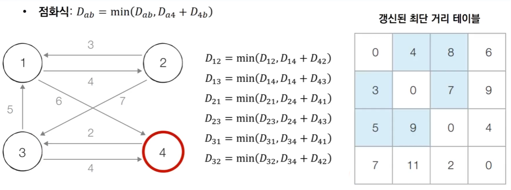

### 플로이드 워셜 알고리즘: 구현
  ```
  INF = int(1e9) # 무한을 의미하는 값으로 10억을 설정

  # 노드의 개수 및 간선의 개수를 입력받기
  n, m = map(int, input().split())

  # 2차원 리스트(그래프 리스트)를 만들고, 무한으로 초기화
  graph = [[INF] * (n+1) for _ in range(n+1)]

  # 자기 자신에서 자기 자신으로 가는 비용은 0으로 초기화
  for a in range(1,n+1):
    for b in range(1,n+1):
      if a == b:
        graph[a][b] = 0

  # 각 간선에 대한 정보를 입력 받아, 그 값으로 초기화
  for _ in range(m):
    # a에서 b로 가는 비용이 c라고 설정
    a, b, c = map(int, input().split())
    graph[a][b] = c

  # 점화식에 따라 플로이드 워셜 알고리즘 수행
  for k in range(1, n+1):
    for a in range(1, n+1):
      for b in range(1, n+1):
        graph[a][b] = min(graph[a][b], graph[a][k]+graph[k][b])

  # 수행된 결과를 출력
  for a in range(1,n+1):
    for b in range(1,n+1):
      # 도달할 수 없는 경우, 무한(INFINITY)이라고 출력
      if graph[a][b] = INF:
        print("INFINITY", end=" ")
      # 도달할 수 있는 경우 거리를 출력
      esle:
        print(graph[a][b], end=" ")
    print()
  ```
### 플로이드 워셜 알고리즘 성능 분석
- 노드의 개수가 N개일 때 알고리즘상으로 N번의 단계(N개의 노드를 거쳐가는 경우를 확인)를 수행

  - 각 단계마다 $O(N^2)$의 연산을 통해 현재 노드를 거쳐 가는 모든 경로를 고려한다.

- 따라서 플로이드 워셜 알고리즘의 총 시간 복잡도는 $O(N^3)$이다.
- 플로이드 워셜 알고리즘은 노드의 개수가 290개 일때 연산 횟수가 대략 2,500만번으로 파이썬 기준 1초 걸린다.

### <문제> 전보
#### 문제 설명
- 어떤 나라에는 **N개의 도시**가 있다. 그리고 각 도시는 보내고자 하는 메시지가 있는 경우, 다른 도시로 전보를 보내서 다른 도시로 해당 메시지를 전송할 수 있다.

- 하지만 X라는 도시에서 Y라는 도시로 전보를 보내고자 한다면, 도시 X에서 Y로 향하는 통로가 설치되어 있어야 한다. 예를 들어 X에서 Y로 향하는 통로는 있지만, Y에서 X로 향하는 통로가 없다면 Y는 X로 메시지를 보낼 수 없다. 또한 통로를 거쳐 메시지를 보낼 때는 일정 시간이 소요된다.

- 어느 날 C라는 도시에서 위급 상황이 발생했다. 그래서 최대한 많은 도시로 메시지를 보내고자 한다. 메시지는 **도시 C에서 출발하여 각 도시 사이에 설치된 통로를 거쳐, 최대한 많이 퍼져나갈 것**이다.

- 각 도시의 번호와 통로가 설치되어 있는 정보가 주어졌을 때, 도시 C에서 보낸 메시지를 받게 되는 도시의 개수는 총 몇개이며 도시들이 모두 메시지를 받는 데까지 걸리는 시간은 얼마인지 계산하는 프로그램을 작성하시오.

#### 문제 조건


#### 문제 해결 아이디어
- 핵심 아이디어: 한 도시에서 다른 도시까지 **최단 거리 문제**로 치환할 수 있다.
- 현재 문제에서는 N과 M의 범위가 크기 때문에 우선순위 큐를 활용한 다익스트라 알고리즘을 구현한다.
- 
#### 문제 풀이
- 나의 풀이
  ```
  import sys
  import heapq
  input = sys.stdin.readline
  INF = int(1e9)

  n, m, start = map(int, input().split())

  graph = [[] for i in range(n+1)]

  distance = [INF] * (n+1)

  for _ in range(m):
      a, b, c = map(int, input().split())
      graph[a].append((b,c))

  def dijkstra(start):
      q = []
      cnt = 0
      heapq.heappush(q, (0, start))
      distance[start] = 0

      while q:
          dist, now = heapq.heappop(q)
          if distance[now] < dist:
              continue
          else:
              cnt += 1
          for i in graph[now]:
              cost = dist + i[1]
              if cost < distance[i[0]]:
                  distance[i[0]] = cost
                  heapq.heappush(q,(cost, i[0]))
                  
      return cnt - 1

  print(dijkstra(start), max(distance[1:n+1]))
  ```
  - n과 m이 각각 최대 30,000과 200,000이므로 플로이드 워셜 알고리즘이 아닌 다익스트라 알고리즘을 사용
  - 방문처리 할 때, cnt에 1을 더한다.
  - 처음 start 노드를 방문처리 하므로 문제로 보자면 C도시를 방문하는 것과 같으니 cnt-1을 return값으로 한다.
  - 풀이 예시는 count를 dijkstra 함수 밖에 따로 만들어서 따로 계산한다. 근데 따로 밖에서 for문으로 반복하며 count와 max_distance를 계산하나 내가 한 방식으로 구현하나 복잡도는 동일하다.

- 풀이 예시에만 있는 부분
  ```
  dijkstra(start)

  count = 0
  max_distance = 0
  for i in distance:
    if i != 1e9:
      count += 1
      max_distance = max(max_distance, i)

  print(count-1, max_distance)
  ```
