# 정렬 알고리즘
- 정렬(Sorting)이란 데이터를 특정 기준에 따라 순서대로 나열하는 것을 말한다.
- 일반적으로 문제 상황에 따라 적절한 정렬 알고리즘이 공식처럼 사용된다.

    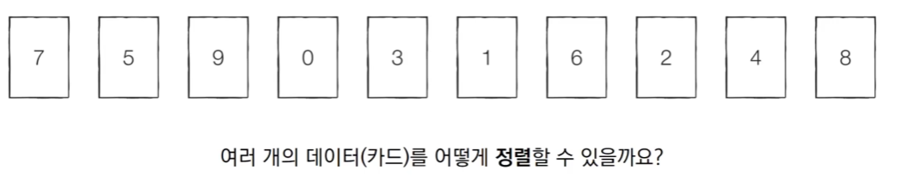

## 선택 정렬
- 처리되지 않은 데이터 중에서 **가장 작은 데이터를 선택해 맨 앞에 있는 데이터와 바꾸는 것을 반복**한다.

### 선택 정렬 동작 예시
- 정렬한 데이터를 준비한다.
 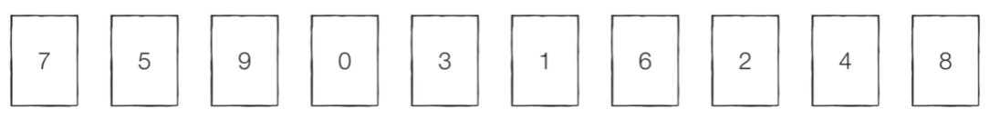

- [Step 0] 처리되지 않은 데이터 중 가장 작은 '0'을 선택해 '7'과 바꾼다.
 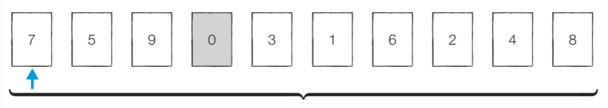

- [Step 1] 처리되지 않은 데이터 중 가장 작은 '1'을 선택해 가장 앞의 '5'와 바꾼다.
 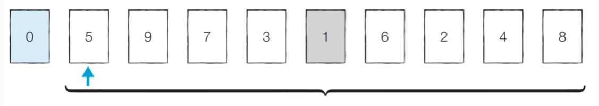

- [Step 2] 처리되지 않은 데이터 중 가장 작은 '2'를 선택해 가장 앞의 '9'와 바꾼다.
 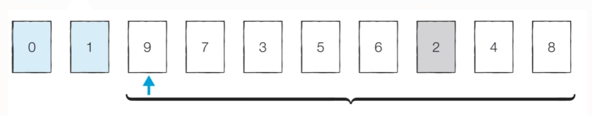

- [Step 3] 처리되지 않은 데이터 중 가장 작은 '3'을 선택해 가장 앞의 '7'과 바꾼다.
 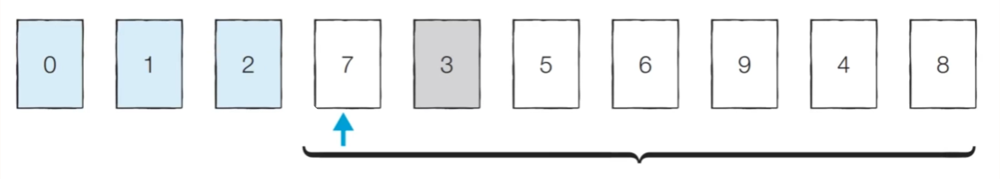

- 위 과정을 반복하면 다음과 같이 정렬이 완료된다.
  - 정렬되지 않은 데이터가 하나 남았을 때는 마지막이기 때문에 처리하지 않아도 전체 데이터가 성공적으로 정렬된다.
- 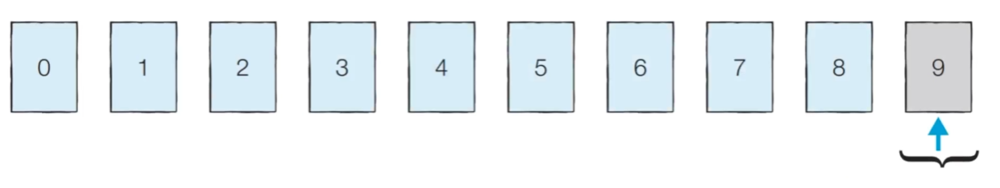
- 탐색 범위는 반복마다 줄어든다.
- 매번 가장 작은 원소를 찾기 위해 탐색 범위만큼 데이터를 하나씩 탐색하므로 매 반복마다 선형 탐색을 반복한다.

### 선택 정렬 소스코드
```
array = [7, 5, 9, 0, 3, 1, 6, 2, 4, 8]

# i는 해당 범위에서 매번 앞쪽으로 보내고자 하는 가장 앞쪽 원소 위치의 인덱스
for i in range(len(array)):
    min_index = i # 가장 작은 원소의 인덱스

    # j는 i+1부터 끝까지 선형 탐색을 해서 가장 작은 원소를 찾기 위한 것
    for j in range(i+1, len(array)):
        if array[min_index] > array[j]:
            min_index = j
    array[i], array[min_index] = array[min_index], array[i] # 스와프
print(array)
```
```
[0,1,2,3,4,5,6,7,8,9]
```

### 선택 정렬의 시간 복잡도
- 선택 정렬은 N번 만큼 가장 작은 수를 찾아서 맨 앞으로 보낸다.

- 구현 방식에 따라서 사소한 오차는 있을 수 있지만, 전체 연산 횟수는 다음과 같다.
  - $N + (N-1) + (N-2) + \cdots + 2$
- 이는 $(N^2 + N - 2)/2$ 로 표현할 수 있으며 결국 $O(N^2)$ 이다.

## 삽입 정렬
- 처리되지 않은 데이터를 하나씩 골라 적절한 위치에 삽입한다.

- 선택 정렬에 비해 구현 난이도가 높지만, 일반적으로 더 효율적으로 동작한다.

### 삽입 정렬 동작 예시
- [Step 0 ] 첫 번째 데이터 '7'은 그 자체로 정렬이 되어 있다고 판단하고, 두 번째 데이터인 '5'가 어떤 위치로 들어갈지 판단한다. '7'의 왼쪽으로 들어가거나 오른쪽으로 들어가거나 두 경우만 존재한다.
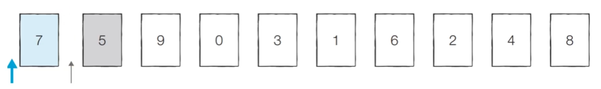

- [Step 1] 이어서 '9'가 어떤 위치로 들어갈지 판단한다.
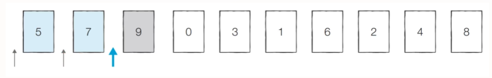

- [Step 2] 이어서 '0'이 어떤 위치로 들어갈지 판단한다.
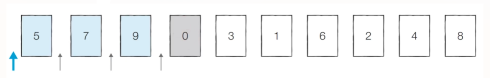

- [Step 3] 이어서 '0'이 어떤 위치로 들어갈지 판단한다.
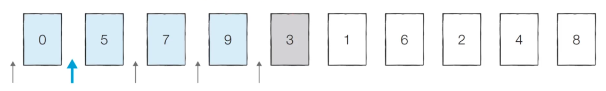

- 이러한 과정을 반복하면 다음과 같이 적렬이 완료된다.
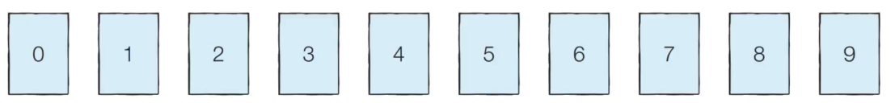

- 즉 현재 정렬하려는 값과 그 값 기준으로 왼쪽에 있는 값과 하나씩 비교해 현재 값이 들어갈 자리를 찾는다.
- 이는 범위 내 모든 값과 꼭 한 번씩 비교할 필요 없이 해당값이 들어갈 자리를 찾는다면 비교를 멈추게 된다.

### 삽입 정렬 소스코드
```
array = [7, 5, 9, 0, 3, 1, 6, 2, 4, 8]

for i in range(1,len(array)):
    for j in range(i, 0, -1):       # 인덱스 i부터 1까지 1씩 감소하며 반복하는 문법
        if array[j] < array[j-1]:   # 현재  인덱스 j에 해당하는 값 보다 큰 데이터를 만나면 한 칸 왼쪽으로 이동
            array[j], array[j-1] = array[j-1], array[j]
        else:                       # 현재 인덱스 j에 해당하는 값 보다 작은 데이터를 만나면 그 위치에서 멈춤
            break
print(array)
```
```
[0,1,2,3,4,5,6,7,8,9]
```

### 삽입 정렬의 시간 복잡도
- 삽입 정렬의 시간 복잡도는 $O(N^2)$이며, 선택 정렬과 마찬가지로 반복문이 두 번 중첩되어 사용된다.

- 삽입 정렬은 현재 리스트의 데이터가 거의 정려로디어 있는 상태라면 매우 빠르게 동작한다.

  - 최선의 경우(이미 정렬이 되어있는 경우) $O(N)$의 시간 복잡도를 가진다.

## 퀵 정렬
- 기준 데이터를 설정하고 그 **기준보다 큰 데이터와 작은 데이터의 위치를 바꾸는 방법**이다.

- 일반적인 상황에서 가장 많이 사용되는 정렬 알고리즘 중 하나이다.

- 병합 정렬과 더불어 대부분 프로그래밍 언어의 정렬 라이브러리의 근간이 되는 알고리즘이다.

- 가장 기본적인 퀵 정렬은 **첫 번째 데이터를 기준 데이터(Pivot)로 설정**한다.

### 퀵 정렬 동작 예시
- [Step 0] 현재 피벗 값이 '5'이다. 왼쪽에서부터 5보다 큰 데이터를 선택하므로 '7'이 선택되고, 오른쪽에서부터 '5'보다 작은 데이터를 선택하므로 '4'가 선택된다. 이제 이 두 데이터의 위치를 서로 변경한다.
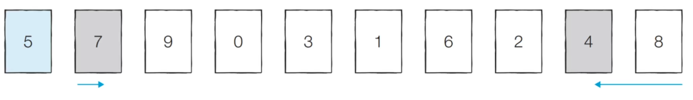

- [Step 1] 현재 피벗 값이 '5'이다. 왼쪽에서부터 5보다 큰 데이터를 선택하므로 '9'가 선택되고, 오른쪽에서부터 '5'보다 작은 데이터를 선택하므로 '2'가 선택된다. 이제 이 두 데이터의 위치를 서로 변경한다.
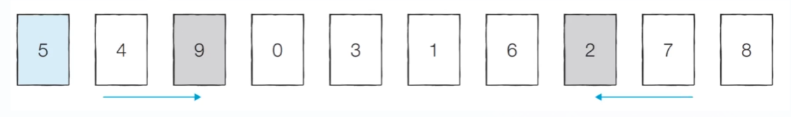

- [Step 2] 현재 피벗 값이 '5'이다. 왼쪽에서부터 5보다 큰 데이터를 선택하므로 '6'이 선택되고, 오른쪽에서부터 '5'보다 작은 데이터를 선택하므로 '1'이 선택된다. 단 이처럼 **위치가 엇갈리는 경우 '피벗'과 '작은 데이터'의 위치를 서로 변경한다.**
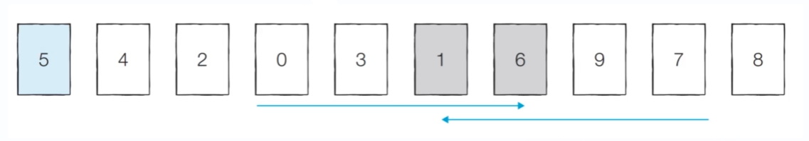

- [분할 완료] 이제 '5'의 왼쪽에 있는 데이터는 모두 5보다 작고, 오른쪽에 있는 데이터는 모두 '5'보다 크다는 특징을 갖게 된다. 이렇게 **피벗을 기준으로 데이터 묶음을 나누는 작업**을 **분할(Divide)**라고 한다.
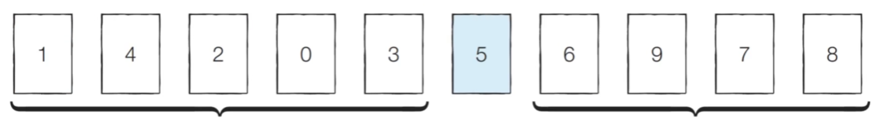

- [왼쪽 데이터 묶음 정렬] 왼쪽에 있는 데이터에 대해서 마찬가지로 정렬을 수행한다.
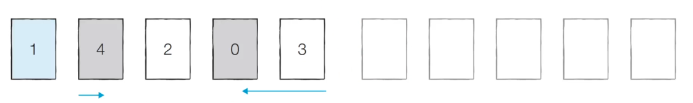

- [오른쪽 데이터 묶음 정렬] 오른쪽에 있는 데이터에 대해서 마찬가지로 정렬을 수행한다.
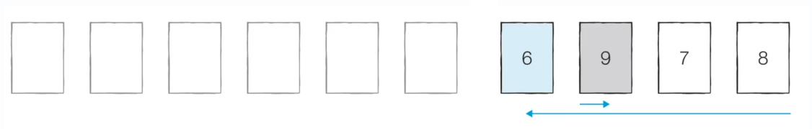

- 이러한 과정을 재귀적으로 반복하면 전체 데이터에 대해서 정렬이 수행된다.

### 퀵 정렬 소스코드: 일반적인 방법
```
array = [5, 7, 9, 0, 3, 1, 6, 2, 4, 8]

def quick_sort(array, start, end): # start, end는 각각 시작, 끝 인덱스
    # 원소가 1개인 경우 함수 종료
    if start >=end: 
        return
    pivot = start # 피벗은 첫 번째 원소
    left = start + 1
    right = end

    #엇갈릴 때까지 반복
    while(left <= right):
        # pivot보다 큰 데이터를 찾을 때까지 반복
        while(left <= end and array[left] <= array[pivot]):
            left += 1

        # pivot보다 작은 데이터를 찾을 때까지 반복
        while(right > start and array[right] >= array[pivot]):
            right -= 1

        # left, right가 엇갈렸다면 작은 데이터와 pivot을 교체
        if(left > right):
            array[right], array[pivot] = array[pivot], array[right]

        # left, right가 엇갈리지 않았다면 작은 데이터와 큰 데이터을 교체
        else:
            array[left], array[right] = array[right], array[left]

    # 분할 이후 왼쪽 부분과 오른쪽 부분에서 각각 정렬 수행
    quick_sort(array, start, right-1)
    quick_sort(array, right, end)

quick_sort(array, 0, len(array)-1)
print(array)
```
```
[0,1,2,3,4,5,6,7,8,9]
```

### 퀵 정렬 소스코드: 파이썬의 장점을 살린 방식
```
array = [5, 7, 9, 0, 3, 1, 6, 2, 4, 8]

def quick_sort(array):
    # 리스트가 하나 이하의 원소만 갖고 있다면 종료
    if len(array) <= 1:
        return array
    pivot = array[0] # pivot은 첫 번째 원소
    tail = array[1:] # pivot을 제외한 나머지 리스트

    left_side = [x for x in tail if x <= pivot] # 분할된 왼쪽 부분
    right_side = [x for x in tail if x > pivot] # 분할된 오른쪽 부분

    # 분할 이후 왼쪽 부분과 오른쪽 부분에서 각각 정렬 수행 후 전체 리스트 반환
    return quick_sort(left_side) + [pivot] + quick_sort(right_side)

print(quick_sort(array))
```
```
[0,1,2,3,4,5,6,7,8,9]
```
- 리스트 컴프리헨션 활용해서 더 간단하게 로직 작성

### 퀵 정렬이 빠른 이유: 직관적 이해
- 이상적인 경우 **분할이 절반씩 일어난다면** 전체 연산 횟수로 $O(NlogN)$을 기대할 수 있다.
  - **너비 X 높이** = N x logN

- 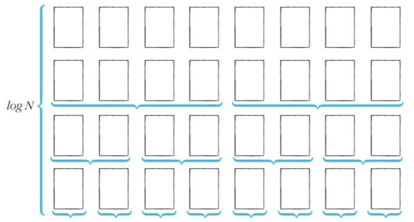

### 퀵 정렬의 시간 복잡도
- 퀵 정렬은 일반적인 경우 $O(NlogN)$의 시간 복잡도를 가진다.

- 하지만 최악의 경우(이미 배열이 정렬된 경우) $O(N^2)$의 시간 복잡도를 가질 수 있다.
  - 분할이 이루어질 때마다 오른쪽 데이터만 남게 되어 N에 비례하게 되고 분할을 하기 위해서 매번 선형 탐색을 하며 이는 또 N에 비례하기 때문이다.

## 계수 정렬
- 특정한 조건이 부합할 때만 사용할 수 있지만 매우 빠르게 동작하는 정렬 알고리즘이다.
  - 계수 정렬은 데이터의 크기 범위가 제한되어 정수 형태로 표현할 수 있을 때 사용 가능하다.

- 데이터의 개수가 N, 데이터(양수) 중 최댓값이 K일 때 최악의 경우에도 항상 수행 시간 $O(N+K)$를 보장한다.

### 계수 정렬 동작 과정
- [Step 0] 가장 작은 데이터부터 가장 큰 데이터까지의 범위가 모두 담길 수 있도록 리스트를 만든다.
  - 정렬할 데이터: 7 5 9 0 3 1 6 2 9 1 4 8 0 5 2
  - 각 인덱스가 데이터의 값에 해당한다. 즉 각각의 데이터가 총 몇번 등장했는지 그 횟수를 센다.
- 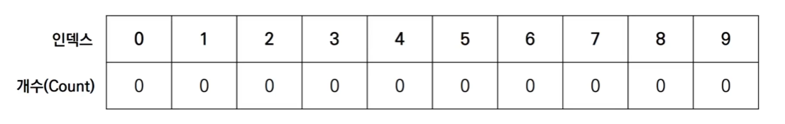

- [Step 1] 데이터를 하나씩 확인하며 데이터의 값과 동일한 인덱스의 데이터를 1씩 증가시킨다.
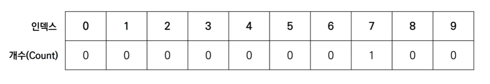

- [Step 2] 데이터를 하나씩 확인하며 데이터의 값과 동일한 인덱스의 데이터를 1씩 증가시킨다.
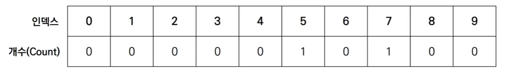

- [Step 3] 데이터를 하나씩 확인하며 데이터의 값과 동일한 인덱스의 데이터를 1씩 증가시킨다.
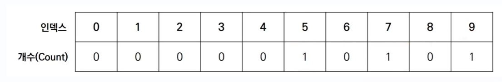

    $\vdots$

- [Step 15] 데이터를 하나씩 확인하며 데이터의 값과 동일한 인덱스의 데이터를 1씩 증가시킨다.
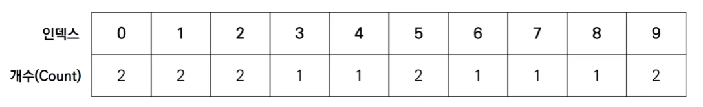

- 결과를 확인할 때는 리스트의 첫 번째 데이터부터 하나씩 그 값만큼 반복하여 인덱스를 출력한다.
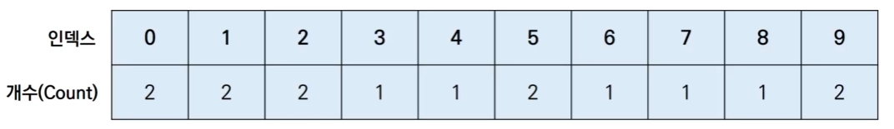

  - 출력 결과: 0 0 1 1 2 2 3 4 5 5 6 7 8 9 9
  
  - 계수 정렬은 각각의 데이터가 몇 번씩 등장했는지를 세는 방식으로 동작하는 정렬 알고리즘이다.

### 계수 정렬 소스코드
```
# 모든 원소의 값이 0보다 크거나 같다고 가정
array = [7, 5, 9, 0, 3, 1, 6, 2, 9, 1, 4, 8, 0, 5, 2]

# 모든 범위를 포함하는 리스트를 선언(모든 값은 0으로 초기화)
count = [0] * (max(array) + 1)

for i in range(len(array)):
    count[array[i]] += 1 # 각 데이터에 해당하는 인덱스의 값 증가

for i in range(len(count)): # 리스트에 기록된 정렬 정보 확인
    for j in range(count[j]):
        print(i, end = ' ') # 띄어쓰기를 구분으로 등장한 횟수만큼 인덱스 출력
```
```
0 0 1 1 2 2 3 4 5 5 6 7 8 9 9
```

### 계수 정렬의 시간 복잡도
- 계수 정렬의 시간 복잡도와 공간 복잡도는 모두 $O(N+K)이다.

- 계수 정렬은 때에 따라서 심각한 비효율성을 초래할 수 있다.

  - 데이터가 0과 999,999로 단 2개만 존재하는 경우 2~999,998의 불필요한 값을 추가로 리스트에 넣기 때문에 비효율적임

- 계수 정렬은 **동일한 값을 가지는 데이터가 여러 개 등장할 때** 효과적으로 사용할 수 있다.

  - 성적의 경우 100점을 맞은 학생이 여러 명일 수 있기 때문에 계수 정렬이 효과적이다.

## 정렬 알고리즘 비교
- 앞서 다룬 네 가지 정렬 알고리즘을 비교하면 다음과 같다.
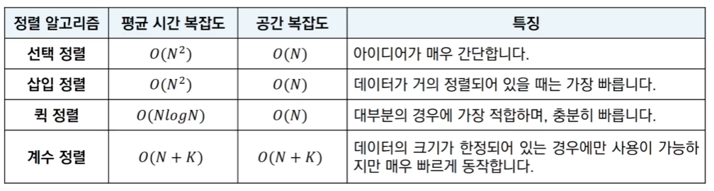

- 추가적으로 대부분의 프로그래밍 언어에서 지원하는 **표준 정렬 라이브러리는 최악의 경우에도 $O(NlogN)$을 보장**하도록 설계되어 있다.

## <문제> 두 배열의 원소 교체
### 문제 설명
- 두개의 배열 A, B가 있다. 두 배열은 N개의 원소로 구성되어 있으며, 배열의 원소는 모두 자연수이다.
- 최대 K번의 바꿔치기 연산을 수행할 수 있는데, 바꿔치기 연산이란 배열 A에 있는 원소 하나와 배역 B에 있는 원소 하나를 골라서 두 원소를 서로 바꾸는 것을 말한다.
- 최종 목표는 배열 A의 모든 원소의 합이 최대하 되도록 하는 것이다.
- N,K 그리고 배열 A, B의 정보가 주어졌을 때, 최대 K번의 바꿔치기 연산을 수행하여 만들 수 있는 배열 A의 모든 원소의 합의 최댓값을 출력하는 프로그램을 작성하시오.
- 예를 들어 N = 5, K = 3이고, 배열 A와 B가 다음과 같다고 해보자.

  - 배열 A = [1, 2, 5, 4, 3]

  - 배열 B = [5, 5, 6, 6, 5]

- 이 경우, 다음과 같이 세 번의 연산을 수행할 수 있다.

  - 연산 1. 배열 A의 원소 '1'과 배열 B의 원소 '6'을 바꾸기

  - 연산 2. 배열 A의 원소 '2'와 배열 B의 원소 '6'을 바꾸기

  - 연산 3. 배열 A의 원소 '3'과 배열 B의 원소 '5'를 바꾸기

- 세 번의 연산 이후 배열 A와 배열 B의 상태는 다음과 같이 구성될 것이다.

  - 배열 A = [6, 6, 5, 4, 5]

  - 배열 B = [3, 5, 1, 2, 5]

- 이때 배열 A의 모든 원소의 합은 26이 되며, 이보다 더 합을 크게 만들 수는 없다.

### 문제 조건
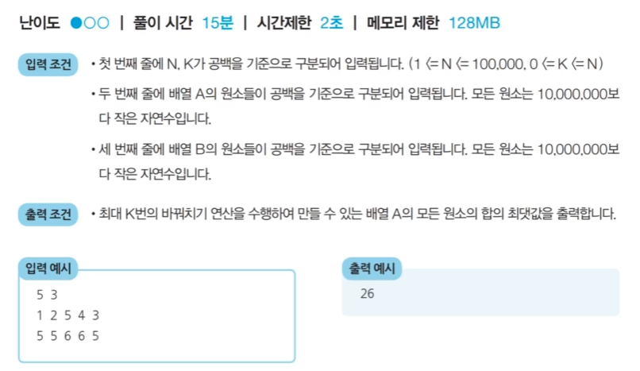

### 문제 해결 아이디어
- 핵심 아이디어: 매번 배열 A에서 가장 작은 원소를 골라서, 배열 B에서 가장 큰 원소와 교체한다.

- 가장 먼저 배열 A와 B가 주어지염 A에 대하여 오름차순 정렬, B에 대하여 내림차순 정렬을 한다.

- 이후 두 배열의 원소를 첫 번째 인덱스부터 차례로 확인하면서 A의 원소가 B의 원소보다 작을 때만 교체를 수행한다.

- 이 문제에서 두 배열의 원소가 최대 100,000개까지 입력될 수 있으므로, 최악의 경우 O(NlogN)을 보장하는 정렬 알고리즘을 이용해야 한다.

### 문제 풀이
- 나의 풀이
```
n, k = map(int, input().split())
A = list(map(int, input().split()))
B = list(map(int, input().split()))

# 함수로 정의해서 풀이한 경우
def func(k,A,B):
  A.sort()
  B.sort(reverse=True)

  for i in range(k):
    if A[i] < B[i]:
      A[i], B[i] = B[i], A[i]
    else:
      return sum(A)  # 더이상 바꿔치기 연산을 할 필요가 없는 경우

print(func(k,A,B))
```
```
5 3
1 2 5 4 3
5 5 6 6 5
26
```

- 풀이 답안 예시
```
n, k = map(int, input().split())
A = list(map(int, input().split()))
B = list(map(int, input().split()))

A.sort()
B.sort(reverse=True)

# 첫 번째 인덱스부터 확인하며, 두 배열의 원소를 최대 K번 비교
for i in range(k):
  # A의 원소가 B의 원소보다 작은 경우
  if A[i] < B[i]:
    A[i], B[i] = B[i], A[i]
  else:
    break  # 더이상 바꿔치기 연산을 할 필요가 없는 경우

print(sum(A))
```
